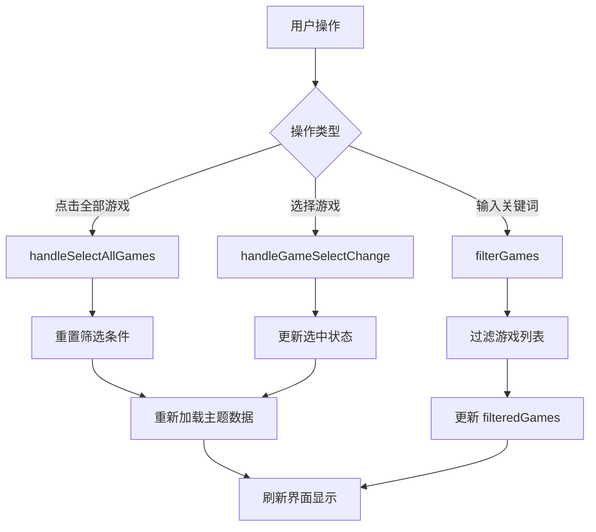

# 创作者中心游戏选择器模糊检索功能实现

## 📋 更新概述

为创作者中心的游戏选择器集成了**Element Plus el-select 组件的搜索过滤功能**，配合"全部游戏"按钮，提供简洁高效的游戏选择体验。

### 💡 设计理念
- **开箱即用**：直接使用 Element Plus 的 el-select 组件，无需额外实现
- **filterable 属性**：利用 el-select 内置的搜索过滤功能
- **符合习惯**：用户熟悉的下拉选择 + 搜索交互方式
- **智能过滤**：输入关键词时自动过滤下拉列表，支持游戏名称和代码匹配
- **一键重置**：点击"全部"按钮快速清除所有筛选条件

## ✨ 新增功能

### 1. 游戏模糊检索
- **搜索输入框**：在游戏选择器旁集成搜索输入框
- **实时过滤**：输入关键词时实时过滤下拉列表中的游戏
- **大小写不敏感**：支持大小写混合输入
- **双重匹配**：同时搜索游戏名称和游戏代码

### 2. 全部游戏选项
- **"全部"按钮**：一键清除筛选，显示所有游戏主题
- **高亮状态**：当前选中"全部"时有明显的高亮提示
- **快速重置**：点击后自动清空搜索关键词和游戏选择

## 🔧 技术实现

### 前端组件修改

#### 使用的 Element Plus 特性
- **el-select**: 下拉选择组件
- **filterable**: 启用搜索过滤功能
- **clearable**: 显示清除按钮
- **v-model**: 双向绑定选中的游戏 ID

#### 1. 模板结构优化
```vue
<div v-if="filterOwnerType === 'GAME'" class="game-selector-inline">
  <span class="filter-label">选择游戏：</span>
  <div class="game-select-wrapper">
    <!-- 全部游戏按钮 -->
    <button 
      class="game-select-all-btn"
      :class="{ active: selectedGameId === null || selectedGameId === undefined }"
      @click="handleSelectAllGames"
      title="显示所有游戏主题"
    >
      🎮 全部
    </button>
    
    <!-- Element Plus Select 组件（支持搜索过滤） -->
    <el-select
      v-model="selectedGameId"
      filterable
      placeholder="请选择游戏"
      clearable
      style="flex: 1; min-width: 200px;"
      @change="handleGameSelectChange"
    >
      <el-option
        v-for="game in filteredGames"
        :key="game.gameId"
        :label="`${game.gameName} (${game.gameCode})`"
        :value="game.gameId"
      />
    </el-select>
  </div>
</div>
```

#### 2. 响应式数据
```typescript
// 游戏模糊检索相关
const gameSearchKeyword = ref('');
const filteredGames = ref<Array<{ gameId: number; gameName: string; gameCode: string }>>([]);
```

#### 3. 核心函数

**选择全部游戏**
```typescript
function handleSelectAllGames() {
  selectedGameId.value = undefined;
  selectedGameCode.value = undefined;
  gameSearchKeyword.value = ''; // 清空搜索关键词
  filteredGames.value = [...games.value]; // 恢复完整游戏列表
  
  console.log('[CreatorCenter] 选择全部游戏');
  
  // 重新加载数据
  if (currentTab.value === 'mine') {
    loadMyThemesOnly();
  } else {
    reloadCurrentData();
  }
}
```

**游戏模糊检索**（el-select 自动处理）
```typescript
// el-select 的 filterable 属性会自动处理搜索逻辑
// 默认根据 option label 进行模糊匹配
// 我们的 option label 格式："游戏名称 (游戏代码)"
// 因此用户可以输入游戏名称或游戏代码进行搜索
```

#### 4. 样式设计

```scss
.game-select-wrapper {
  display: flex;
  align-items: center;
  gap: 8px;
  flex: 1;
  max-width: 600px;
}

.game-select-all-btn {
  display: flex;
  align-items: center;
  gap: 6px;
  padding: 8px 14px;
  background: #f7fafc;
  border: 2px solid #e2e8f0;
  border-radius: 8px;
  color: #4a5568;
  font-size: 13px;
  font-weight: 500;
  cursor: pointer;
  transition: all 0.2s;
  white-space: nowrap;
  
  &:hover {
    background: #edf2f7;
    border-color: #cbd5e0;
    transform: translateY(-1px);
  }
  
  &.active {
    background: #4ECDC4;
    border-color: #4ECDC4;
    color: white;
    box-shadow: 0 4px 12px rgba(78, 205, 196, 0.3);
  }
}


## 🎯 使用场景

### 场景 1：快速定位特定游戏
1. 用户点击下拉框，开始输入"蛇"
2. el-select 自动过滤出包含"蛇"字的游戏（如"贪吃蛇大冒险 (snake-vue3)"）
3. 用户从过滤后的下拉列表中选择目标游戏

### 场景 2：查看所有游戏主题
1. 用户点击"🎮 全部"按钮
2. 系统清除筛选条件，显示所有游戏的主题
3. 下拉列表恢复显示完整游戏列表

### 场景 3：通过游戏代码搜索
1. 用户在下拉框中输入"snake"
2. el-select 自动匹配游戏代码包含 snake 的游戏
3. 用户从下拉列表快速找到目标游戏

### 场景 4：清除选择
1. 用户点击下拉框右侧的清除按钮（×）
2. 清空当前选择，恢复到初始状态

## 📊 数据流程



## 🔍 搜索逻辑

### Element Plus 内置搜索
- **filterable 属性**：启用组件内置的搜索功能
- **默认匹配规则**：根据 option 的 label 进行模糊匹配
- **我们的 label 格式**：`游戏名称 (游戏代码)`
- **匹配效果**：用户输入游戏名称或游戏代码都能匹配

### 示例
```javascript
// Option label 显示：
// "贪吃蛇大冒险 (snake-vue3)"

// 搜索关键词："蛇"
// 匹配结果：
// - 贪吃蛇大冒险 (snake-vue3) ✅ （label 包含"蛇"）
// - 超级染色体 (chromosome) ❌
// - 飞机大战 (plane-shooter) ❌

// 搜索关键词："snake"
// 匹配结果：
// - 贪吃蛇大冒险 (snake-vue3) ✅ （label 包含"snake"）
// - 植物大战僵尸 (plants-vs-zombie) ❌

// 搜索关键词："冒险"
// 匹配结果：
// - 贪吃蛇大冒险 (snake-vue3) ✅ （label 包含"冒险"）
```

### 注意事项
⚠️ **重要**：el-select 的搜索是基于 option label 的，所以我们需要将游戏名称和代码组合显示：
```vue
<el-option
  :label="`${game.gameName} (${game.gameCode})`"
  :value="game.gameId"
/>
```

这样用户无论是输入游戏名称还是游戏代码，都能被搜索到。

## 🎨 UI/UX 优化

### 视觉反馈
- **悬停效果**：按钮和下拉框悬停时有交互反馈
- **激活状态**："全部"按钮激活时显示主题色背景
- **焦点高亮**：el-select 获得焦点时显示主题色边框
- **紧凑布局**：按钮 + 下拉框横向排列，节省空间且美观
- **清除按钮**：选中后显示 × 按钮，一键清空选择

### 交互优化
- **开箱即用**：Element Plus 内置搜索，无需额外实现
- **实时响应**：输入时自动过滤下拉列表，无需手动提交
- **一键清空**：点击清除按钮或"全部"按钮快速重置
- **平滑过渡**：所有状态变化都有流畅的过渡动画
- **直观操作**：标准的下拉选择交互，零学习成本
- **键盘支持**：支持键盘上下键选择和回车确认

## 📝 注意事项

1. **Element Plus 依赖**：确保项目已安装 Element Plus
2. **filterable 属性**：el-select 的搜索功能基于 option label 文本匹配
3. **label 格式重要性**：必须将游戏名称和代码组合显示，才能同时支持两种搜索
4. **性能考虑**：当游戏数量较多时（>1000），建议启用 `remote` 远程搜索
5. **样式自定义**：如需覆盖 el-select 默认样式，使用 `:deep()` 选择器

## 🚀 未来扩展

### 可能的增强功能
1. **高级筛选**：支持按游戏类型、创建时间等维度筛选
2. **排序功能**：支持按名称、热度等排序
3. **最近使用**：记录用户最近选择的游戏，方便快速访问
4. **收藏功能**：允许用户收藏常用游戏

## ✅ 测试验证

### 功能测试点
- [x] 点击"全部游戏"按钮能正确显示所有游戏主题
- [x] 搜索框输入关键词能实时过滤游戏列表
- [x] 搜索支持游戏名称和游戏代码
- [x] 搜索不区分大小写
- [x] 清空搜索框后恢复完整游戏列表
- [x] 选择游戏后能正确加载对应主题
- [x] 切换标签页后筛选条件保持正确

### 兼容性测试
- [x] TypeScript 类型检查通过
- [x] 开发环境运行正常
- [x] 模拟数据和真实 API 切换正常

## 📌 相关文件

- **修改文件**: `kids-game-frontend/src/modules/creator-center/index.vue`
- **涉及组件**: 游戏选择器、搜索框、全部游戏按钮
- **影响范围**: 创作者中心所有需要选择游戏的场景

---

**更新时间**: 2026-03-23  
**版本**: v1.0.0
