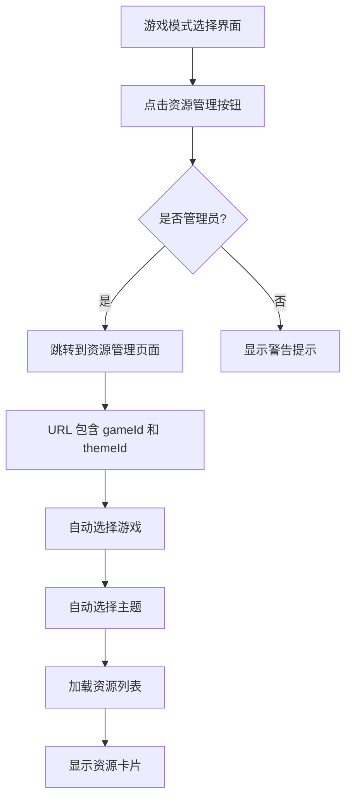

# 游戏资源管理按钮 - 功能说明

## 📋 功能概述

在游戏模式选择界面添加了"🖼️ 资源管理"按钮，点击后可直接跳转到当前游戏的资源管理页面。

## 🎯 实现位置

### 1. 游戏模式选择界面
**文件**: `kids-game-frontend/src/modules/game/GameModeSelect.vue`

**修改内容**:
- ✅ 在头部添加"资源管理"按钮
- ✅ 添加 `openResourceManager()` 方法
- ✅ 添加按钮样式

### 2. 资源管理页面
**文件**: `kids-game-frontend/src/modules/admin/components/GameResourceManager.vue`

**修改内容**:
- ✅ 支持从 URL 参数接收 `gameId` 和 `themeId`
- ✅ 自动选择对应的游戏和主题
- ✅ 自动加载资源列表

## 🚀 使用方法

### 方式 1: 从游戏界面进入

1. 进入游戏模式选择页面
   ```
   http://localhost:5173/game/pvz
   ```

2. 点击右上角的 "🖼️ 资源管理" 按钮

3. 如果是管理员，会自动跳转到资源管理页面并选中当前游戏和主题

### 方式 2: 直接访问（带参数）

```
http://localhost:5173/admin/game-resources?gameId=pvz&themeId=pvz
```

### 方式 3: 直接访问（手动选择）

```
http://localhost:5173/admin/game-resources
```

然后手动选择游戏和主题。

## 🔐 权限控制

- **仅管理员可访问**: 非管理员点击按钮会显示提示"仅管理员可以访问资源管理"
- **自动检测**: 系统会检查 localStorage 中的 `adminInfo` 来判断是否为管理员

## 💡 工作流程



## 🎨 界面效果

### 头部布局
```
┌─────────────────────────────────────────────┐
│ ← 返回    植物大战僵尸    🖼️资源管理 🎨主题 │
└─────────────────────────────────────────────┘
```

### 按钮样式
- **颜色**: 天蓝色 (#48dbfb)
- **悬停效果**: 向上移动 + 阴影
- **图标**: 🖼️ emoji

## 📝 代码示例

### 打开资源管理

```typescript
function openResourceManager() {
  const game = gameStore.getGameById(parseInt(gameType.value));
  if (!game) {
    toast.error('游戏信息不存在');
    return;
  }
  
  // 获取当前选择的主题
  const gameThemeKey = `game-theme-${gameCode.value}`;
  const themeId = localStorage.getItem(gameThemeKey) || 'default';
  
  // 检查是否为管理员
  const adminInfo = localStorage.getItem('adminInfo');
  if (adminInfo) {
    router.push({
      path: '/admin/game-resources',
      query: {
        gameId: game.gameCode,
        themeId: themeId
      }
    });
  } else {
    toast.warning('仅管理员可以访问资源管理');
  }
}
```

### 资源管理页面接收参数

```typescript
onMounted(() => {
  loadGames();
  
  // 从 URL 参数中获取 gameId 和 themeId
  const gameId = route.query.gameId as string;
  const themeId = route.query.themeId as string;
  
  if (gameId) {
    setTimeout(() => {
      selectedGame.value = gameId;
      loadThemes();
      
      if (themeId) {
        setTimeout(() => {
          selectedTheme.value = themeId;
          loadThemeResources();
        }, 500);
      }
    }, 500);
  }
});
```

## 🔧 自定义配置

### 修改按钮位置

编辑 `GameModeSelect.vue` 的模板部分：

```vue
<header class="mode-header">
  <button @click="goBack" class="back-btn">← 返回</button>
  <div class="game-title">{{ gameName }}</div>
  <div class="header-actions">
    <!-- 在这里调整按钮顺序 -->
    <button @click="openResourceManager" class="resource-manage-btn">
      🖼️ 资源管理
    </button>
    <button @click="showThemeSelector = true" class="theme-select-btn">
      🎨 主题
    </button>
  </div>
</header>
```

### 修改按钮样式

编辑 `GameModeSelect.vue` 的样式部分：

```css
.resource-manage-btn {
  padding: 0.5rem 1rem;
  background: #48dbfb;  /* 修改背景色 */
  color: white;
  border: none;
  border-radius: 8px;
  cursor: pointer;
  font-size: 0.9rem;
  font-weight: 600;
  transition: all 0.3s;
}
```

### 修改权限检查逻辑

如果需要允许其他用户类型访问，修改 `openResourceManager` 函数：

```typescript
function openResourceManager() {
  // ... 前面的代码
  
  // 允许管理员和家长访问
  const adminInfo = localStorage.getItem('adminInfo');
  const parentInfo = localStorage.getItem('parentInfo');
  
  if (adminInfo || parentInfo) {
    router.push({
      path: '/admin/game-resources',
      query: { gameId, themeId }
    });
  } else {
    toast.warning('需要管理员或家长权限');
  }
}
```

## 🐛 常见问题

### Q1: 点击按钮没有反应？

**可能原因**:
- 不是管理员账号登录
- 浏览器控制台有错误

**解决方案**:
1. 使用管理员账号登录
2. 检查浏览器控制台 (F12) 的错误信息
3. 确认 localStorage 中有 `adminInfo`

### Q2: 跳转后没有自动选择游戏？

**可能原因**:
- URL 参数不正确
- 游戏列表加载延迟

**解决方案**:
1. 检查 URL 是否包含 `?gameId=xxx&themeId=xxx`
2. 等待几秒让数据加载完成
3. 手动选择游戏和主题

### Q3: 如何测试功能？

**步骤**:
1. 使用管理员账号登录后台
2. 访问任意游戏模式选择页面
3. 点击右上角"资源管理"按钮
4. 确认自动跳转到资源管理页面
5. 确认游戏和主题已自动选择

## 📊 相关文件

- ✏️ `kids-game-frontend/src/modules/game/GameModeSelect.vue` - 添加按钮
- ✏️ `kids-game-frontend/src/modules/admin/components/GameResourceManager.vue` - 支持 URL 参数
- 📄 `GAME_RESOURCE_MANAGER_GUIDE.md` - 完整使用指南
- 📄 `QUICK_START_RESOURCE_MANAGER.md` - 快速启动指南

## 🎉 总结

通过这个功能，管理员可以：
- ✅ 从游戏界面快速访问资源管理
- ✅ 自动定位到当前游戏和主题
- ✅ 方便地查看和管理游戏资源
- ✅ 提高工作效率

---

**添加时间**: 2026-04-13  
**版本**: 1.0.0  
**状态**: ✅ 已完成
