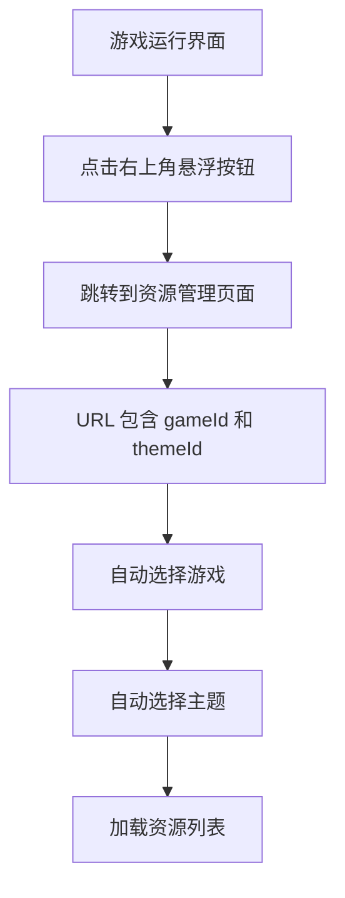

# 游戏资源管理悬浮按钮 - 功能说明

## 📋 功能概述

在游戏运行界面（iframe 页面）右上角添加了一个**圆形悬浮按钮**，点击后可直接跳转到当前游戏的资源管理页面。

## 🎯 实现位置

### 1. 游戏主界面
**文件**: `kids-game-frontend/src/modules/game/index.vue`

**修改内容**:
- ✅ 在模板中添加悬浮按钮
- ✅ 添加 `openResourceManager()` 方法
- ✅ 添加悬浮按钮样式（固定定位、渐变背景、动画效果）

## 🚀 使用方法

### 访问方式

1. **启动任意游戏**
   ```
   http://localhost:5173/game/pvz
   ```

2. **查看右上角**
   - 会看到一个圆形的蓝色按钮 🖼️
   - 位置：右上角，距离边缘 20px

3. **点击按钮**
   - 直接跳转到资源管理页面
   - 自动选择当前游戏和主题

## 🔐 权限控制

- ✅ **无权限限制**: 所有用户都可以访问资源管理页面
- ✅ **自动传递参数**: 自动获取当前游戏代码和主题 ID
- ✅ **友好体验**: 点击即可跳转，无需登录验证

## 💡 工作流程



## 🎨 界面效果

### 按钮样式
- **形状**: 圆形 (60x60px)
- **颜色**: 天蓝色渐变 (#48dbfb → #0abde3)
- **图标**: 🖼️ emoji (24px)
- **位置**: 右上角固定 (top: 20px, right: 20px)
- **层级**: z-index: 9999 (在所有元素之上)

### 交互动画
- **悬停**: 放大 1.1 倍 + 旋转 10 度 + 阴影加深
- **点击**: 缩小到 0.95 倍
- **过渡**: 0.3s ease

### 视觉效果
```
┌─────────────────────────────────────┐
│                              [🖼️]   │ ← 悬浮按钮
│                                     │
│                                     │
│         游戏画面 (iframe)            │
│                                     │
│                                     │
└─────────────────────────────────────┘
```

## 📝 代码示例

### 模板部分

```vue
<!-- 资源管理悬浮按钮 -->
<button 
  @click="openResourceManager" 
  class="resource-manager-float-btn"
  title="打开资源管理"
>
  🖼️
</button>
```

### 脚本部分

```typescript
/**
 * 打开资源管理页面
 */
function openResourceManager() {
  console.log('[Resource Manager] 点击资源管理按钮');
  console.log('[Resource Manager] 当前游戏代码:', gameCode.value);
  
  if (!gameCode.value) {
    console.error('[Resource Manager] 游戏代码不存在');
    alert('游戏信息不存在');
    return;
  }
  
  // 获取当前选择的主题
  const gameThemeKey = `game-theme-${gameCode.value}`;
  const themeId = localStorage.getItem(gameThemeKey) || 'default';
  
  console.log('[Resource Manager] 主题ID:', themeId);
  
  // 跳转到资源管理页面（不限制权限）
  console.log('[Resource Manager] 跳转到资源管理页面');
  router.push({
    path: '/admin/game-resources',
    query: {
      gameId: gameCode.value,
      themeId: themeId
    }
  });
}
```

### 样式部分

```css
/* 资源管理悬浮按钮 */
.resource-manager-float-btn {
  position: fixed;
  top: 20px;
  right: 20px;
  width: 60px;
  height: 60px;
  border-radius: 50%;
  background: linear-gradient(135deg, #48dbfb 0%, #0abde3 100%);
  color: white;
  border: none;
  cursor: pointer;
  font-size: 24px;
  box-shadow: 0 4px 15px rgba(72, 219, 251, 0.4);
  transition: all 0.3s ease;
  z-index: 9999;
  display: flex;
  align-items: center;
  justify-content: center;
}

.resource-manager-float-btn:hover {
  transform: scale(1.1) rotate(10deg);
  box-shadow: 0 6px 20px rgba(72, 219, 251, 0.6);
}

.resource-manager-float-btn:active {
  transform: scale(0.95);
}
```

## 🔧 自定义配置

### 修改按钮位置

编辑 `index.vue` 的样式部分：

```css
.resource-manager-float-btn {
  position: fixed;
  top: 20px;      /* 调整垂直位置 */
  right: 20px;    /* 调整水平位置 */
  /* 或者使用 left/bottom */
}
```

### 修改按钮大小

```css
.resource-manager-float-btn {
  width: 60px;   /* 调整宽度 */
  height: 60px;  /* 调整高度 */
  font-size: 24px; /* 调整图标大小 */
}
```

### 修改按钮颜色

```css
.resource-manager-float-btn {
  background: linear-gradient(135deg, #ff6b6b 0%, #ee5a6f 100%); /* 红色渐变 */
  box-shadow: 0 4px 15px rgba(255, 107, 107, 0.4);
}
```

### 修改权限检查逻辑

如果需要添加权限限制：

```typescript
function openResourceManager() {
  // ... 前面的代码
  
  // 添加管理员检查
  const adminInfo = localStorage.getItem('adminInfo');
  
  if (!adminInfo) {
    alert('需要管理员权限');
    return;
  }
  
  router.push({
    path: '/admin/game-resources',
    query: { gameId: gameCode.value, themeId }
  });
}
```

## 🐛 常见问题

### Q1: 看不到悬浮按钮？

**可能原因**:
- 浏览器缓存问题
- z-index 被其他元素覆盖
- CSS 未正确加载

**解决方案**:
1. 强制刷新浏览器 (`Ctrl + Shift + R`)
2. 检查浏览器控制台是否有 CSS 错误
3. 确认按钮的 z-index (9999) 高于其他元素

### Q2: 点击按钮没有反应？

**可能原因**:
- JavaScript 错误
- 路由配置问题
- 游戏代码未正确获取

**解决方案**:
1. 检查浏览器控制台 (F12) 的错误信息
2. 查看控制台日志 `[Resource Manager]` 开头的输出
3. 确认游戏已正确加载

### Q3: 按钮遮挡了游戏内容？

**解决方案**:
调整按钮位置：

```css
.resource-manager-float-btn {
  top: 80px;    /* 向下移动 */
  right: 20px;
}
```

或者添加透明度：

```css
.resource-manager-float-btn {
  opacity: 0.7; /* 半透明 */
}

.resource-manager-float-btn:hover {
  opacity: 1; /* 悬停时完全不透明 */
}
```

### Q4: 如何在移动端优化？

**解决方案**:
添加媒体查询：

```css
@media (max-width: 768px) {
  .resource-manager-float-btn {
    width: 50px;
    height: 50px;
    font-size: 20px;
    top: 10px;
    right: 10px;
  }
}
```

## 📊 相关文件

- ✏️ `kids-game-frontend/src/modules/game/index.vue` - 添加悬浮按钮
- ✏️ `kids-game-frontend/src/modules/admin/components/GameResourceManager.vue` - 支持 URL 参数
- 📄 `GAME_RESOURCE_BUTTON_FEATURE.md` - 模式选择界面按钮说明
- 📄 `GAME_RESOURCE_MANAGER_GUIDE.md` - 完整使用指南

## 🎉 总结

通过这个功能，管理员可以：
- ✅ 在游戏运行时快速访问资源管理
- ✅ 不影响游戏体验（悬浮设计）
- ✅ 自动定位到当前游戏和主题
- ✅ 美观的交互动画
- ✅ 提高工作效率

---

**添加时间**: 2026-04-13  
**版本**: 1.0.0  
**状态**: ✅ 已完成  
**位置**: 游戏运行界面右上角
