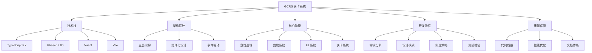
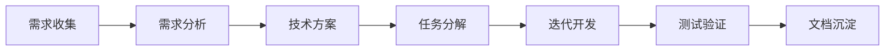

# 🧠 GCRS 关卡系统 - 知识地图

**版本**: v1.3.0-dev  
**创建时间**: 2026-04-02  
**目标**: 系统性梳理项目知识体系

---

## 📚 知识体系总览



---

## 1️⃣ 技术栈知识

### TypeScript 5.x

#### 核心知识点
- ✅ **类型系统**
  - 基础类型（string, number, boolean）
  - 接口（Interface）和类型别名（Type Alias）
  - 泛型（Generics）
  - 枚举（Enum）
  - 联合类型和交叉类型

- ✅ **高级特性**
  - 装饰器（Decorators）
  - 命名空间（Namespaces）
  - 模块解析（Module Resolution）
  - 路径映射（Path Mapping）

- ✅ **配置文件**
  ```json
  {
    "compilerOptions": {
      "target": "ES2020",
      "module": "ESNext",
      "strict": true,
      "esModuleInterop": true,
      "skipLibCheck": true,
      "forceConsistentCasingInFileNames": true,
      "outDir": "./dist",
      "rootDir": "./src",
      "paths": {
        "@/*": ["./src/*"],
        "@components/*": ["./src/components/*"]
      }
    }
  }
  ```

**学习资源**: 
- 📖 [TypeScript 官方文档](https://www.typescriptlang.org/docs/)
- 📖 [PROJECT_STRUCTURE.md](./PROJECT_STRUCTURE.md) - tsconfig.json 配置说明

---

### Phaser 3.80

#### 核心知识点
- ✅ **场景管理**
  - Scene 生命周期（preload, create, update）
  - Scene 切换和数据传递
  - SceneManager 使用

- ✅ **游戏对象**
  - GameObject 创建和管理
  - Physics 物理系统
  - Tweens 补间动画
  - Particle Emitters 粒子系统

- ✅ **输入处理**
  - Keyboard 键盘输入
  - Pointer 指针输入
  - InputPlugin 使用

- ✅ **渲染系统**
  - Canvas vs WebGL
  - Graphics 图形绘制
  - Texture 纹理管理
  - Camera 摄像机

**学习资源**:
- 📖 [Phaser 官方文档](https://photonstorm.github.io/phaser3-docs/)
- 📖 [SnakeGameLogic.ts](./kids-game-house/games/snake/src/scenes/SnakeGameLogic.ts) - 实际示例

---

### Vue 3

#### 核心知识点
- ✅ **Composition API**
  - setup() 函数
  - ref 和 reactive
  - computed 计算属性
  - watch 和 watchEffect
  - 生命周期钩子

- ✅ **组件系统**
  - Props 定义和验证
  - Emits 事件发射
  - Slots 插槽使用
  - Provide/Inject 依赖注入

- ✅ **响应式原理**
  - Proxy 实现原理
  - 响应式数据追踪
  - 批量更新机制

- ✅ **模板语法**
  - 指令系统（v-if, v-for, v-bind, v-on）
  - 过滤器
  - 自定义指令

**学习资源**:
- 📖 [Vue 3 官方文档](https://vuejs.org/)
- 📖 [LevelProgressBar.vue](./kids-game-house/games/snake/src/components/ui/LevelProgressBar.vue) - 组件示例

---

### Vite

#### 核心知识点
- ✅ **构建工具**
  - 热模块替换（HMR）
  - 预构建依赖
  - 代码分割
  - Tree Shaking

- ✅ **插件系统**
  - @vitejs/plugin-vue
  - @vitejs/plugin-basic-ssl
  - 自定义插件开发

- ✅ **环境配置**
  ```typescript
  // vite.config.ts
  export default defineConfig({
    plugins: [vue()],
    resolve: {
      alias: {
        '@': path.resolve(__dirname, './src')
      }
    },
    server: {
      port: 5173,
      hot: true
    },
    build: {
      outDir: 'dist',
      sourcemap: true
    }
  })
  ```

**学习资源**:
- 📖 [Vite 官方文档](https://vitejs.dev/)
- 📖 [vite.config.ts](./kids-game-house/games/snake/vite.config.ts) - 配置文件

---

## 2️⃣ 架构设计知识

### 三层架构

#### Framework Layer（框架层）
**职责**: 提供基础框架和通用组件

**核心类**:
```typescript
// ComponentBase.ts - 组件基类
abstract class ComponentBase {
  protected scene: any
  protected eventBus: EventBus
  
  abstract init(): void
  abstract update(delta: number): void
  abstract destroy(): void
  
  protected emit(event: GameEvent): void {
    this.eventBus.emit(event)
  }
}

// EventBus.ts - 事件总线
class EventBus {
  private static instance: EventBus
  private emitter: EventEmitter
  
  static getInstance(): EventBus {
    return this.instance || (this.instance = new EventBus())
  }
  
  emit(event: GameEvent): void
  on(type: GameEventType, callback: Function): void
}
```

**学习要点**:
- 单一职责原则
- 开闭原则
- 依赖倒置原则

---

#### Component Layer（组件层）
**职责**: 实现具体功能组件

**核心组件**:
```typescript
// SnakeMovementComponent
class SnakeMovementComponent extends ComponentBase {
  move(snake: SnakeSegment[], direction: Direction): void {
    // 纯粹的移动算法
  }
}

// CollisionDetectionComponent
class CollisionDetectionComponent extends ComponentBase {
  checkWallCollision(head: Position, grid: Grid): boolean
  checkSelfCollision(head: Position, snake: SnakeSegment[]): boolean
  checkFoodCollision(head: Position, food: Food): boolean
}

// FoodSpawnerComponent
class FoodSpawnerComponent extends ComponentBase {
  spawnFood(snake: SnakeSegment[], obstacles: Obstacle[]): Food
}
```

**学习要点**:
- 组合优于继承
- 高内聚低耦合
- 接口隔离原则

---

#### Game Layer（游戏层）
**职责**: 协调各组件，实现完整游戏逻辑

**核心类**:
```typescript
// SnakeGameLogic
class SnakeGameLogic {
  private movement: SnakeMovementComponent
  private collision: CollisionDetectionComponent
  private foodSpawner: FoodSpawnerComponent
  
  startGame(): void {
    // 初始化游戏状态
  }
  
  update(delta: number): void {
    // 协调各组件
    this.movement.move(this.snake, this.direction)
    this.collision.checkCollisions()
    this.foodSpawner.spawnIfNeeded()
  }
}
```

**学习要点**:
- 协调者模式
- 状态模式
- 命令模式

---

### 事件驱动架构

#### 事件类型系统
```typescript
enum GameEventType {
  // 游戏状态事件
  GAME_START,
  GAME_OVER,
  PAUSE,
  RESUME,
  
  // 蛇相关事件
  SNAKE_MOVE,
  SNAKE_EAT,
  SNAKE_GROW,
  
  // 食物相关事件
  FOOD_SPAWN,
  FOOD_CONSUMED,
  
  // UI 相关事件
  SCORE_CHANGED,
  LEVEL_COMPLETE,
  LOAD_PROGRESS,
  
  // 目标相关事件
  OBJECTIVE_UPDATED,
  OBJECTIVE_COMPLETE
}
```

#### 事件格式规范
```typescript
interface GameEvent {
  type: GameEventType
  payload: any
  timestamp: number
  source?: string
}
```

#### 使用示例
```typescript
// 发射事件
this.emit({
  type: GameEventType.SCORE_CHANGED,
  payload: { score: 100, previousScore: 80 },
  timestamp: Date.now(),
  source: 'SnakeGameLogic'
})

// 监听事件
eventBus.on(GameEventType.SCORE_CHANGED, (event) => {
  console.log(`分数：${event.payload.previousScore} -> ${event.payload.score}`)
})
```

**学习要点**:
- 观察者模式
- 发布订阅模式
- 事件总线模式

---

## 3️⃣ 核心功能知识

### 游戏逻辑系统

#### 网格系统
```typescript
class Grid {
  rows: number
  cols: number
  cellSize: number
  offsetX: number
  offsetY: number
  
  render(graphics: Phaser.GameObjects.Graphics): void {
    // 绘制网格线
  }
  
  worldToGrid(worldPos: Position): Position {
    // 世界坐标转网格坐标
  }
  
  gridToWorld(gridPos: Position): Position {
    // 网格坐标转世界坐标
  }
}
```

#### 蛇系统
```typescript
interface SnakeSegment {
  x: number      // 网格坐标
  y: number
}

class Snake {
  segments: SnakeSegment[]
  direction: Direction
  growPending: number
  
  move(direction: Direction): void {
    // 基于 deltaTime 的平滑移动
  }
  
  grow(length: number): void {
    this.growPending += length
  }
  
  checkCollision(grid: Grid): CollisionResult {
    // 撞墙、撞自己检测
  }
}
```

#### 游戏状态管理
```typescript
enum GameState {
  IDLE,
  PLAYING,
  PAUSED,
  GAME_OVER
}

class GameManager {
  state: GameState
  
  changeState(newState: GameState): void {
    const oldState = this.state
    this.state = newState
    
    this.emit({
      type: GameEventType.GAME_STATE_CHANGED,
      payload: { oldState, newState }
    })
  }
}
```

**学习要点**:
- 状态机模式
- 游戏循环模式
- 更新模式

---

### 食物系统

#### 食物类型枚举
```typescript
enum FoodType {
  NORMAL = 'normal',      // 10 分，红色，70%
  BONUS = 'bonus',        // 50 分，金色，15%
  SPECIAL = 'special',    // 100 分，紫色，5%
  SPEED_UP = 'speed_up',  // 20 分，蓝色，加速 50%(5 秒)
  SLOW_DOWN = 'slow_down',// 15 分，绿色，减速 30%(5 秒)
  INVINCIBLE = 'invincible' // 30 分，白色，穿墙 3 秒
}
```

#### 食物配置数据库
```typescript
interface FoodConfig {
  type: FoodType
  baseScore: number
  color: string
  spawnProbability: number
  growsSnake: boolean
  lengthIncrease?: number
  effect?: FoodEffect
}

const FOOD_DATABASE: Record<FoodType, FoodConfig> = {
  [FoodType.NORMAL]: {
    type: FoodType.NORMAL,
    baseScore: 10,
    color: '#ff4444',
    spawnProbability: 0.7,
    growsSnake: true,
    lengthIncrease: 1
  },
  // ... 其他配置
}
```

#### 食物效果系统
```typescript
interface FoodEffect {
  type: 'speed_change' | 'length_change' | 'invincibility' | 'score_multiplier'
  value: number
  duration: number  // 毫秒
}

function applyFoodEffect(food: Food, gameState: GameState): void {
  if (food.effect) {
    switch (food.effect.type) {
      case 'speed_change':
        gameState.snakeSpeed *= food.effect.value
        setTimeout(() => {
          gameState.snakeSpeed /= food.effect.value
        }, food.effect.duration)
        break
      // ... 其他效果
    }
  }
}
```

**学习要点**:
- 策略模式
- 工厂模式
- 配置与逻辑分离

---

### UI 系统

#### 加载进度条
```vue
<template>
  <div class="progress-container">
    <div class="progress-bar-bg">
      <div class="progress-bar-fill" :style="{ width: progress + '%' }">
        <div class="progress-gradient"></div>
        <div class="progress-breath"></div>
      </div>
      <div class="progress-text">{{ Math.round(progress) }}%</div>
    </div>
  </div>
</template>

<script lang="ts">
export default defineComponent({
  props: {
    progress: { type: Number, default: 0 },
    visible: { type: Boolean, default: true }
  },
  emits: ['update:visible', 'complete']
})
</script>
```

#### 目标列表
```vue
<template>
  <div class="objective-list">
    <div v-for="obj in objectives" :key="obj.id" 
         :class="{ completed: obj.completed }">
      <div class="objective-icon">{{ getIcon(obj.type) }}</div>
      <div class="objective-content">
        <div class="objective-title">{{ obj.title }}</div>
        <div class="objective-progress">
          {{ obj.current }}/{{ obj.target }}
        </div>
      </div>
    </div>
  </div>
</template>
```

**学习要点**:
- CSS 动画（keyframes）
- 响应式设计
- 组件通信

---

## 4️⃣ 开发流程知识

### 需求分析流程



**关键活动**:
1. **需求收集**: 明确功能需求和性能指标
2. **需求分析**: 拆解为具体的技术需求
3. **技术方案**: 选择合适的架构和模式
4. **任务分解**: 拆分为可执行的小任务
5. **迭代开发**: 快速迭代，持续集成
6. **测试验证**: 单元测试、集成测试
7. **文档沉淀**: 编写技术文档和使用指南

---

### 设计模式应用

#### 创建型模式
- **工厂模式**: `createFood()` 统一创建食物
- **单例模式**: `EventBus.getInstance()` 全局事件总线

#### 结构型模式
- **组合模式**: 优先使用组合而非继承
- **装饰器模式**: Vue 组件的 `@Component` 装饰器

#### 行为型模式
- **策略模式**: 食物效果系统
- **观察者模式**: EventBus 事件系统
- **状态模式**: GameState 状态管理

---

### 代码规范

#### TypeScript 编码规范
```typescript
// ✅ 好的做法
interface FoodConfig {
  type: FoodType
  baseScore: number
  color: string
}

class FoodSpawnerComponent extends ComponentBase {
  private currentFood: Food | null = null
  
  public spawnFood(): Food {
    const position = this.findValidPosition()
    return createFood(position)
  }
}

// ❌ 不好的做法
let food: any = {}  // 避免使用 any
function SpawnFood() {  // 函数名应该小驼峰
  var x = 10  // 使用 let/const 而非 var
}
```

#### Vue 组件规范
```vue
<!-- ✅ 好的做法 -->
<template>
  <div class="component-name">
    <!-- 内容 -->
  </div>
</template>

<script lang="ts">
export default defineComponent({
  name: 'ComponentName',
  props: {
    title: { type: String, required: true }
  },
  emits: ['update:title'],
  setup(props, { emit }) {
    // 逻辑
  }
})
</script>

<style scoped>
.component-name {
  /* 样式 */
}
</style>
```

---

## 5️⃣ 质量保障知识

### 代码质量管理

#### TypeScript 严格模式
```json
{
  "compilerOptions": {
    "strict": true,
    "noImplicitAny": true,
    "strictNullChecks": true,
    "noUnusedLocals": true,
    "noUnusedParameters": true
  }
}
```

#### ESLint 规则
```javascript
module.exports = {
  root: true,
  env: { browser: true, es2020: true },
  extends: [
    'eslint:recommended',
    'plugin:@typescript-eslint/recommended',
    'plugin:vue/vue3-recommended'
  ],
  rules: {
    'no-console': process.env.NODE_ENV === 'production' ? 'warn' : 'off',
    'no-debugger': process.env.NODE_ENV === 'production' ? 'warn' : 'off'
  }
}
```

---

### 性能优化

#### 渲染优化
```typescript
// ✅ 使用对象池
class FoodPool {
  private pool: Food[] = []
  
  acquire(): Food {
    return this.pool.pop() || createNewFood()
  }
  
  release(food: Food): void {
    this.pool.push(food)
  }
}

// ✅ 减少 GC 压力
class Snake {
  private tempPosition = { x: 0, y: 0 }  // 复用对象
  
  move(): void {
    // 复用 tempPosition 而非创建新对象
    this.tempPosition.x = this.head.x
    this.tempPosition.y = this.head.y
  }
}
```

#### 动画优化
```css
/* ✅ 使用 GPU 加速 */
.progress-bar-fill {
  transform: translateZ(0);
  will-change: width;
}

/* ❌ 触发重排 */
.bad-practice {
  width: 0;
  transition: width 0.3s;
}
```

---

### 测试策略

#### 单元测试
```typescript
describe('FoodTypes', () => {
  it('should create normal food with correct score', () => {
    const food = createFood({ x: 5, y: 5 }, FoodType.NORMAL)
    expect(food.score).toBe(10)
    expect(food.type).toBe('normal')
  })
})
```

#### 集成测试
```typescript
describe('Game Integration', () => {
  it('should handle complete game flow', async () => {
    const game = createTestGame()
    game.start()
    
    // 模拟输入
    simulateKeyPress('ArrowRight')
    
    // 验证状态
    expect(game.getState()).toBe('PLAYING')
  })
})
```

---

## 📊 学习路径建议

### 初学者路径

1. **TypeScript 基础** (1-2 周)
   - 基础语法
   - 类型系统
   - 接口和类

2. **Vue 3 基础** (1-2 周)
   - Composition API
   - 组件系统
   - 响应式原理

3. **Phaser 入门** (1-2 周)
   - 场景管理
   - 游戏对象
   - 输入处理

4. **项目实战** (2-3 周)
   - 阅读源代码
   - 实现简单功能
   - 参与项目开发

---

### 进阶路径

1. **架构设计** (2-3 周)
   - 设计模式
   - 架构原则
   - 代码重构

2. **性能优化** (1-2 周)
   - 性能分析
   - 优化技巧
   - 最佳实践

3. **工程化** (2-3 周)
   - 构建工具
   - 测试策略
   - CI/CD

---

### 专家路径

1. **系统设计** (持续)
   - 大型系统架构
   - 技术选型
   - 团队规范

2. **技术创新** (持续)
   - 新技术研究
   - 最佳实践总结
   - 技术分享

---

## 🎯 知识检查清单

### TypeScript
- [ ] 理解泛型的概念和使用
- [ ] 掌握接口和类型别名的区别
- [ ] 熟悉装饰器的使用
- [ ] 理解模块解析机制

### Vue 3
- [ ] 熟练使用 Composition API
- [ ] 理解响应式原理
- [ ] 掌握组件通信方式
- [ ] 熟悉生命周期钩子

### Phaser
- [ ] 理解场景生命周期
- [ ] 掌握游戏对象创建
- [ ] 熟悉物理系统
- [ ] 掌握输入处理

### 架构设计
- [ ] 理解三层架构的优势
- [ ] 掌握常用设计模式
- [ ] 理解事件驱动架构
- [ ] 掌握组件化设计原则

---

**最后更新**: 2026-04-02  
**维护者**: GCRS 开发团队  
**版本**: v1.3.0-dev  
**状态**: Phase 3 完成，准备进入 Phase 4
