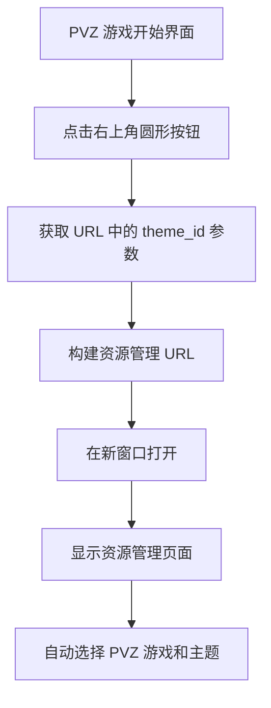

# PVZ 游戏内资源管理按钮 - 功能说明

## 📋 功能概述

在**植物大战僵尸游戏的开始界面**（TitleScene）右上角添加了一个圆形悬浮按钮，点击后可在新窗口打开资源管理页面。

## 🎯 实现位置

### 游戏场景文件
**文件**: `kids-game-house/games/pvz/src/scenes/TitleScene.js`

**修改内容**:
- ✅ 在 TitleScene 的 create() 方法中添加资源管理按钮
- ✅ 使用 Phaser 3 API 创建圆形按钮和图标
- ✅ 添加悬停动画效果
- ✅ 点击后在新窗口打开资源管理页面

## 🚀 使用方法

### 访问方式

1. **启动 PVZ 游戏**
   ```
   http://localhost:5173/game/pvz
   ```

2. **查看游戏开始界面**
   - 会看到"🌻 植物大战僵尸 🧟"标题
   - 右上角有一个蓝色圆形按钮 🖼️

3. **点击按钮**
   - 在新窗口打开资源管理页面
   - 自动传递 gameId=pvz 和 themeId 参数

## 💡 工作流程



## 🎨 界面效果

### 按钮样式
- **形状**: 圆形 (直径 50px)
- **颜色**: 天蓝色 (#48dbfb) + 深蓝色边框 (#0abde3)
- **图标**: 🖼️ emoji (24px)
- **位置**: 右上角 (距离右边 20px, 距离顶部 20px)
- **提示文本**: "资源管理" (白色, 12px)

### 交互动画
- **悬停**: 
  - 颜色变浅 (#6be4ff)
  - 放大到 1.1 倍
- **移出**: 
  - 恢复原色 (#48dbfb)
  - 恢复原大小 (1.0 倍)

### 视觉效果
```
┌─────────────────────────────────────┐
│                              [🖼️]   │ ← 资源管理按钮
│                             资源管理  │
│                                     │
│       🌻 植物大战僵尸 🧟            │
│       Plants vs. Zombies            │
│                                     │
│         [  开始游戏  ]              │
│                                     │
│   点击「开始游戏」进入战斗          │
└─────────────────────────────────────┘
```

## 📝 代码示例

### 按钮创建

```javascript
// 资源管理按钮（右上角）
const resourceBtnSize = 50
const resourceBtnX = W - resourceBtnSize - 20
const resourceBtnY = 20

// 按钮背景（圆形）
const resourceBtn = this.add.circle(resourceBtnX, resourceBtnY, resourceBtnSize / 2, 0x48dbfb)
  .setStrokeStyle(2, 0x0abde3)
  .setInteractive({ useHandCursor: true })
  .setScrollFactor(0) // 固定位置，不随相机滚动

// 按钮图标
const resourceIcon = this.add.text(resourceBtnX, resourceBtnY, '🖼️', {
  font: '24px sans-serif'
}).setOrigin(0.5).setScrollFactor(0)
```

### 交互事件

```javascript
// 悬停效果
resourceBtn.on('pointerover', () => {
  resourceBtn.setFillStyle(0x6be4ff)
  resourceBtn.setScale(1.1)
})

resourceBtn.on('pointerout', () => {
  resourceBtn.setFillStyle(0x48dbfb)
  resourceBtn.setScale(1)
})

// 点击事件 - 打开资源管理页面
resourceBtn.on('pointerdown', () => {
  console.log('[PVZ] 点击资源管理按钮')
  
  // 获取当前主题 ID
  const urlParams = new URLSearchParams(window.location.search)
  const themeId = urlParams.get('theme_id') || 'default'
  
  // 构建资源管理页面 URL
  const resourceManagerUrl = `/admin/game-resources?gameId=pvz&themeId=${themeId}`
  
  console.log('[PVZ] 跳转到:', resourceManagerUrl)
  
  // 在新窗口打开资源管理页面
  window.open(resourceManagerUrl, '_blank')
})
```

### 提示文本

```javascript
// 添加提示文本
const resourceTip = this.add.text(resourceBtnX, resourceBtnY + resourceBtnSize / 2 + 15, '资源管理', {
  font: '12px sans-serif',
  fill: '#FFFFFF'
}).setOrigin(0.5).setScrollFactor(0)
```

## 🔧 自定义配置

### 修改按钮位置

编辑 `TitleScene.js`：

```javascript
const resourceBtnX = W - resourceBtnSize - 20  // 调整水平位置
const resourceBtnY = 20                         // 调整垂直位置
```

### 修改按钮大小

```javascript
const resourceBtnSize = 50  // 调整按钮直径
```

### 修改按钮颜色

```javascript
// 默认颜色
const resourceBtn = this.add.circle(..., 0x48dbfb)  // 修改为天蓝色
  .setStrokeStyle(2, 0x0abde3)                       // 修改边框颜色

// 悬停颜色
resourceBtn.on('pointerover', () => {
  resourceBtn.setFillStyle(0xff6b6b)  // 修改为红色
})
```

### 修改图标

```javascript
const resourceIcon = this.add.text(resourceBtnX, resourceBtnY, '⚙️', {
  font: '24px sans-serif'
})
```

### 修改跳转方式

如果想在当前窗口打开而不是新窗口：

```javascript
resourceBtn.on('pointerdown', () => {
  // 在当前窗口打开
  window.location.href = resourceManagerUrl
})
```

## 🐛 常见问题

### Q1: 看不到按钮？

**可能原因**:
- 游戏未正确加载
- Phaser 渲染问题
- 浏览器缓存

**解决方案**:
1. 强制刷新浏览器 (`Ctrl + Shift + R`)
2. 检查浏览器控制台是否有错误
3. 确认游戏已正确启动

### Q2: 点击按钮没有反应？

**可能原因**:
- JavaScript 错误
- URL 参数解析失败

**解决方案**:
1. 打开浏览器控制台 (F12)
2. 查看是否有 `[PVZ]` 开头的日志
3. 检查错误信息

### Q3: 按钮遮挡了其他元素？

**解决方案**:
调整按钮位置：

```javascript
const resourceBtnX = W - resourceBtnSize - 40  // 向左移动
const resourceBtnY = 40                         // 向下移动
```

### Q4: 如何在游戏中其他场景也添加按钮？

**解决方案**:
在其他 Scene 的 `create()` 方法中添加相同的代码：

```javascript
// 在 PlayScene.js 或 OverScene.js 中
create() {
  // ... 原有代码
  
  // 添加资源管理按钮（复制 TitleScene 中的代码）
  const resourceBtnSize = 50
  // ... 其余代码
}
```

## 📊 技术要点

### 1. setScrollFactor(0)
```javascript
.setScrollFactor(0)
```
这个设置确保按钮固定在屏幕上，不会随着游戏相机滚动而移动。

### 2. URL 参数获取
```javascript
const urlParams = new URLSearchParams(window.location.search)
const themeId = urlParams.get('theme_id') || 'default'
```
从 iframe 的 URL 中提取主题 ID 参数。

### 3. 新窗口打开
```javascript
window.open(resourceManagerUrl, '_blank')
```
使用 `_blank` 在新窗口/标签页打开，不影响游戏运行。

### 4. 交互式对象
```javascript
.setInteractive({ useHandCursor: true })
```
启用鼠标悬停时显示手型光标，提升用户体验。

## 🎯 与其他方案对比

| 方案 | 位置 | 优点 | 缺点 |
|------|------|------|------|
| **Vue 外层悬浮按钮** | iframe 外层 | 实现简单 | 不在游戏内部 |
| **游戏模式选择界面** | Vue 组件 | 易于维护 | 不是游戏运行时 |
| **✅ 游戏内 TitleScene** | Phaser 场景内 | 沉浸式体验 | 需要修改游戏代码 |

## 📝 相关文件

- ✏️ `kids-game-house/games/pvz/src/scenes/TitleScene.js` - 添加按钮
- 📄 `GAME_RESOURCE_FLOAT_BUTTON.md` - Vue 外层按钮说明
- 📄 `GAME_RESOURCE_BUTTON_FEATURE.md` - 模式选择界面按钮说明
- 📄 `RESOURCE_MANAGER_PERMISSION_UPDATE.md` - 权限调整说明

## 🎉 总结

通过这个实现：
- ✅ 按钮位于游戏内部的开始界面
- ✅ 沉浸式游戏体验
- ✅ 自动传递游戏和主题参数
- ✅ 美观的交互动画
- ✅ 新窗口打开，不影响游戏

---

**添加时间**: 2026-04-13  
**版本**: 1.0.0  
**状态**: ✅ 已完成  
**位置**: PVZ 游戏 TitleScene 右上角
