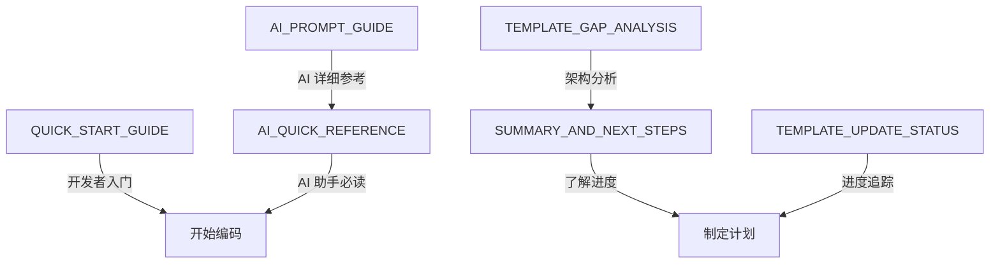

# 📚 Game Template 完整文档索引

## 🎯 快速导航

### 对于开发者
1. **[QUICK_START_GUIDE.md](./QUICK_START_GUIDE.md)** - ⭐ **从这里开始！**
   - 新增组件说明
   - 集成步骤（路由 + 占位符）
   - 测试验证流程
   - 常见问题解答

2. **[SUMMARY_AND_NEXT_STEPS.md](./SUMMARY_AND_NEXT_STEPS.md)** - 项目状态和计划
   - 已完成工作总结
   - 待完成任务分解（P0/P1/P2）
   - 时间估算和建议

---

### 对于 AI 助手
1. **[AI_QUICK_REFERENCE.md](./AI_QUICK_REFERENCE.md)** - ⭐ **AI 必背卡片**
   - 30 秒速查表
   - 标准实现模式
   - 三大禁忌
   - 代码生成检查清单

2. **[AI_PROMPT_GUIDE.md](./AI_PROMPT_GUIDE.md)** - AI 详细指南
   - 核心原则和优先级
   - 标准提示词模板
   - 关键概念解释
   - 常见错误及纠正
   - 培训示例

---

### 对于架构师/技术负责人
1. **[TEMPLATE_GAP_ANALYSIS.md](./TEMPLATE_GAP_ANALYSIS.md)** - 对比分析报告
   - 贪吃蛇 vs 模板的详细对比
   - 缺失功能清单
   - 修复方案（方案 A/B）
   - 实施建议

2. **[TEMPLATE_UPDATE_STATUS.md](./TEMPLATE_UPDATE_STATUS.md)** - 进度报告
   - 已完成工作详情
   - 待完成工作清单
   - 模板占位符表格
   - 实施检查清单

---

## 📖 阅读顺序建议

### 新手开发者
```
QUICK_START_GUIDE.md
    ↓
SUMMARY_AND_NEXT_STEPS.md
    ↓
开始编码实现
```

### AI 助手（新接入）
```
AI_QUICK_REFERENCE.md (打印贴显示器旁)
    ↓
AI_PROMPT_GUIDE.md (遇到问题时查阅)
    ↓
开始生成代码
```

### 技术负责人
```
TEMPLATE_GAP_ANALYSIS.md
    ↓
TEMPLATE_UPDATE_STATUS.md
    ↓
评估进度和调整计划
```

---

## 🔍 按主题查找

### 组件使用
- LoadingView → QUICK_START_GUIDE.md §1.1
- GameSettingsPanel → QUICK_START_GUIDE.md §1.2
- GameConfigModal → QUICK_START_GUIDE.md §1.3

### 集成步骤
- 路由配置 → QUICK_START_GUIDE.md §2
- 占位符替换 → QUICK_START_GUIDE.md §2
- 测试验证 → QUICK_START_GUIDE.md §3

### AI 规范
- 标准模式 → AI_QUICK_REFERENCE.md §2
- 常见错误 → AI_QUICK_REFERENCE.md §3
- 检查清单 → AI_QUICK_REFERENCE.md §5

### 架构设计
- 对比分析 → TEMPLATE_GAP_ANALYSIS.md §2
- 修复方案 → TEMPLATE_GAP_ANALYSIS.md §5
- 实施建议 → TEMPLATE_GAP_ANALYSIS.md §7

---

## 💡 使用技巧

### 快速找到答案
1. **组件怎么用？** → 查看 QUICK_START_GUIDE.md 的"新增组件说明"
2. **路由怎么配？** → 查看 QUICK_START_GUIDE.md 的"集成步骤"
3. **AI 怎么写代码？** → 查看 AI_QUICK_REFERENCE.md 的"标准实现模式"
4. **为什么有问题？** → 查看 AI_QUICK_REFERENCE.md 的"三大禁忌"

### 团队协作
- **新人入职**: 发送 QUICK_START_GUIDE.md
- **AI 调教**: 将 AI_QUICK_REFERENCE.md 添加到 system prompt
- **进度追踪**: 每周 review TEMPLATE_UPDATE_STATUS.md
- **质量保证**: 代码审查时对照 AI_QUICK_REFERENCE.md 的检查清单

---

## 📊 文档关系图



---

## 🎓 学习路径

### Level 1: 入门（1 小时）
- ✅ 阅读 QUICK_START_GUIDE.md
- ✅ 打印 AI_QUICK_REFERENCE.md
- ✅ 运行示例项目

### Level 2: 进阶（2-3 小时）
- ✅ 完成 SUMMARY_AND_NEXT_STEPS.md 中的 P0 任务
- ✅ 研究 AI_PROMPT_GUIDE.md 中的示例
- ✅ 创建一个简单的测试游戏

### Level 3: 精通（1 天）
- ✅ 阅读 TEMPLATE_GAP_ANALYSIS.md 理解架构设计
- ✅ 完成所有 P1/P2 任务
- ✅ 能够为团队编写自定义指南

---

## 🔗 外部资源

- **Vue 3 官方文档**: https://cn.vuejs.org/
- **TypeScript 手册**: https://www.typescriptlang.org/zh/docs/
- **Phaser 3 文档**: https://photonstorm.github.io/phaser3-docs/
- **Tailwind CSS**: https://tailwindcss.com/docs

---

## 📞 获取帮助

遇到问题时的排查顺序：

1. **查看 QUICK_START_GUIDE.md** 的"常见问题"章节
2. **检查 AI_QUICK_REFERENCE.md** 的"三大禁忌"
3. **搜索 AI_PROMPT_GUIDE.md** 是否有类似场景
4. **在团队群提问**（附上错误信息和已尝试的方案）

---

## 📝 更新日志

### v1.0 - 2026-03-29
- ✅ 创建 3 个核心组件（LoadingView / GameSettingsPanel / GameConfigModal）
- ✅ 创建 4 份基础文档（分析报告/进度报告/快速指南/总结计划）
- ✅ 创建 2 份 AI 指南（详细版/快速版）
- ✅ 完成文档索引（本文档）

### 待更新
- [ ] 补充视频教程链接
- [ ] 添加更多代码示例
- [ ] 完善故障排查手册

---

**最后更新**: 2026-03-29  
**维护者**: AI Assistant Team  
**版本**: v1.0
