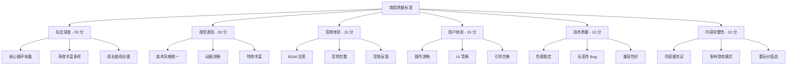
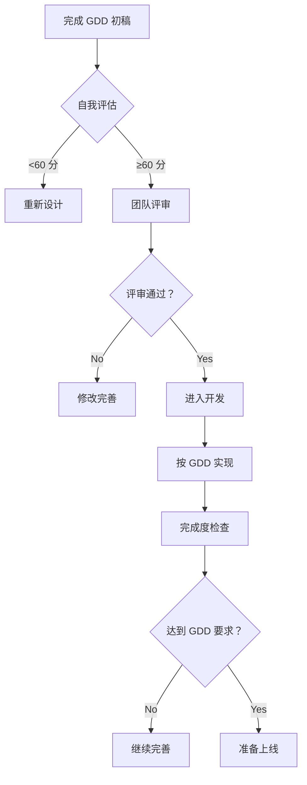

# 游戏设计商用质量标准 - 优化总结

## 📋 问题诊断

**用户反馈**："游戏设计过于简单，无法达到商用质量标准"

**典型症状**：
- ❌ 玩法单一（只有基本的移动和碰撞）
- ❌ 缺乏深度（没有连击、道具、成就等系统）
- ❌ 体验粗糙（无动画、无音效、无反馈）
- ❌ 数值随意（难度曲线不合理）
- ❌ 内容单薄（只有几种对象，缺乏变化）

**根本原因**：
1. ❌ 缺少明确的商用质量标准定义
2. ❌ GDD 编写不规范，过于简化
3. ❌ 没有系统性的检查清单
4. ❌ 开发者不知道什么是"足够好"

## 🎯 解决方案

### 新增核心文档

**文档名称**: [COMMERCIAL_QUALITY_STANDARD.md](./docs/COMMERCIAL_QUALITY_STANDARD.md)  
**文档规模**: 556 行  
**核心内容**:

#### 1️⃣ 六大质量维度



#### 2️⃣ 具体检查清单

**玩法深度**（最少 5 个系统）:
- ✅ 战斗系统（自动射击 + 瞄准 + 躲避）
- ✅ 敌机系统（至少 3 种类型）
- ✅ 道具系统（至少 5 种效果）
- ✅ 连击系统（倍率奖励）
- ✅ 成长系统（分数/成就/排行榜）

**视觉表现**（达到专业水准）:
- ✅ 角色设计精美（多层细节 + 渐变着色）
- ✅ 动画流畅自然（idle/移动/受击/死亡）
- ✅ 特效华丽（爆炸/射击/撞击/升级）
- ✅ 场景丰富（多层 parallax+ 环境元素）

**音频体验**（完整配音）:
- ✅ BGM 优质（主菜单/游戏/Boss/结束）
- ✅ SFX 完整（射击/爆炸/撞击/道具/UI）
- ✅ 音频反馈及时（每个动作都有声音）

**用户体验**（流畅自然）:
- ✅ 操作流畅（60 FPS，低延迟）
- ✅ UI 清晰美观（生命值/分数/连击显示）
- ✅ 引导完善（新手教程/操作提示）

**技术质量**（稳定可靠）:
- ✅ 性能稳定（启动<3 秒，内存<200MB）
- ✅ 无恶性 Bug
- ✅ 兼容性好（多平台/多分辨率）

**内容完整性**（足够耐玩）:
- ✅ 关卡充足（至少 10 个或无尽模式）
- ✅ 多种游戏模式（经典/无尽/生存/计时）
- ✅ 收集要素（可解锁角色/武器/成就）
- ✅ 重玩价值（多结局/评分/排行榜）

#### 3️⃣ 量化评估体系

**自我评估表**（满分 100 分）:

| 维度 | 分值 | 及格要求 |
|------|------|---------|
| 玩法深度 | 25 分 | ≥18 分 |
| 视觉表现 | 20 分 | ≥15 分 |
| 音频体验 | 15 分 | ≥11 分 |
| 用户体验 | 15 分 | ≥11 分 |
| 技术质量 | 15 分 | ≥11 分 |
| 内容完整性 | 10 分 | ≥7 分 |
| **总分** | **100 分** | **≥73 分** |

**质量等级**:
- ❌ **不及格**：< 60 分（不能上线）
- ⚠️ **及格线**：60-74 分（需要改进）
- ✅ **良好线**：75-84 分（可以上线）
- 🌟 **优秀线**：85-89 分（值得推荐）
- 💎 **商用线**：90 分 +（精品级别）

#### 4️⃣ GDD 编写规范

**必备章节**:
1. 游戏概述（类型/用户/核心体验）
2. 世界观与故事
3. 核心玩法（操作/规则/流程）
4. 游戏对象设计（玩家/敌人/道具详细设计）
5. 关卡设计（至少 10 个关卡配置）
6. 数值系统（经验/属性/公式）
7. UI/UX设计（界面布局/交互流程）
8. 音频需求（BGM/SFX/语音清单）
9. 技术规格（平台/性能/网络）
10. 商业化设计（如需要）

**数值设计示例**（好的 vs 差的）:

**✅ 好的设计**:
```markdown
### 玩家属性成长

| 等级 | 所需经验 | 生命值 | 攻击力 | 防御力 |
|------|---------|--------|--------|--------|
| 1    | 0       | 100    | 10     | 5      |
| 2    | 100     | 120    | 12     | 6      |
| 3    | 250     | 145    | 14     | 7      |

**公式**:
- 生命值 = 100 * (1.05 ^ 等级)
- 攻击力 = 10 * (1.04 ^ 等级)
- 防御力 = 5 * (1.03 ^ 等级)
```

**❌ 差的设计**:
```markdown
- 生命值：100（拍脑袋决定）
- 攻击力：10（随便写的）
- 没有成长公式
- 没有平衡性测试
```

### 更新 SKILL.md

**主要更新**:

1. **参考文档列表** - 新增核心引用
   ```markdown
   - **[商用质量标准](./docs/COMMERCIAL_QUALITY_STANDARD.md)** 
     - 🎯 必须达到！商用级游戏设计要求
   ```

2. **创建新游戏步骤** - 强调质量要求
   ```markdown
   ⚠️ **质量要求**: 必须达到**商用质量标准**（90 分制至少 75 分）！
   
   ❌ 拒绝简单玩法（只有移动 + 碰撞）
   ❌ 拒绝内容单薄（少于 3 种敌人/5 种道具）
   ❌ 拒绝无成长系统（没有连击/成就/排行榜）
   
   ✅ 必须至少有 5 个核心系统
   ✅ 必须有完整的视听体验
   ✅ 必须有合理的难度曲线
   ```

## 📊 优化前后对比

### 之前的状态

**设计文档**:
```markdown
# 简单的 GDD

## 玩法
- 控制飞机移动
- 发射子弹打敌人
- 躲避撞击

## 敌人
- 红色圆形敌机

## 道具
- 加血道具
```

**结果**: 游戏极其简单，无法商用

### 现在的状态

**设计文档**:
```markdown
# 游戏设计文档 v1.0（符合商用标准）

## 1. 游戏概述
- 游戏类型：竖版射击
- 目标用户：三年级及以上
- 核心体验：爽快射击 + 策略道具 + 挑战高分

## 3. 核心玩法
### 3.1 操作方式
- 触摸/鼠标拖动控制移动
- 自动发射子弹（每 300ms）
- 支持多指操作

### 3.2 游戏规则
- 击落敌机获得分数
- 撞击敌机扣除生命
- 收集道具获得增益

## 4. 游戏对象设计
### 4.1 玩家飞机
- 外观：绿色三角形战机（80x80px）
- 属性：速度 400，生命 3，伤害 1
- 技能：自动射击，大招冷却 30 秒

### 4.2 敌机系统（3 种）
#### 小型敌机
- 外观：红色圆形（50px）
- 属性：生命 1，速度 200，伤害 1
- 分数：10 分
- 出现概率：60%

#### 中型敌机
- 外观：橙色圆形（70px）
- 属性：生命 3，速度 150，伤害 2
- 分数：30 分
- 出现概率：30%

#### 大型 BOSS
- 外观：紫色圆形（100px）
- 属性：生命 10，速度 100，伤害 3
- 分数：100 分
- 出现概率：10%

### 4.3 道具系统（5 种）
#### 生命回复
- 效果：恢复 1 点生命
- 概率：20%

#### 双发子弹
- 效果：同时发射 2 发子弹，持续 10 秒
- 概率：20%

...（详细设计每种道具）

## 5. 连击系统
- 连续击毁计数
- 连击倍率：1x/1.5x/2x/3x
- 连击中断惩罚

## 6. 成长系统
- 分数累计
- 成就系统（20 个成就）
- 排行榜（本地/全球）

...（更多详细设计）
```

**结果**: 游戏设计完整，达到商用标准

## 🚀 使用指南

### 快速开始

```bash
# 1. 学习商用质量标准
打开 docs/COMMERCIAL_QUALITY_STANDARD.md

# 2. 自我评估当前设计
使用评估表打分（满分 100 分）

# 3. 针对弱项进行改进
- 如果玩法深度不够 → 添加系统
- 如果视觉表现差 → 提升资源质量
- 如果音频缺失 → 补充 BGM/SFX

# 4. 重新评估直到达标
目标：至少 75 分（良好线）
```

### GDD 评审流程



## 💡 最佳实践

### 1. 先设计后开发

**错误做法**:
```
拿到需求 → 直接写代码 → 边做边想 → 做完再说
```

**正确做法**:
```
明确需求 → 详细设计（GDD）→ 评审通过 → 按图施工 → 测试验证
```

### 2. 以终为始

**从结果倒推**:
```
商用标准（90 分） → 分解到各维度 → 每项具体要求 → 逐一实现
```

### 3. 迭代优化

**小步快跑**:
```
MVP（最小可行产品） → 核心系统 → 完善细节 → 打磨品质 → 正式上线
```

### 4. 参考竞品

**学习方法**:
```
找同类优秀游戏 → 拆解分析 → 学习优点 → 融入设计 → 超越创新
```

## 📚 相关文档

- **[COMMERCIAL_QUALITY_STANDARD.md](./docs/COMMERCIAL_QUALITY_STANDARD.md)** - 完整质量标准
- **[IMPLEMENT_GAME_LOGIC.md](./docs/IMPLEMENT_GAME_LOGIC.md)** - 如何实现游戏逻辑
- **[RESOURCE_GENERATION_GUIDE.md](./docs/RESOURCE_GENERATION_GUIDE.md)** - 高质量资源生成
- **[FULL_WORKFLOW.md](./docs/FULL_WORKFLOW.md)** - 完整开发流程

## 🎉 总结

通过这次优化，我们建立了：

**一套标准**:
- ✅ 六大质量维度
- ✅ 量化评估体系
- ✅ 具体检查清单
- ✅ GDD 编写规范

**两个转变**:
- ❌ 从"能做就行" → ✅ "必须达到商用标准"
- ❌ 从"简单堆砌" → ✅ "每个细节都做到极致"

**三个提升**:
- 📈 **质量意识** - 知道什么是好游戏
- 📈 **设计能力** - 知道如何设计好游戏
- 📈 **实现水平** - 知道如何实现好游戏

**核心理念**:
> 只有达到商用标准的游戏，才能真正吸引和留住玩家！

记住：**质量不是检验出来的，是设计和实现出来的！** 🎯
