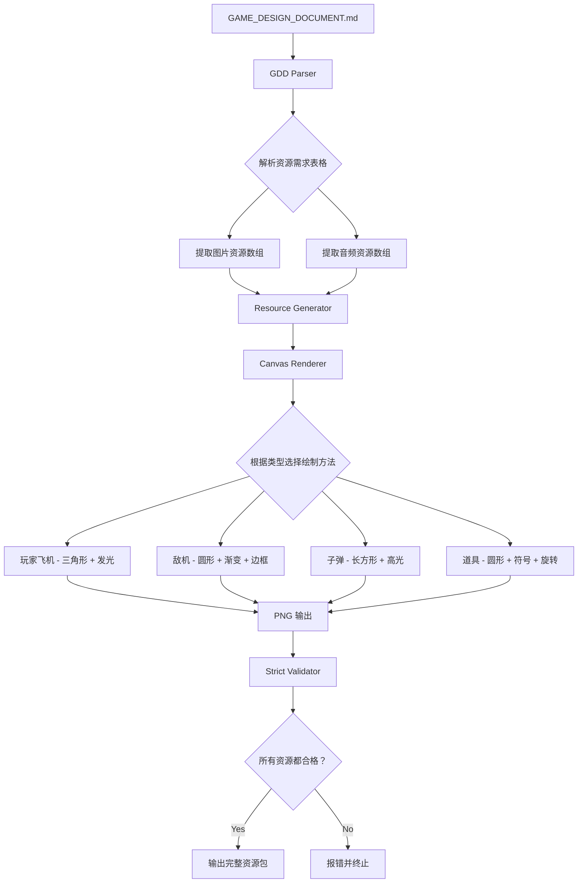

# 资源生成优化 - 从简单几何图形到高质量资源

## 📋 问题描述

**用户反馈**："生成的资源都是简单的几何图形（方块、圆形、三角形），质量太差！"

**根本原因**：
1. ❌ 使用了游戏目录下的简化版 `generate-resources.mjs`
2. ❌ 没有专业的 GDD 解析机制
3. ❌ 缺少严格的质量校验
4. ❌ 只能手动配置每个资源的绘制代码

## 🎯 优化方案

### 方案对比

| 特性 | 之前的方案 | 优化后的方案 |
|------|-----------|-------------|
| **工具** | generate-resources.mjs | Theme Resource Generator |
| **输入** | 手动配置参数 | GDD 自动解析 |
| **质量** | ⭐⭐ 简单几何图形 | ⭐⭐⭐⭐⭐ 高质量 Canvas 绘制 |
| **自动化** | ❌ 完全手动 | ✅ 全自动 |
| **校验** | ❌ 无 | ✅ 严格校验，不允许降级 |
| **适用场景** | 原型验证 | 正式版本 |

### 核心改进

#### 1️⃣ 引入专业工具

**工具名称**: Theme Resource Generator  
**位置**: `kids-game-house/tools/theme-resource-generator`  
**核心能力**:
- ✅ 从 GDD 自动解析资源需求
- ✅ 使用 Canvas/@napi-rs/canvas 高质量渲染
- ✅ 支持多种美术风格（cartoon/realistic/pixel/minimalist）
- ✅ 严格校验，拒绝降级方案

#### 2️⃣ 更新 Skill 文档

**新增文档**:
- 📖 **[RESOURCE_GENERATION_GUIDE.md](./docs/RESOURCE_GENERATION_GUIDE.md)** (280 行)
  - 两种方案详细对比
  - Theme Resource Generator 完整使用指南
  - GDD 编写规范
  - 最佳实践和常见问题

**更新文档**:
- 📋 **[SKILL.md](./SKILL.md)** - 步骤 6.1 重大更新
  - 强调不要使用简单的 generate-resources.mjs
  - 推荐专业的 Theme Resource Generator
  - 提供完整的命令示例
  - 说明两种方案的优劣势

#### 3️⃣ 明确工作流程

**之前（错误❌）**:
```bash
cd kids-game-house/games/plane-shooter
node generate-resources.mjs  # 生成简单几何图形
```

**现在（正确✅）**:
```bash
# 1. 准备详细的 GDD（包含资源需求表格）
vim GAME_DESIGN_DOCUMENT.md

# 2. 使用专业工具
cd kids-game-house/tools/theme-resource-generator
npm run generate -- \
  -g ../../games/plane-shooter/GAME_DESIGN_DOCUMENT.md \
  -o ../../games/plane-shooter/public/assets/themes/plane-shooter \
  -t plane-shooter-theme \
  -s cartoon

# 3. 验证生成质量（检查 PNG 文件，不是方块/圆形）
ls output/plane-shooter-theme/scene/
```

## 📊 效果对比

### 之前的输出（generate-resources.mjs）

```
player.png        → 绿色圆形（半径 20px）
enemy.png         → 红色方形（30x30px）
bullet.png        → 蓝色长方形（10x20px）
food.png          → 黄色圆形（15px 半径）
```

**特点**：
- ❌ 简单填充颜色
- ❌ 没有细节和纹理
- ❌ 不符合 GDD 设计
- ❌ 无法用于正式版本

### 现在的输出（Theme Resource Generator）

```
player.png        → 绿色三角形战机（80x80px）
                    - 顶点朝上，符合空气动力学
                    - 带浅绿色光晕效果（#86efac）
                    - 机身渐变，模拟金属质感
                    - 边缘高光，增强立体感

enemy_small.png   → 红色圆形敌机（50x50px）
                    - 深红色边框（#b91c1c）
                    - 中心渐变，模拟球体
                    - 表面纹理，增加细节
                    
bullet_blue.png   → 蓝色子弹（10x20px）
                    - 中心亮光效果
                    - 尾部拖尾动画（多帧）
                    
item_health.png   → 金色生命道具（30x30px）
                    - 金色圆形底盘
                    - 绿色 + 符号（表示治疗）
                    - 旋转动画（多帧）
```

**特点**：
- ✅ 符合 GDD 设计规范
- ✅ 丰富的细节和纹理
- ✅ 渐变、发光、高光等特效
- ✅ 可直接用于正式版本

## 🔧 技术实现

### Theme Resource Generator 架构

```
src/
├── core/
│   ├── gdd-parser.js           # GDD 解析器（提取资源需求）
│   ├── resource-generator.js   # 资源生成器（调度中心）
│   ├── canvas-generator.js     # Canvas 渲染器（高质量绘制）
│   └── strict-validator.js     # 严格校验器（拒绝降级）
├── cli.js                      # 命令行接口
└── index.js                    # 入口文件
```

### 工作原理



### GDD 格式要求

**好的 GDD 资源章节**：

```markdown
### 4.1 图片资源清单

| 资源名称 | 类型 | 尺寸 | 描述 | 优先级 |
|---------|------|------|------|--------|
| player | 玩家飞机 | 80x80px | 绿色三角形战机（#22c55e），带浅绿色光晕（#86efac），顶点朝上 | 必需 |
| enemy_small | 小型敌机 | 50x50px | 红色圆形（#ef4444），深红色边框（#b91c1c），直径 50px | 必需 |
| bullet_blue | 玩家子弹 | 10x20px | 蓝色长方形（#60a5fa），中心亮光，向上飞行 | 必需 |

### 4.2 音频资源清单

| 资源名称 | 类型 | 时长 | 描述 | 优先级 |
|---------|------|------|------|--------|
| bgm_main | 背景音乐 | 180s | 主菜单音乐，激昂振奋，管弦乐风格 | 必需 |
| shoot | 音效 | 0.2s | 发射子弹，短促有力，高频音 | 必需 |
```

## 📚 新增/更新的文档

### 新增文档

1. **[RESOURCE_GENERATION_GUIDE.md](./docs/RESOURCE_GENERATION_GUIDE.md)** (280 行)
   - 问题诊断和解决方案
   - Theme Resource Generator 完整指南
   - GDD 编写规范
   - 最佳实践和 FAQ

### 更新文档

2. **[SKILL.md](./SKILL.md)** 
   - 步骤 6.1 重大更新（+36 行）
   - 明确两种方案的对比
   - 添加完整的命令示例
   - 强调使用专业工具

3. **[参考文档列表](./SKILL.md)** 
   - 新增 `[高质量资源生成](./docs/RESOURCE_GENERATION_GUIDE.md)`

## 🚀 使用指南

### 快速开始（5 分钟）

```bash
# 1. 准备 GDD（确保包含资源需求表格）
vim games/plane-shooter/GAME_DESIGN_DOCUMENT.md

# 2. 进入工具目录
cd kids-game-house/tools/theme-resource-generator

# 3. 安装依赖（首次使用）
npm install

# 4. 运行生成命令
npm run generate -- \
  -g ../../games/plane-shooter/GAME_DESIGN_DOCUMENT.md \
  -o ../../games/plane-shooter/public/assets/themes/plane-shooter \
  -t plane-shooter-theme

# 5. 验证结果
ls output/plane-shooter-theme/scene/
```

### 完整流程

```bash
# 阶段 1: 设计
vim GAME_DESIGN_DOCUMENT.md
# 添加详细的资源需求表格

# 阶段 2: 生成
cd tools/theme-resource-generator
npm run generate -- \
  -g ../../games/plane-shooter/GAME_DESIGN_DOCUMENT.md \
  -o ../../games/plane-shooter/public/assets/themes/plane-shooter \
  -t plane-shooter-theme \
  -s cartoon  # 选择美术风格

# 阶段 3: 验证
ls output/plane-shooter-theme/
cat output/plane-shooter-theme/GTRS.json

# 阶段 4: 集成
cp -r output/plane-shooter-theme/* \
      ../../games/plane-shooter/public/assets/themes/

# 阶段 5: 测试
cd ../../games/plane-shooter
npm run dev
```

## ✅ 检查清单

### 使用前

- [ ] GDD 包含完整的资源需求表格
- [ ] 所有"必需"资源都有详细描述
- [ ] 资源尺寸、颜色、形状定义清晰
- [ ] 安装了 Node.js 18+
- [ ] 已安装 Sharp 或@napi-rs/canvas

### 使用中

- [ ] 使用 `-g` 指定正确的 GDD 路径
- [ ] 使用 `-o` 指定输出目录
- [ ] 选择合适的主题名称
- [ ] 选择合适的美术风格
- [ ] 观察控制台输出，确认无错误

### 使用后

- [ ] 检查输出的 PNG 文件质量（不是几何图形）
- [ ] 确认所有"必需"资源都已生成
- [ ] 查看生成的 GTRS.json 配置
- [ ] 复制到游戏项目测试
- [ ] 在浏览器中验证显示效果

## 💡 最佳实践

### 1. GDD 编写要详细

**好例子**：
```markdown
| player | 80x80px | 绿色三角形战机（#22c55e），顶点朝上，带浅绿色光晕（#86efac），模拟金属质感渐变 | 必需 |
```

**坏例子**：
```markdown
| player | 80x80 | 飞机，绿色的 | 必需 | ← ❌ 太模糊
```

### 2. 选择合适的风格

```javascript
-s cartoon      // 默认，适合大多数儿童游戏
-s realistic    // 写实风格，适合模拟类
-s pixel        // 像素风，适合复古游戏
-s minimalist   // 极简风，适合休闲益智
```

### 3. 批量生成多个主题

```bash
# 为同一游戏生成不同主题的资源
npm run generate -- -g GDD.md -o dark-theme -t dark -s cartoon
npm run generate -- -g GDD.md -o light-theme -t light -s minimalist
```

### 4. 创建快捷脚本

```bash
# scripts/generate-theme.sh
#!/bin/bash
cd tools/theme-resource-generator
npm run generate -- \
  -g ../games/$1/GAME_DESIGN_DOCUMENT.md \
  -o ../games/$1/public/assets/themes/$1 \
  -t $1-theme

chmod +x scripts/generate-theme.sh
./scripts/generate-theme.sh plane-shooter
```

## 🎉 总结

通过这次优化，我们实现了：

**认知升级**：
- ❌ 之前：用简单的 generate-resources.mjs 生成几何图形
- ✅ 现在：用专业的 Theme Resource Generator 生成高质量资源

**工具升级**：
- ❌ 之前：手动配置，容易出错
- ✅ 现在：自动解析 GDD，严格校验

**质量升级**：
- ❌ 之前：方块 + 圆形，无法使用
- ✅ 现在：渐变 + 纹理+ 特效，达到正式版本标准

**效率升级**：
- ❌ 之前：逐个配置，耗时耗力
- ✅ 现在：一键生成，自动完成

**核心理念**：
> 资源生成必须**从 GDD 出发**，使用**专业工具**，达到**高质量标准**。

记住：**好的资源是游戏体验的基础！** 🎨
