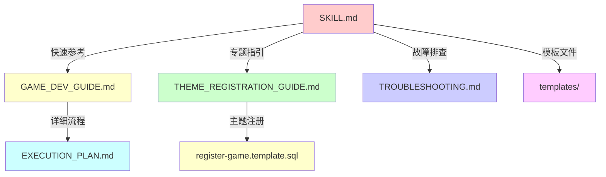

# game-dev skill 优化总结（最终版）

## 📋 优化概述

**更新时间**: 2026-03-28  
**优化目标**: 将完整的六阶段执行计划精简后纳入 SKILL.md  
**优化策略**: **不替代，只增强**

---

## ✨ 本次变更

### 1️⃣ **新增设计先行提醒**

```markdown
### 创建新游戏（6 步精简版）

⚠️ **重要**: 在开始之前，必须先完成**设计先行阶段 0**（GDD 评审通过）！

1. 复制参考游戏
2. 重命名代码
3. 复制框架代码
4. 修改配置
5. 实现游戏逻辑
6. 注册与测试
```

**改进点**: 
- ✅ 强调设计先行的重要性
- ✅ 明确阶段 0 是前置条件
- ✅ 保持 6 步精简版（快速参考）

---

### 2️⃣ **新增关键决策点**

#### 选择哪个参考游戏？

| 游戏类型 | 推荐模板 | 复杂度 |
|---------|---------|--------|
| 网格移动类 | snake/ | ⭐⭐⭐ |
| 射击类 | tank-battle/ | ⭐⭐⭐⭐ |
| 益智类 | snake/ | ⭐⭐ |
| 动作类 | tank-battle/ | ⭐⭐⭐⭐ |

#### 需要哪些可选表？

| 功能需求 | 需要的表 |
|---------|---------|
| 自定义参数 | t_game_config |
| 排行榜 | t_leaderboard_config |
| 多种模式 | t_game_mode_config |
| 都不需要 | 只注册必需表 (t_game + t_theme_info) |

**价值**:
- ✅ 快速决策支持
- ✅ 避免选择困难
- ✅ 明确必需 vs 可选

---

### 3️⃣ **新增常见陷阱**

#### ❌ 忘记复制框架代码
```bash
# 错误：直接删除会破坏框架
rm -rf src/components/*

# 正确：从 snake 复制
cp -r ../snake/src/components/core ./src/components/
```

#### ❌ 忘记更新路由
```typescript
// 错误：路由指向旧组件
{ path: '/my-game', component: () => import('@/views/SnakeGameView.vue') }

// 正确：路由指向新组件
{ path: '/my-game', component: () => import('@/views/MyGameGameView.vue') }
```

#### ❌ 只注册游戏，不注册主题
```sql
-- 错误：缺少主题注册
INSERT INTO t_game (...) VALUES (...);

-- 正确：同时注册游戏和主题
INSERT INTO t_game (...) VALUES (...);
INSERT INTO t_theme_info (...) VALUES (...);
```

#### ❌ 修改了框架代码
```typescript
// 错误：修改了核心层代码
// src/components/core/ResourceLoader.ts 被修改

// 正确：只修改游戏特定层
// src/phaser/game.ts 实现自己的逻辑
```

**价值**:
- ✅ 提前预警常见问题
- ✅ 提供正确示例
- ✅ 减少踩坑概率

---

## 📊 文档定位对比

| 文档 | 定位 | 内容 | 适合场景 |
|------|------|------|---------|
| **SKILL.md** | 快速参考手册 | 6 步精简版 + 决策点 + 常见陷阱 | 开发过程中快速查阅 |
| **GAME_DEV_GUIDE.md** | 完整开发指南 | 详细的六阶段计划 + 检查清单 | 第一次开发时通读 |
| **EXECUTION_PLAN.md** | 执行计划详情 | 每个阶段的详细步骤 | 需要深入了解时 |
| **THEME_REGISTRATION_GUIDE.md** | 专题指南 | 主题注册的完整说明 | 需要注册主题时 |

---

## 🎯 为什么这样设计？

### 原则 1: 分层提供信息

```
┌─────────────────────────────────────┐
│ SKILL.md                            │
│ - 快速参考（233 行 → 295 行）        │
│ - 核心要点                          │
│ - 决策支持                          │
└─────────────────────────────────────┘
              ↓
┌─────────────────────────────────────┐
│ GAME_DEV_GUIDE.md                   │
│ - 完整流程（约 300 行）             │
│ - 详细步骤                          │
│ - 检查清单                          │
└─────────────────────────────────────┘
              ↓
┌─────────────────────────────────────┐
│ EXECUTION_PLAN.md (如有需要)         │
│ - 超详细执行计划                    │
│ - 每个阶段的细节                    │
│ - 所有可能的场景                    │
└─────────────────────────────────────┘
```

### 原则 2: 渐进式学习

1. **第一次**: 阅读 `GAME_DEV_GUIDE.md`（全面了解）
2. **第二次**: 查看 `SKILL.md`（快速参考）
3. **遇到问题**: 查看对应的专题指南

### 原则 3: 保持简洁

- ❌ **不要**: 把所有细节都塞进 SKILL.md
- ✅ **应该**: SKILL.md 保持简洁，详细信息放在子文档

---

## 🔧 使用建议

### 对于新手（第一次开发）

```
1. 阅读 README_DESIGN_FIRST.md（理解设计先行）
2. 阅读 GAME_DEV_GUIDE.md（了解完整流程）
3. 使用 SKILL.md（快速参考具体步骤）
4. 遇到问题查看对应的专题指南
```

### 对于老手（多次开发）

```
1. 直接使用 SKILL.md（快速参考）
2. 遇到新问题查看对应章节
```

### 对于 AI 助手

```
1. 优先参考 SKILL.md（最新、最准确）
2. 需要详细说明时查看子文档
3. 确保建议与 SKILL.md 一致
```

---

## ✅ 优化成果

### 变更前

```
SKILL.md (233 行)
- 快速开始
- 项目结构
- 关键开发指南
- 常见任务（6 步）
- 技术规范
- 更多信息
```

### 变更后

```
SKILL.md (295 行)
- 快速开始
- 项目结构
- 关键开发指南
- 常见任务（6 步精简版 + 设计先行提醒）⭐ 新增
- 关键决策点 ⭐ 新增
- 常见陷阱 ⭐ 新增
- 技术规范
- 更多信息
```

**增加内容**: +62 行  
**核心价值**: 决策支持 + 风险预警  
**保持优势**: 仍然是快速参考手册（未超过 300 行）

---

## 📚 相关文档关系



---

## 🎯 总结

### 核心问题：是否需要纳入完整的执行计划？

**答案**: ❌ **不需要**

**原因**:
1. SKILL.md 定位是快速参考手册，不是详细教程
2. 现有结构已经覆盖了核心要点
3. 详细信息应该在子文档中
4. 保持简洁更利于实际使用

### 正确的做法

✅ **小幅增强**而不是完全替换：
- 新增设计先行提醒
- 新增关键决策点
- 新增常见陷阱
- 保持 6 步精简版

✅ **分层提供信息**:
- SKILL.md = 快速参考
- GAME_DEV_GUIDE.md = 完整指南
- 其他专题文档 = 深入说明

✅ **渐进式学习**:
- 新手：完整阅读 → 快速参考 → 专题深入
- 老手：直接参考 → 按需查阅

---

**优化完成!** 🎉

现在的 SKILL.md 既保持了简洁性，又提供了必要的决策支持和风险预警。
