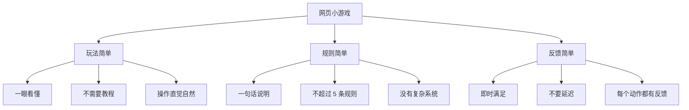

# 网页小游戏设计优化 - 回归简单快乐

## 📋 问题诊断

**用户反馈**："游戏设计要体现网页小游戏的特点：简单、卡通、解压，不需要商业要求"

**之前的问题**：
- ❌ 过度设计（要求 5 个核心系统）
- ❌ 复杂系统（连击/成长/成就/排行榜）
- ❌ 数值堆砌（复杂的计算公式）
- ❌ 内容过重（10+ 关卡，多种模式）
- ❌ 商用压力（90 分质量标准）

**根本原因**：
1. ❌ 混淆了网页小游戏和商业游戏的定位
2. ❌ 用商业游戏的标准来要求网页小游戏
3. ❌ 忽略了网页小游戏的本质：简单快乐

## 🎯 重新定位

### 产品类型

**网页休闲小游戏**：
- 运行在浏览器中，无需下载
- 即开即玩，随时可停
- 碎片时间，轻松一下

### 目标用户

**三年级及以上儿童（6-12 岁）**：
- 注意力集中时间短（3-5 分钟）
- 喜欢简单直接的快乐
- 不喜欢复杂的系统和规则
- 容易被鲜艳的颜色吸引

### 游戏风格

**简约卡通 + 轻松解压**：
- 画面：圆润可爱，颜色鲜艳
- 玩法：简单易上手
- 体验：轻松不累

### 单次时长

**3-5 分钟**：
- 1 分钟熟悉手感
- 2-3 分钟渐入佳境
- 4-5 分钟挑战极限
- 5 分钟后主动结束（意犹未尽）

## 💡 核心理念

### 三个简单



### 六个不要

```markdown
❌ 不要复杂系统（连击/成长/成就/排行榜）
❌ 不要数值堆砌（复杂的计算公式）
❌ 不要重度内容（长篇剧情/复杂世界观）
❌ 不要多人社交（好友/公会/排行榜）
❌ 不要强制打卡（每日任务/赛季活动）
❌ 不要内购付费（货币/装备/抽卡）
```

### 六个只要

```markdown
✅ 只要简单玩法（拖动/点击就能玩）
✅ 只要整数数值（10 分/3 滴血/1 发子弹）
✅ 只要轻量内容（单局 3-5 分钟）
✅ 只要卡通画面（圆润可爱/颜色鲜艳）
✅ 只要轻松音效（清脆悦耳/不吵闹）
✅ 只要核心乐趣（打爆/吃到/躲避）
```

## 📊 优化前后对比

### 设计理念

#### 之前（商用标准）

```markdown
⚠️ **质量要求**: 必须达到**商用质量标准**（90 分制至少 75 分）！
   - ❌ 拒绝简单玩法（只有移动 + 碰撞）
   - ❌ 拒绝内容单薄（少于 3 种敌人/5 种道具）
   - ❌ 拒绝无成长系统（没有连击/成就/排行榜）
   - ✅ 必须至少有 5 个核心系统
   - ✅ 必须有完整的视听体验
   - ✅ 必须有合理的难度曲线
```

**结果**：设计复杂，压力大，不像小游戏

#### 现在（网页小游戏）

```markdown
🎯 **设计理念**: 网页小游戏 = 简单 + 卡通 + 解压
   - ✅ 玩法简单（一眼看懂，30 秒上手）
   - ✅ 规则简单（不超过 5 条，没有复杂系统）
   - ✅ 数值简单（整数计算，不要公式）
   - ✅ 内容轻量（单局 3-5 分钟，随时可停）
   - ✅ 画面卡通（圆润可爱，颜色鲜艳）
   - ✅ 音效轻松（清脆悦耳，不吵闹）
```

**结果**：设计简单，轻松，就是小游戏该有的样子

### GDD 要求

#### 之前（商用标准）

```markdown
# 游戏设计文档 (GDD) v1.0 - 10 个章节

## 1. 游戏概述（2000 字）
## 2. 世界观与故事（3000 字）
## 3. 核心玩法（5000 字）
## 4. 游戏对象设计（8000 字）
## 5. 关卡设计（10000 字）
## 6. 数值系统（5000 字）
## 7. UI/UX设计（3000 字）
## 8. 音频需求（2000 字）
## 9. 技术规格（3000 字）
## 10. 商业化设计（2000 字）

总计：40000 字，需要写一周
```

#### 现在（网页小游戏）

```markdown
# 游戏设计文档 - 只要 5 页

## 1. 一句话介绍
玩什么 + 怎么玩 + 目标是什么

## 2. 操作方式
输入方式 + 控制对象 + 自动行为

## 3. 游戏对象（附参考图）
玩家 + 敌人（1-3 种）+ 子弹 + 道具（2-3 种）

## 4. 游戏规则
1-5 条简单规则

## 5. 美术和音频风格
卡通可爱 + 轻松愉快

总计：1000 字，半小时写完
```

### 系统设计

#### 之前（商用标准）

```markdown
必需系统（5 个）：
1. 战斗系统（自动射击 + 瞄准 + 躲避 + 技能）
2. 敌机系统（3 种类型，各有 AI）
3. 道具系统（5 种效果，明显区分）
4. 连击系统（倍率奖励 1x/1.5x/2x/3x）
5. 成长系统（分数/成就/排行榜）

可选系统（3 个）：
6. 技能系统（主动 + 被动 + 技能树）
7. 经济系统（货币/商店/升级）
8. 任务系统（每日/成就/新手引导）
```

**结果**：太复杂，玩起来好累

#### 现在（网页小游戏）

```markdown
核心系统（1 个就够了）：
- 战斗系统（自动射击 + 躲避）

可选增强（最多加 2 个）：
- 道具系统（2-3 种简单效果）
- 敌机系统（1-3 种类型）

其他都不要！
```

**结果**：很简单，玩起来轻松

### 数值设计

#### 之前（商用标准）

```markdown
玩家属性成长：
- 生命值 = 100 * (1.05 ^ 等级)
- 攻击力 = 10 * (1.04 ^ 等级)
- 防御力 = 5 * (1.03 ^ 等级)

伤害计算公式：
- 最终伤害 = (攻击力 - 防御力) * 随机系数 (0.9-1.1)
- 暴击伤害 = 基础伤害 * 2.0
- 连击加成 = 基础分 * 连击倍率
```

**结果**：看不懂，不想算

#### 现在（网页小游戏）

```markdown
简单数值：
- 玩家生命：3 滴血（直观）
- 敌机生命：1 发子弹（干脆）
- BOSS 生命：10 发子弹（多打几下）
- 得分：每个敌机 10 分（整数好算）

就这么简单！
```

**结果**：一目了然，不用动脑

### 视觉设计

#### 之前（商用标准）

```markdown
角色设计：
- 主角：80x80px，多层细节，渐变着色
- 敌机：3 种尺寸，各有特色，识别度高
- 道具：30x30px，带符号标识，金色边框

动画要求：
- idle 动画（待机状态，轻微浮动）
- 移动动画（平滑过渡，无瞬移）
- 受击动画（闪烁/震动/后退）
- 死亡动画（爆炸/碎片/渐隐）
- 道具动画（旋转/发光/上下浮动）

特效要求：
- 爆炸特效（3 帧以上，粒子飞溅）
- 射击特效（枪口火焰/子弹轨迹）
- 撞击特效（火花/冲击波）
- 升级特效（光芒四射/屏幕震动）
```

**结果**：很精美，但开发成本高

#### 现在（网页小游戏）

```markdown
造型设计：
- 主角：圆滚滚的小飞机（直径 60px）
- 敌机：胖嘟嘟的小怪物（直径 40px）
- 子弹：亮晶晶的小星星（直径 10px）
- 道具：闪闪发光的宝石（直径 30px）

颜色搭配：
- 玩家：绿色 #22c55e（清新可爱）
- 敌机：红色 #ef4444（醒目好认）
- 子弹：蓝色 #60a5fa（亮眼清晰）
- 道具：金色 #eab308（珍贵感觉）

动画效果：
- idle：轻微上下浮动（像呼吸）
- 移动：平滑跟随（不瞬移）
- 受击：闪烁 + 后退（不血腥）
- 死亡：变成星星消失（不爆炸）
```

**结果**：很可爱，开发成本也低

## 📚 新增/更新的文档

### 新增文档

**[WEB_GAME_DESIGN_GUIDE.md](./docs/WEB_GAME_DESIGN_GUIDE.md)** (383 行)
- 核心定位（产品类型/用户/风格/时长）
- 不需要的复杂系统（8 个❌）
- 需要的设计原则（3 个简单）
- 视觉/音频/数值设计指南
- GDD 简化模板（只要 5 页）
- 检查清单（设计/实现/测试）

### 更新文档

**[SKILL.md](./SKILL.md)**:
- 参考文档列表：替换"商用质量标准"为"网页小游戏设计指南"
- 设计理念：从"商用标准 75 分"改为"简单卡通解压"

**[COMMERCIAL_QUALITY_STANDARD.md](./docs/COMMERCIAL_QUALITY_STANDARD.md)**:
- 添加废弃说明
- 引导查看新的设计指南

## 🚀 使用指南

### 快速开始

```bash
# 1. 阅读网页小游戏设计指南
打开 docs/WEB_GAME_DESIGN_GUIDE.md

# 2. 用简化模板写 GDD（1000 字，半小时）
vim GAME_DESIGN_DOCUMENT.md

# 3. 按照检查清单自我验证
- 能用一句话说清楚玩法吗？
- 不需要教程就能上手吗？
- 规则不超过 5 条吗？
- 数值都是整数吗？
- 单局 3-5 分钟吗？

# 4. 开始开发
```

### GDD 示例（飞机大战）

```markdown
# 飞机大战设计文档

## 1. 一句话介绍
控制绿色小飞机，发射子弹打爆红色敌机，躲避撞击，看谁得分高

## 2. 操作方式
- 触摸或鼠标拖动控制飞机移动
- 子弹自动发射（每 0.3 秒一发）

## 3. 游戏对象

### 玩家飞机
- 外观：绿色圆形小飞机（直径 60px）
- 生命：3 滴血（显示在左上角）
- 移动：跟随手指/鼠标

### 小型敌机
- 外观：红色圆形（直径 40px）
- 生命：1 发子弹就爆
- 分数：10 分
- 出现概率：80%

### 中型敌机（可选）
- 外观：橙色圆形（直径 60px）
- 生命：需要 3 发子弹
- 分数：30 分
- 出现概率：20%

### 子弹
- 玩家子弹：蓝色小圆点（直径 10px），向上飞行
- 敌机子弹：红色小圆点（直径 10px），向下飞行（如果有）

### 道具（2 种）
- 生命道具：红色爱心（直径 30px），吃了加 1 滴血
- 双发道具：黄色闪电（直径 30px），10 秒内同时发射两发子弹

## 4. 游戏规则
1. 击落敌机得 10 分（中型 30 分）
2. 被撞到扣 1 滴血
3. 血量归零游戏结束
4. 尽量多得分数

## 5. 美术和音频风格
- 美术：卡通可爱，颜色鲜艳（绿/红/蓝/金）
- 音频：轻松愉快，音效清脆（"biu~""嘭~""叮铃~"）
```

## 💡 最佳实践

### 从简单开始

**MVP（最小可行产品）**：
```
1 个玩家 + 1 种敌人 + 1 种子弹 + 1 种道具 = 完整游戏
```

**不要想着一口气做完**：
```
先做核心玩法 → 测试好玩 → 再考虑加内容
```

### 记住核心

**网页小游戏的本质**：
> 让人在碎片时间放松一下，不是让人沉迷！

**三个就够了**：
- 简单的玩法
- 可爱的画面
- 轻松的体验

**其他的都是多余的负担！**

## 🎉 总结

通过这次优化，我们实现了：

**理念转变**：
- ❌ 从"商用标准 90 分" → ✅ "简单快乐就好"
- ❌ 从"复杂系统" → ✅ "核心乐趣"
- ❌ 从"重度内容" → ✅ "轻量体验"

**文档简化**：
- ❌ 从"40000 字 GDD" → ✅ "1000 字 5 页纸"
- ❌ 从"10 个章节" → ✅ "5 个部分"
- ❌ 从"一周写完" → ✅ "半小时搞定"

**设计简化**：
- ❌ 从"5 个核心系统" → ✅ "1 个就够了"
- ❌ 从"复杂数值公式" → ✅ "整数计算"
- ❌ 从"精美画面" → ✅ "可爱就行"

**核心认知**：
> 网页小游戏不需要达到商用标准，只要能给人带来简单的快乐就够了！

记住：**越简单，越快乐！** 🎮✨
