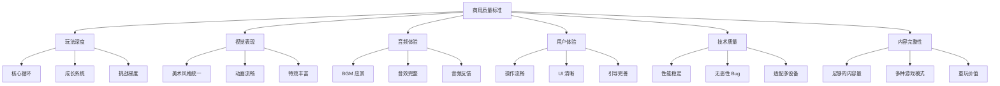

# 🎮 网页小游戏设计指南 - 简约卡通解压风

## ⚠️ 重要说明

**本文档已废弃！** 网页小游戏不需要达到商用质量标准。

请查看新的设计指南：**[WEB_GAME_DESIGN_GUIDE.md](./WEB_GAME_DESIGN_GUIDE.md)**

---

## 原内容（仅供参考）

## ⚠️ 问题诊断

**症状**：游戏设计过于简单，无法达到商用标准

**表现**：
- ❌ 玩法单一（只有基本的移动和碰撞）
- ❌ 缺乏深度（没有连击、道具、成就等系统）
- ❌ 体验粗糙（无动画、无音效、无反馈）
- ❌ 数值随意（难度曲线不合理）
- ❌ 内容单薄（只有几种对象，缺乏变化）

**后果**：
- ❌ 玩家流失率高（3 分钟内失去兴趣）
- ❌ 无法通过审核（不符合平台标准）
- ❌ 缺乏竞争力（与同类游戏差距大）
- ❌ 难以维护（代码混乱，扩展困难）

## 🎯 商用质量标准

### 核心原则：3 分钟留存法则

**玩家在前 3 分钟内必须体验到**：
1. ✅ **清晰的目标** - 知道要做什么
2. ✅ **即时的反馈** - 每个操作都有响应
3. ✅ **适度的挑战** - 既不太难也不太简单
4. ✅ **成长的感知** - 看到自己的进步
5. ✅ **情感的共鸣** - 产生愉悦/兴奋感

### 六大质量维度



## 📋 具体检查清单

### 1. 玩法深度（最少 5 个系统）

#### ❌ 不合格设计
```markdown
- 只有基本移动
- 只有一种敌人
- 没有道具系统
- 没有分数/成就
- 难度一成不变
```

#### ✅ 商用标准设计

**飞机大战示例**：

```markdown
### 核心系统（必需）

#### 1. 战斗系统
- [ ] 自动射击（基础攻击）
- [ ] 瞄准机制（触摸/鼠标跟随）
- [ ] 躲避机制（走位空间）
- [ ] 受击反馈（扣血动画 + 音效）

#### 2. 敌机系统（至少 3 种）
- [ ] 小型敌机（快速、低血量、10 分）
- [ ] 中型敌机（中速、中血量、30 分）
- [ ] 大型 BOSS（慢速、高血量、100 分）
- [ ] 每种敌机有独特外观和行为 AI

#### 3. 道具系统（至少 5 种）
- [ ] 生命回复（立即生效）
- [ ] 双发子弹（持续 10 秒）
- [ ] 三发散射（持续 10 秒）
- [ ] 护盾保护（免疫一次）
- [ ] 速度提升（持续 10 秒）
- [ ] 每种道具有明显视觉区分

#### 4. 连击系统
- [ ] 连续击毁计数
- [ ] 连击倍率奖励（1x/1.5x/2x/3x）
- [ ] 连击显示 UI
- [ ] 连击中断惩罚

#### 5. 成长系统
- [ ] 分数累计
- [ ] 解锁成就（至少 10 个）
- [ ] 排行榜（本地/全球）
- [ ] 历史最高记录

### 进阶系统（推荐）

#### 6. 技能系统
- [ ] 主动技能（大招，冷却时间）
- [ ] 被动技能（永久增益）
- [ ] 技能树（加点选择）

#### 7. 经济系统
- [ ] 游戏币获取
- [ ] 商店购买
- [ ] 装备升级

#### 8. 任务系统
- [ ] 每日任务
- [ ] 成就任务
- [ ] 新手引导任务
```

### 2. 视觉表现（达到专业水准）

#### ❌ 不合格设计
```markdown
- 简单几何图形（方块/圆形/三角形）
- 颜色单调（纯色填充）
- 无动画效果
- 无粒子特效
- UI 简陋
```

#### ✅ 商用标准设计

**资源质量要求**：

```markdown
### 角色设计
- [ ] 主角：80x80px，多层细节，渐变着色
- [ ] 敌机：3 种尺寸，各有特色，识别度高
- [ ] 道具：30x30px，带符号标识，金色边框
- [ ] 子弹：带拖尾光效，高亮显示

### 动画要求
- [ ]  idle 动画（待机状态，轻微浮动）
- [ ] 移动动画（平滑过渡，无瞬移）
- [ ] 受击动画（闪烁/震动/后退）
- [ ] 死亡动画（爆炸/碎片/渐隐）
- [ ] 道具动画（旋转/发光/上下浮动）

### 特效要求
- [ ] 爆炸特效（3 帧以上，粒子飞溅）
- [ ] 射击特效（枪口火焰/子弹轨迹）
- [ ] 撞击特效（火花/冲击波）
- [ ] 升级特效（光芒四射/屏幕震动）
- [ ] UI 特效（按钮悬停/点击反馈）

### 场景要求
- [ ] 背景图层（多层 parallax 滚动）
- [ ] 环境元素（星星/云雾/光晕）
- [ ] 边界提示（屏幕边缘警告）
- [ ] 网格/地面（动态移动感）
```

### 3. 音频体验（完整配音）

#### ❌ 不合格设计
```markdown
- 没有背景音乐
- 只有简单的"滴滴"声
- 音量不均衡
- 无音频反馈
```

#### ✅ 商用标准设计

**音频清单**：

```markdown
### 背景音乐（BGM）
- [ ] 主菜单音乐（2-3 分钟，循环无缝）
- [ ] 游戏进行音乐（紧张刺激，动态变化）
- [ ] BOSS 战音乐（高潮迭起）
- [ ] 游戏结束音乐（低沉悲伤）
- [ ] 胜利音乐（欢快振奋）

### 音效（SFX）
- [ ] 射击音效（短促有力）
- [ ] 爆炸音效（低频震撼）
- [ ] 撞击音效（金属碰撞）
- [ ] 道具拾取音效（清脆悦耳）
- [ ] 道具激活音效（魔法感）
- [ ] UI 点击音效（轻快确认）
- [ ] 连击提示音（ escalating 音调）
- [ ] 警告音效（危险临近）

### 语音（可选但推荐）
- [ ] 开始提示（"Ready! Go!"）
- [ ] 连击播报（"Double Kill!"）
- [ ] 升级提示（"Level Up!"）
- [ ] 游戏结束（"Game Over"）
```

### 4. 用户体验（流畅自然）

#### ❌ 不合格设计
```markdown
- 操作延迟高
- UI 布局混乱
- 无新手引导
- 无暂停功能
- 无设置选项
```

#### ✅ 商用标准设计

**UX 要求**：

```markdown
### 操作体验
- [ ] 60 FPS 流畅度（稳定帧率）
- [ ] 低延迟响应（<100ms）
- [ ] 精确碰撞检测（像素级）
- [ ] 支持多种输入（触摸/鼠标/键盘）
- [ ] 防误触机制（边缘屏蔽）

### UI 设计
- [ ] 清晰的生命值显示（心形图标）
- [ ] 实时分数显示（大号字体）
- [ ] 连击数显示（动态增长）
- [ ] 小地图/雷达（可选）
- [ ] 暂停按钮（明显位置）
- [ ] 设置菜单（音量/画质/控制）

### 引导系统
- [ ] 新手教程（前 30 秒完成）
- [ ] 操作提示（首次出现时）
- [ ] 道具说明（拾取时显示）
- [ ] 目标指引（当前任务）
- [ ] 失败建议（如何改进）

### 辅助功能
- [ ] 难度选择（简单/普通/困难）
- [ ] 暂停/继续功能
- [ ] 存档/读档
- [ ] 回放功能（录像保存）
- [ ] 截图分享
```

### 5. 技术质量（稳定可靠）

#### ❌ 不合格设计
```markdown
- 频繁卡顿
- 内存泄漏
- 崩溃闪退
- 兼容性问题
- 加载缓慢
```

#### ✅ 商用标准设计

**技术要求**：

```markdown
### 性能指标
- [ ] 启动时间 < 3 秒
- [ ] 加载时间 < 5 秒
- [ ] 内存占用 < 200MB
- [ ] CPU 占用 < 30%
- [ ] 电量消耗 < 5%/小时

### 兼容性
- [ ] 支持 iOS 12+
- [ ] 支持 Android 8+
- [ ] 支持主流浏览器
- [ ] 适配多种分辨率
- [ ] 横竖屏切换（如需要）

### 稳定性
- [ ] 无崩溃闪退
- [ ] 无恶性 Bug
- [ ] 数据持久化
- [ ] 异常处理
- [ ] 日志记录

### 网络（如需要）
- [ ] 弱网优化
- [ ] 断线重连
- [ ] 数据同步
- [ ] 反作弊机制
```

### 6. 内容完整性（足够耐玩）

#### ❌ 不合格设计
```markdown
- 只有 1 个关卡
- 5 分钟就通关
- 没有重玩价值
- 内容单一枯燥
```

#### ✅ 商用标准设计

**内容量要求**：

```markdown
### 关卡设计
- [ ] 至少 10 个关卡（或无尽模式）
- [ ] 每关有不同配置（敌人/道具/Boss）
- [ ] 难度递增曲线合理
- [ ] 隐藏关卡/彩蛋

### 游戏模式
- [ ] 经典模式（主线剧情）
- [ ] 无尽模式（挑战极限）
- [ ] 生存模式（坚持时间）
- [ ] 计时模式（速通挑战）
- [ ] 每日挑战（特殊规则）

### 收集要素
- [ ] 可解锁角色（至少 5 个）
- [ ] 可升级武器（至少 3 种）
- [ ] 成就系统（至少 20 个）
- [ ] 收集品（隐藏物品）

### 重玩价值
- [ ] 多结局设定
- [ ] 评分系统（S/A/B/C/D）
- [ ] 排行榜竞争
- [ ] 每日/每周任务
- [ ] 赛季活动
```

## 🔧 GDD 编写规范（达到商用标准）

### 必备章节

```markdown
# 游戏设计文档 (GDD) v1.0

## 1. 游戏概述
- 游戏类型
- 目标用户
- 核心体验
- 竞品分析

## 2. 世界观与故事
- 背景设定
- 角色介绍
- 剧情大纲

## 3. 核心玩法
- 操作方式
- 游戏规则
- 胜利/失败条件
- 游戏流程

## 4. 游戏对象设计
### 4.1 玩家角色
- 外观描述（附参考图）
- 属性数值（血量/速度/攻击力）
- 技能列表
- 成长曲线

### 4.2 敌对势力
- 敌人类型（至少 3 种）
- 每种详细设计（外观/行为/数值）
- AI 逻辑
- 掉落物品

### 4.3 道具系统
- 道具分类（消耗品/装备/材料）
- 每种效果详细说明
- 获取方式
- 使用限制

## 5. 关卡设计
- 关卡列表（至少 10 个）
- 每关详细配置
  - 敌人配置表
  - 道具配置表
  - Boss 设计
  - 胜利条件
- 难度曲线图

## 6. 数值系统
- 经验值表
- 升级所需经验
- 属性成长公式
- 伤害计算公式
- 经济系统平衡

## 7. UI/UX设计
- 界面布局图
- 交互流程图
- 图标设计稿
- 动效说明

## 8. 音频需求
- BGM 清单（场景/情绪）
- SFX 清单（动作/反馈）
- 语音清单（如有）

## 9. 技术规格
- 目标平台
- 性能指标
- 网络需求
- 数据存储

## 10. 商业化设计（如需要）
- 内购项目
- 广告设计
- 会员体系
```

### 数值设计示例

**好的数值设计**：

```markdown
### 玩家属性成长

| 等级 | 所需经验 | 生命值 | 攻击力 | 防御力 |
|------|---------|--------|--------|--------|
| 1    | 0       | 100    | 10     | 5      |
| 2    | 100     | 120    | 12     | 6      |
| 3    | 250     | 145    | 14     | 7      |
| ...  | ...     | ...    | ...    | ...    |
| 50   | 100000  | 1000   | 100    | 50     |

**公式**:
- 生命值 = 100 * (1.05 ^ 等级)
- 攻击力 = 10 * (1.04 ^ 等级)
- 防御力 = 5 * (1.03 ^ 等级)
```

**差的数值设计**：

```markdown
- 生命值：100（拍脑袋决定）
- 攻击力：10（随便写的）
- 没有成长公式
- 没有平衡性测试
```

## 📊 商用质量评估表

### 自我评估（满分 100 分）

```markdown
### 玩法深度（25 分）
- [ ] 核心循环有趣（5 分）
- [ ] 系统丰富多样（5 分）
- [ ] 成长曲线合理（5 分）
- [ ] 有重玩价值（5 分）
- [ ] 创新元素（5 分）

### 视觉表现（20 分）
- [ ] 美术风格统一（5 分）
- [ ] 角色设计精美（5 分）
- [ ] 动画流畅自然（5 分）
- [ ] 特效华丽（5 分）

### 音频体验（15 分）
- [ ] BGM 优质（5 分）
- [ ] SFX 完整（5 分）
- [ ] 音频反馈及时（5 分）

### 用户体验（15 分）
- [ ] 操作流畅（5 分）
- [ ] UI 清晰美观（5 分）
- [ ] 引导完善（5 分）

### 技术质量（15 分）
- [ ] 性能稳定（5 分）
- [ ] 无恶性 Bug（5 分）
- [ ] 兼容性好（5 分）

### 内容完整性（10 分）
- [ ] 内容量充足（5 分）
- [ ] 耐玩度高（5 分）

**及格线**: 60 分
**良好线**: 75 分
**优秀线**: 85 分
**商用线**: 90 分
```

## 💡 提升建议

### 从 60 分到 90 分的路径

**阶段 1: 基础完善（60 分）**
1. 确保核心玩法完整
2. 至少有 3 种敌人
3. 至少有 5 种道具
4. 有基本的分数系统
5. 无明显 Bug

**阶段 2: 品质提升（75 分）**
1. 添加连击系统
2. 完善动画效果
3. 添加背景音乐和音效
4. 优化 UI/UX
5. 平衡数值曲线

**阶段 3: 精益求精（85 分）**
1. 添加成长系统（升级/技能树）
2. 丰富关卡设计（10+ 关卡）
3. 完善成就系统（20+ 成就）
4. 添加多种游戏模式
5. 优化性能和兼容性

**阶段 4: 商用标准（90 分+）**
1. 独特的创新点
2. 精美的过场动画
3. 完整的剧情故事
4. 社交/排行榜功能
5. 持续更新计划

## 🎉 总结

**核心理念**：
> 商用质量 ≠ 复杂堆砌，而是**每个细节都做到极致**

**关键认知**：
1. ✅ **玩法深度** > 画面华丽
2. ✅ **用户体验** > 功能数量
3. ✅ **细节打磨** > 快速上线
4. ✅ **长期运营** > 一锤子买卖

**行动指南**：
- 📖 严格按照 GDD 模板编写设计文档
- ✅ 逐项完成检查清单的要求
- 🎯 以 90 分为目标，不低于 75 分
- 🔄 持续迭代，收集反馈，不断优化

记住：**只有达到商用标准的游戏，才能真正吸引和留住玩家！** 🎮
