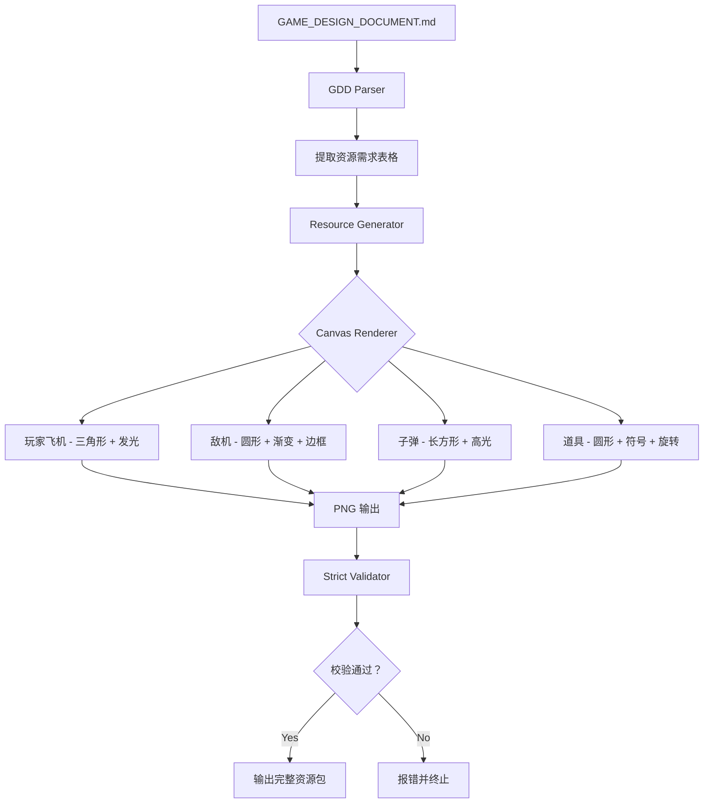

# 🎨 高质量资源生成指南

## ⚠️ 问题诊断

**症状**：生成的资源都是简单几何图形（方块、圆形、三角形）

**原因**：
1. ❌ 使用了游戏目录下的简化版 `generate-resources.mjs`
2. ❌ 没有使用专业的主题资源生成工具
3. ❌ 缺少对 GDD 设计文档的解析

## 🎯 解决方案：使用专业工具

### 方案 A：Theme Resource Generator（推荐⭐）

**工具位置**：`kids-game-house/tools/theme-resource-generator`

**核心优势**：
- ✅ 从 GDD 自动解析资源需求
- ✅ 使用 Canvas 绘制高质量图片
- ✅ 严格校验，不允许降级方案
- ✅ 支持多种美术风格

#### 快速开始

```bash
# 1. 进入工具目录
cd kids-game-house/tools/theme-resource-generator

# 2. 安装依赖
npm install

# 3. 准备 GDD 文件
# 确保 GAME_DESIGN_DOCUMENT.md 包含资源需求章节

# 4. 运行生成命令
npm run generate -- \
  -g ../../games/plane-shooter/GAME_DESIGN_DOCUMENT.md \
  -o ../../games/plane-shooter/public/assets/themes/plane-shooter \
  -t plane-shooter-theme \
  -s cartoon  # 可选：cartoon/realistic/pixel

# 5. 验证生成结果
ls output/plane-shooter-theme/scene/
```

#### GDD 资源需求格式

在你的 `GAME_DESIGN_DOCUMENT.md` 中添加：

```markdown
### 4.1 图片资源清单

| 资源名称 | 类型 | 尺寸 | 描述 | 优先级 |
|---------|------|------|------|--------|
| player | 玩家飞机 | 80x80px | 绿色三角形战机，带发光效果 | 必需 |
| enemy_small | 小型敌机 | 50x50px | 红色圆形敌机 | 必需 |
| enemy_medium | 中型敌机 | 70x70px | 橙色圆形敌机 | 必需 |
| enemy_large | 大型 BOSS | 100x100px | 紫色圆形 BOSS | 必需 |
| bullet_blue | 玩家子弹 | 10x20px | 蓝色长方形子弹 | 必需 |
| item_health | 生命道具 | 30x30px | 金色圆形，带 + 符号 | 必需 |
| explosion_1 | 爆炸帧 1 | 60x60px | 爆炸特效第一帧 | 必需 |

### 4.2 音频资源清单

| 资源名称 | 类型 | 时长 | 描述 | 优先级 |
|---------|------|------|------|--------|
| bgm_main | 背景音乐 | 180s | 主菜单音乐，激昂振奋 | 必需 |
| bgm_gameplay | 游戏音乐 | 180s | 战斗 BGM，紧张刺激 | 必需 |
| shoot | 音效 | 0.2s | 发射子弹音效 | 必需 |
| explosion | 音效 | 0.5s | 敌机爆炸音效 | 必需 |
```

#### 工具会自动生成

```
output/plane-shooter-theme/
├── scene/
│   ├── player.png              # 80x80 绿色三角形战机
│   ├── enemy_small.png         # 50x50 红色敌机
│   ├── enemy_medium.png        # 70x70 橙色敌机
│   ├── enemy_large.png         # 100x100 紫色 BOSS
│   ├── bullet_blue.png         # 10x20 蓝色子弹
│   ├── item_health.png         # 30x30 金色道具
│   ├── explosion_1.png         # 60x60 爆炸特效
│   └── ...
├── audio/
│   ├── bgm_main.wav
│   ├── bgm_gameplay.wav
│   ├── shoot.wav
│   └── ...
└── GTRS.json                   # 完整资源配置
```

### 方案 B：自定义 generate-resources.mjs（不推荐）

**仅适用于**：简单的占位图或原型验证

**问题**：
- ❌ 只能生成简单几何图形
- ❌ 需要手动编写每个资源的绘制代码
- ❌ 不符合 GDD 设计规范
- ❌ 质量差，无法用于正式版本

**如果必须使用**，参考飞机大战的高质量版本：
`kids-game-house/games/plane-shooter/generate-resources.mjs`

该脚本包含了：
- ✅ 基于 GDD 的配置（所有资源参数来自设计文档）
- ✅ 渐变、发光、纹理等高级效果
- ✅ 多层结构绘制（不是简单填充）

## 📊 两种方案对比

| 特性 | Theme Resource Generator | generate-resources.mjs |
|------|-------------------------|------------------------|
| **资源质量** | ⭐⭐⭐⭐⭐ 高质量 | ⭐⭐ 简单图形 |
| **自动化** | ✅ 完全自动 | ❌ 手动配置 |
| **GDD 解析** | ✅ 自动解析 | ❌ 需要手动输入 |
| **严格校验** | ✅ 不允许降级 | ❌ 无校验 |
| **可维护性** | ✅ 易维护 | ❌ 难维护 |
| **适用场景** | 正式版本 | 原型验证 |

## 🔧 Theme Resource Generator 工作原理



## 📋 使用检查清单

### 使用前准备

- [ ] GDD 包含完整的资源需求表格
- [ ] 所有"必需"资源都有明确描述
- [ ] 资源尺寸、颜色、形状定义清晰
- [ ] 安装了 Node.js 18+
- [ ] 已安装 Sharp 或@napi-rs/canvas

### 生成过程

- [ ] 使用 `-g` 指定正确的 GDD 路径
- [ ] 使用 `-o` 指定输出目录
- [ ] 选择合适的主题名称和风格
- [ ] 观察控制台输出，确认无错误

### 生成后验证

- [ ] 检查输出的 PNG 文件质量
- [ ] 确认所有"必需"资源都已生成
- [ ] 查看生成的 GTRS.json 配置
- [ ] 复制到游戏项目测试

## 💡 最佳实践

### 1. GDD 编写规范

**好的资源描述**：
```markdown
| player | 玩家飞机 | 80x80px | 绿色三角形战机（#22c55e），带浅绿色光晕效果（#86efac），顶点朝上 | 必需 |
```

**差的资源描述**：
```markdown
| player | 飞机 | 80x80 | 绿色的东西 | 必需 | ← ❌ 太模糊
```

### 2. 选择合适的风格

```javascript
-s cartoon      // 卡通风格（默认，适合大多数游戏）
-s realistic    // 写实风格（适合模拟类游戏）
-s pixel        // 像素风格（适合复古游戏）
-s minimalist   // 极简风格（适合休闲益智）
```

### 3. 批量生成多个主题

```bash
# 为同一游戏生成不同主题
npm run generate -- -g GDD.md -o output/dark -t dark-theme -s cartoon
npm run generate -- -g GDD.md -o output/light -t light-theme -s minimalist
npm run generate -- -g GDD.md -o output/colorful -t colorful-theme -s cartoon
```

### 4. 与游戏目录集成

```bash
# 在项目根目录创建快捷脚本
cat > scripts/generate-theme.sh << 'EOF'
#!/bin/bash
cd "$(dirname "$0")/.."
cd tools/theme-resource-generator
npm run generate -- \
  -g ../games/$1/GAME_DESIGN_DOCUMENT.md \
  -o ../games/$1/public/assets/themes/$1 \
  -t $1-theme
EOF

chmod +x scripts/generate-theme.sh

# 使用
./scripts/generate-theme.sh plane-shooter
```

## 🆘 常见问题

### Q1: 为什么不能直接用 generate-resources.mjs？

**A**: 
- `generate-resources.mjs` 是简化版本，只能生成几何图形
- 它没有 GDD 解析，需要手动配置每个资源
- 它没有严格校验，容易遗漏资源
- **正式版本必须使用 Theme Resource Generator**

### Q2: 工具报错说找不到 GDD 怎么办？

**A**: 
1. 检查 GDD 路径是否正确（使用绝对路径）
2. 确认 GDD 文件存在且可读
3. 确保 GDD 包含资源需求表格

### Q3: 生成的图片和 GDD 描述不一致怎么办？

**A**: 
1. 检查 GDD 中的描述是否足够详细
2. 查看工具的解析日志，确认理解正确
3. 如有必要，修改 `src/core/gdd-parser.js` 的解析逻辑

### Q4: 可以自定义绘制算法吗？

**A**: 可以！在 `src/core/resource-generator.js` 中添加：

```javascript
async generateCustom(filename, config) {
  // 你的自定义绘制逻辑
  await this.canvasGenerator.draw(filename, (ctx) => {
    // 使用 Canvas API 绘制
    ctx.fillStyle = config.color;
    ctx.beginPath();
    // ... 你的绘制代码
  });
}
```

## 📚 相关文档

- **[Theme Resource Generator README](../../kids-game-house/tools/theme-resource-generator/README.md)** - 工具完整文档
- **[USAGE_GUIDE](../../kids-game-house/tools/theme-resource-generator/USAGE_GUIDE.md)** - 详细使用指南
- **[GENERATION_REPORT](../../kids-game-house/tools/theme-resource-generator/GENERATION_REPORT.md)** - 生成报告示例

## 🎉 总结

**核心理念**：
> 资源生成必须**从 GDD 出发**，使用**专业工具**，达到**高质量标准**。

**行动指南**：
1. ✅ 优先使用 Theme Resource Generator
2. ✅ 编写详细的 GDD 资源需求
3. ✅ 严格校验生成的资源
4. ❌ 避免使用简单几何图形降级方案

记住：**好的资源是游戏体验的基础！** 🎨
