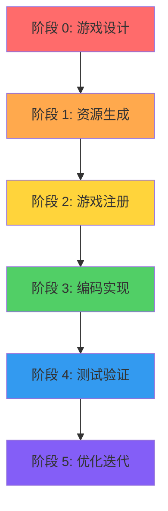

# 📋 游戏开发标准流程 - Skills 优化总结

## 🎯 优化目标

**优化前的问题**：
- ❌ 开发流程混乱，没有清晰的步骤指引
- ❌ 先注册再生成资源，导致 GTRS 路径错误
- ❌ 缺少设计阶段，直接开始编码
- ❌ 文档分散，不知道按什么顺序阅读

**优化后的效果**：
- ✅ 明确的 6 个阶段，顺序清晰
- ✅ 先设计后开发，避免返工
- ✅ 正确的流程顺序：设计→资源→注册→编码→测试→优化
- ✅ 每个阶段都有对应的文档指引

## 📊 标准开发流程

### 完整流程图



## 🔴 阶段 0：游戏设计（必须先完成！）

### 核心任务

**输出物**：
- ✅ 《游戏概念设计书》（1-2 页）
- ✅ 《游戏设计文档 (GDD)》（使用模板）
- ✅ 《设计评审记录》

**设计要求**：
- ✅ 玩法简单（一眼看懂，30 秒上手）
- ✅ 规则简单（不超过 5 条）
- ✅ 数值简单（整数计算）
- ✅ 内容轻量（单局 3-5 分钟）
- ✅ 画面卡通（圆润可爱，颜色鲜艳）
- ✅ 音效轻松（清脆悦耳，不吵闹）

### 关键文档

| 文档 | 用途 | 位置 |
|------|------|------|
| [网页小游戏设计指南](../.lingma/skills/game-dev/docs/WEB_GAME_DESIGN_GUIDE.md) | 设计理念和要求 | skills/docs/ |
| [游戏设计模板](../../kids-game-house/docs/GAME_DESIGN_TEMPLATE.md) | GDD 标准格式 | kids-game-house/docs/ |

### 检查清单

- [ ] GDD 已编写完成
- [ ] 已通过评审会议
- [ ] 所有人签字确认
- [ ] 玩法符合"简单卡通解压"定位
- [ ] 没有复杂系统和数值堆砌

---

## 🟠 阶段 1：资源生成（从 GDD 到资源）

### 核心任务

**输入**：GDD（游戏设计文档）  
**输出**：
- ✅ 图片资源（PNG 格式）
- ✅ 音频资源（WAV/MP3 格式）
- ✅ GTRS.json 配置文件

### 执行步骤

```bash
# 1. 进入工具目录
cd kids-game-house/tools/theme-resource-generator

# 2. 安装依赖
npm install

# 3. 从 GDD 自动生成资源
npm run generate -- \
  -g ../../games/my-game/GAME_DESIGN_DOCUMENT.md \
  -o ../../games/my-game/public/assets/themes/my-game \
  -t my-game-theme \
  -s cartoon
```

### 关键文档

| 文档 | 用途 | 位置 |
|------|------|------|
| [高质量资源生成指南](../.lingma/skills/game-dev/docs/RESOURCE_GENERATION_GUIDE.md) | 使用专业工具 | skills/docs/ |
| [GTRS 资源配置规范](../.lingma/skills/game-dev/docs/GTRS_GUIDE.md) | v1.0.0 标准 | skills/docs/ |
| [Theme Resource Generator README](../../kids-game-house/tools/theme-resource-generator/README.md) | 工具使用说明 | tools/ |

### 检查清单

- [ ] 所有资源已生成到正确目录
- [ ] GTRS.json 配置正确
- [ ] 资源质量符合要求（不是简单几何图形）
- [ ] 路径符合 GTRS 规范（`/themes/default/assets/`）

---

## 🟡 阶段 2：游戏注册（数据库注册）

### 核心任务

**输入**：
- 完整的 GDD
- 生成的资源文件
- GTRS.json 配置

**输出**：
- ✅ 游戏在数据库中存在
- ✅ 可以在前台看到游戏
- ✅ 游戏可以正常启动

### 执行步骤

```bash
# 1. 编写注册 SQL 脚本
vim register-game.sql

# 2. 确保数据库存在
mysql -u root -p -e "CREATE DATABASE IF NOT EXISTS kids_game DEFAULT CHARACTER SET utf8mb4 COLLATE utf8mb4_unicode_ci;"

# 3. 执行注册
mysql -u root -p kids_game < register-game.sql
```

### 关键要点

⚠️ **必须注意**：
1. ✅ `status = 2`（已上架，前台可见）
   - ❌ status = 1 是"待审核"（不可见）
   - ✅ status = 2 是"已上架"（可见）
   
2. ✅ `game_url` 必须是完整 HTTP URL
   - ❌ `/games/plane-shooter`（相对路径）
   - ✅ `http://localhost:3005`（完整 URL）
   
3. ✅ 必须包含 `USE kids_game` 语句
   - ❌ 直接 INSERT（会报错）
   - ✅ 先 USE 再 INSERT

### 关键文档

| 文档 | 用途 | 位置 |
|------|------|------|
| [注册脚本编写规范](../.lingma/skills/game-dev/docs/REGISTER_SCRIPT_SPECIFICATION.md) | ⚠️ 必读！ | skills/docs/ |
| [游戏注册 SQL 模板](../.lingma/skills/game-dev/templates/register-game.template.sql) | 标准模板 | skills/templates/ |
| [数据库配置修复指南](../../kids-game-house/games/plane-shooter/REGISTER_GAME_DB_FIX.md) | 问题解决 | games/plane-shooter/ |

### 检查清单

- [ ] SQL 脚本已编写
- [ ] status = 2（不是 1）
- [ ] game_url 是完整 HTTP URL
- [ ] 包含 USE kids_game 语句
- [ ] 数据库注册成功
- [ ] 游戏在前台可见

---

## 🟢 阶段 3：编码实现（按设计实现）

### 核心任务

**输入**：
- GDD（游戏设计文档）
- 生成的资源
- 数据库注册信息

**输出**：
- ✅ 完整的游戏代码
- ✅ 可实现的游戏逻辑
- ✅ 可用的 UI 界面

### 核心步骤

#### 3.1 复制并重命名

```bash
# 1. 复制参考游戏
cp -r ../snake my-game
cd my-game

# 2. 重命名（避免贪吃蛇代码污染）
# - 修改 package.json
# - 全局替换 Snake → MyGame
# - 重命名 Vue 文件、Store、路由
```

#### 3.2 实现游戏逻辑

**必须修改的文件**：
- ✅ `src/scenes/ComponentGameScene.ts` - Phaser 场景
- ✅ `src/logic/GameManager.ts` - 游戏管理器
- ✅ `src/control/InputHandler.ts` - 输入控制
- ✅ `src/ui/GameView.vue` - 游戏界面

**禁止修改的文件**：
- ❌ `src/components/core/` - 核心层保留原样
- ❌ `src/components/rendering/` - 渲染层保留原样
- ❌ `src/components/game/GameOrchestrator.ts` - 编排器保留原样

### 关键文档

| 文档 | 用途 | 位置 |
|------|------|------|
| [实现游戏逻辑](../.lingma/skills/game-dev/docs/IMPLEMENT_GAME_LOGIC.md) | 🔥 最关键！ | skills/docs/ |
| [重命名检查清单](../.lingma/skills/game-dev/docs/RENAME_CHECKLIST.md) | ⚠️ 避免污染 | skills/docs/ |
| [完整流程指南](../.lingma/skills/game-dev/docs/FULL_WORKFLOW.md) | ⭐ 流程顺序 | skills/docs/ |

### 检查清单

- [ ] 所有贪吃蛇代码已替换
- [ ] 游戏逻辑已实现（不是调用 SnakeGameManager）
- [ ] UI 组件已适配（显示飞机/敌机，不是蛇）
- [ ] 控制方式已实现（拖动/点击，不是方向键）
- [ ] 碰撞规则已实现（打敌人得分，不是吃食物）

---

## 🔵 阶段 4：测试验证（确保可用）

### 核心任务

**输入**：完整的游戏代码  
**输出**：测试报告和问题清单

### 测试步骤

```bash
# 1. 启动开发服务器
npm run dev

# 2. 访问游戏
http://localhost:5173/games/my-game

# 3. 测试核心功能
- 游戏能否正常启动
- 控制是否流畅
- 分数系统是否正常
- 道具效果是否正常
- 难度选择是否正常
```

### 测试清单

**功能测试**：
- [ ] 游戏可以正常启动
- [ ] 无控制台错误
- [ ] 所有功能正常工作
- [ ] 性能稳定（60 FPS）
- [ ] 多设备适配良好

**兼容性测试**：
- [ ] Chrome 浏览器正常
- [ ] Firefox 浏览器正常
- [ ] Safari 浏览器正常
- [ ] 移动端正常（如需要）

**用户体验测试**：
- [ ] 操作简单易懂
- [ ] 反馈及时清晰
- [ ] 难度曲线合理
- [ ] 视觉效果良好

### 关键文档

| 文档 | 用途 | 位置 |
|------|------|------|
| [测试指南](../.lingma/skills/game-dev/docs/TESTING_GUIDE.md) | 🧪 全面测试 | skills/docs/ |
| [故障排查手册](../.lingma/skills/game-dev/docs/TROUBLESHOOTING.md) | 🔧 问题解决 | skills/docs/ |

---

## 🟣 阶段 5：优化迭代（持续改进）

### 核心任务

**输入**：测试报告和用户反馈  
**输出**：优化版本

### 优化方向

**性能优化**：
- ✅ 减少卡顿，提升帧率
- ✅ 优化资源加载速度
- ✅ 减少内存占用

**体验优化**：
- ✅ 操作更流畅
- ✅ 反馈更清晰
- ✅ UI 更友好

**视觉优化**：
- ✅ 画面更精美
- ✅ 动画更自然
- ✅ 特效更华丽

**音效优化**：
- ✅ 配音更完整
- ✅ 音质更好
- ✅ 音量平衡

### 持续迭代

- 收集用户反馈
- 修复发现的问题
- 添加新功能和内容
- 定期更新版本

---

## 📊 流程对比

### 优化前（错误❌）

```
1. 复制游戏
2. 重命名代码
3. 运行资源生成脚本 ← 顺序错误
4. 注册游戏        ← 资源还没生成
5. 测试发现 GTRS 路径错误
6. 重新生成资源
7. 重新开始...
```

**问题**：
- ❌ 流程混乱，容易出错
- ❌ 先注册再生成资源，GTRS 路径错误
- ❌ 没有设计阶段，直接开干
- ❌ 不知道按什么顺序阅读文档

### 优化后（正确✅）

```
阶段 0: 游戏设计      ← 先想清楚要做什么
阶段 1: 资源生成      ← 从 GDD 生成资源
阶段 2: 游戏注册      ← 拿着资源去注册
阶段 3: 编码实现      ← 按设计实现逻辑
阶段 4: 测试验证      ← 确保一切正常
阶段 5: 优化迭代      ← 持续改进
```

**优势**：
- ✅ 流程清晰，不易出错
- ✅ 先生成资源再注册，GTRS 路径正确
- ✅ 设计先行，避免返工
- ✅ 每个阶段都有明确指引

---

## 💡 最佳实践

### 1. 严格执行阶段 0

**不要**：
- ❌ 拿到需求直接写代码
- ❌ 边做边想
- ❌ 做完再说

**应该**：
- ✅ 先写 GDD（1000 字，5 页纸）
- ✅ 通过评审会议
- ✅ 所有人签字确认
- ✅ 再开始后续工作

### 2. 遵循正确顺序

**不要**：
- ❌ 先注册再生成资源
- ❌ 先编码再设计
- ❌ 先测试再优化

**应该**：
- ✅ 设计 → 资源 → 注册 → 编码 → 测试 → 优化
- ✅ 每个阶段完成后才能进入下一阶段
- ✅ 不要跳步，不要颠倒顺序

### 3. 充分利用文档

**不要**：
- ❌ 凭记忆编写 SQL
- ❌ 复制过时的脚本
- ❌ 遇到问题自己摸索

**应该**：
- ✅ 查看最新 schema_v2.sql
- ✅ 使用标准模板
- ✅ 参考对应阶段的文档

### 4. 持续改进

**不要**：
- ❌ 一次做完就不管了
- ❌ 忽视用户反馈
- ❌ 拒绝优化

**应该**：
- ✅ 收集反馈
- ✅ 修复问题
- ✅ 持续迭代
- ✅ 定期更新

---

## 🎯 总结

### 核心理念

> **"流程对了，事半功倍；流程错了，事倍功半！"**

### 三个关键认知

1. ✅ **设计先行**：磨刀不误砍柴工
2. ✅ **顺序重要**：设计→资源→注册→编码→测试→优化
3. ✅ **文档指引**：每个阶段都有对应文档

### 两个不要

- ❌ 不要跳步（每个阶段都重要）
- ❌ 不要颠倒顺序（后果严重）

### 一个核心

> **按照标准流程，做出好游戏！** 🎮✨

---

## 📚 相关文档索引

### 阶段文档

| 阶段 | 核心文档 | 辅助文档 |
|------|---------|---------|
| **阶段 0** | [WEB_GAME_DESIGN_GUIDE.md](../.lingma/skills/game-dev/docs/WEB_GAME_DESIGN_GUIDE.md) | GAME_DESIGN_TEMPLATE.md |
| **阶段 1** | [RESOURCE_GENERATION_GUIDE.md](../.lingma/skills/game-dev/docs/RESOURCE_GENERATION_GUIDE.md) | GTRS_GUIDE.md |
| **阶段 2** | [REGISTER_SCRIPT_SPECIFICATION.md](../.lingma/skills/game-dev/docs/REGISTER_SCRIPT_SPECIFICATION.md) | register-game.template.sql |
| **阶段 3** | [IMPLEMENT_GAME_LOGIC.md](../.lingma/skills/game-dev/docs/IMPLEMENT_GAME_LOGIC.md) | RENAME_CHECKLIST.md |
| **阶段 4** | TESTING_GUIDE.md | TROUBLESHOOTING.md |
| **阶段 5** | PERFORMANCE_OPTIMIZATION.md | UX_OPTIMIZATION.md |

### 综合文档

- [游戏开发指南](../.lingma/skills/game-dev/docs/GAME_DEV_GUIDE.md)
- [完整流程指南](../.lingma/skills/game-dev/docs/FULL_WORKFLOW.md)
- [SKILL.md](../.lingma/skills/game-dev/SKILL.md) - 主文档

---

**记住**：
> **好的流程是成功的一半！严格按照 6 个阶段执行，你一定能做出优秀的游戏！** 🎮✨
