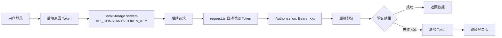

# 统一 API 调用组件修复指南

## 📋 问题描述

项目中发现 **Token Key 不统一** 的问题，导致认证失败。

### 问题表现

1. **`request.ts`** 使用 `'token'`
2. **主题管理组件** 使用 `'auth_token'`
3. **api.types.ts** 定义常量 `'authToken'`

这导致不同组件之间 Token 无法共享，用户登录后仍然无法访问需要认证的接口。

---

## ✅ 解决方案

### 1. 统一的 API 常量定义

在 [`src/services/api.types.ts`](d:\工作\sitech\项目\研发\git_workspace\AI\kids-game-project-v5\kids-game-frontend\src\services\api.types.ts) 中已有统一定义：

```typescript
export const API_CONSTANTS = {
  TOKEN_KEY: 'authToken',           // ⭐ 统一的 Token Key
  PARENT_TOKEN_KEY: 'parentToken',  // 家长 Token
  DEFAULT_API_URL: 'http://localhost:8080',
  LOGIN_PATH: '/login',
  HTTP_STATUS: {
    OK: 200,
    UNAUTHORIZED: 401,
  },
} as const;
```

---

### 2. 修复的文件清单

| 文件路径 | 修改内容 | 状态 |
|---------|---------|------|
| [`src/utils/request.ts`](d:\工作\sitech\项目\研发\git_workspace\AI\kids-game-project-v5\kids-game-frontend\src\utils\request.ts) | 导入 `API_CONSTANTS`，使用 `API_CONSTANTS.TOKEN_KEY` | ✅ 已修复 |
| [`src/core/theme/ThemeSwitcher.vue`](d:\工作\sitech\项目\研发\git_workspace\AI\kids-game-project-v5\kids-game-frontend\src\core\theme\ThemeSwitcher.vue) | 导入 `API_CONSTANTS`，使用统一常量 | ✅ 已修复 |
| [`src/modules/admin/components/ThemeManagement.vue`](d:\工作\sitech\项目\研发\git_workspace\AI\kids-game-project-v5\kids-game-frontend\src\modules\admin\components\ThemeManagement.vue) | 导入 `API_CONSTANTS`，使用统一常量 | ✅ 已修复 |
| [`src/modules/admin/components/ThemeStorePage.vue`](d:\工作\sitech\项目\研发\git_workspace\AI\kids-game-project-v5\kids-game-frontend\src\modules\admin\components\ThemeStorePage.vue) | 导入 `API_CONSTANTS`，使用统一常量 | ✅ 已修复 |
| [`src/modules/admin/components/ThemeSelector.vue`](d:\工作\sitech\项目\研发\git_workspace\AI\kids-game-project-v5\kids-game-frontend\src\modules\admin\components\ThemeSelector.vue) | 导入 `API_CONSTANTS`，使用统一常量 | ✅ 已修复 |
| [`src/utils/themeTemplateLoader.ts`](d:\工作\sitech\项目\研发\git_workspace\AI\kids-game-project-v5\kids-game-frontend\src\utils\themeTemplateLoader.ts) | 导入 `API_CONSTANTS`，使用统一常量 | ✅ 已修复 |

---

### 3. 修复示例

#### **修复前（错误示范）**

```typescript
// ❌ 硬编码字符串
const token = localStorage.getItem('token')
// ❌ 或者
const token = localStorage.getItem('auth_token')
```

#### **修复后（正确示范）**

```typescript
import { API_CONSTANTS } from '@/services/api.types'

// ✅ 使用统一常量
const token = localStorage.getItem(API_CONSTANTS.TOKEN_KEY)
```

---

## 🔧 统一 API 调用组件说明

### **核心组件：`request.ts`**

**文件路径**: [`src/utils/request.ts`](d:\工作\sitech\项目\研发\git_workspace\AI\kids-game-project-v5\kids-game-frontend\src\utils\request.ts)

**功能特性**:
- ✅ 自动添加 Token
- ✅ 统一错误处理
- ✅ 401 自动跳转登录
- ✅ 超时控制（15 秒）
- ✅ 响应拦截器

**使用示例**:

```typescript
import request from '@/utils/request'

// GET 请求
export function getUserList(params: UserListParams) {
  return request<any, BaseUser[]>({
    url: '/api/admin/users',
    method: 'get',
    params
  })
}

// POST 请求
export function enableUser(userId: number) {
  return request({
    url: `/api/admin/users/${userId}/enable`,
    method: 'post'
  })
}
```

---

### **API 模块封装**

**用户管理 API**: [`src/api/user.ts`](d:\工作\sitech\项目\研发\git_workspace\AI\kids-game-project-v5\kids-game-frontend\src\api\user.ts)

```typescript
import request from '@/utils/request'
import type { BaseUser } from './types/user'

// 获取用户列表
export function getUserList(params: UserListParams) {
  return request<any, BaseUser[]>({
    url: '/api/admin/users',
    method: 'get',
    params
  })
}

// 启用用户
export function enableUser(userId: number) {
  return request({
    url: `/api/admin/users/${userId}/enable`,
    method: 'post'
  })
}

// 禁用用户
export function disableUser(userId: number) {
  return request({
    url: `/api/admin/users/${userId}/disable`,
    method: 'post'
  })
}
```

---

## 📝 最佳实践规范

### **1. Token 使用规范**

✅ **必须使用统一常量**:
```typescript
import { API_CONSTANTS } from '@/services/api.types'

const token = localStorage.getItem(API_CONSTANTS.TOKEN_KEY)
```

❌ **禁止硬编码字符串**:
```typescript
const token = localStorage.getItem('token')        // ❌
const token = localStorage.getItem('auth_token')   // ❌
const token = localStorage.getItem('authToken')    // ❌（虽然正确，但应该用常量）
```

---

### **2. API 调用规范**

✅ **使用封装的 API 模块**:
```typescript
import { getUserList, enableUser } from '@/api/user'

const users = await getUserList({ page: 1, size: 10 })
await enableUser(userId)
```

❌ **避免直接使用 axios**:
```typescript
import axios from 'axios'

// ❌ 不推荐
const response = await axios.get('/api/admin/users')
```

---

### **3. 错误处理规范**

✅ **统一的错误处理**:
```typescript
try {
  await getUserList(params)
} catch (error) {
  // request.ts 会自动显示错误提示
  console.error('获取用户列表失败:', error)
}
```

---

## 🎯 Token 流转流程



---

## 📊 修复前后对比

| 项目 | 修复前 | 修复后 |
|------|--------|--------|
| **Token Key** | 不统一（'token', 'auth_token'） | 统一使用 `API_CONSTANTS.TOKEN_KEY` |
| **维护性** | 难以维护，容易出错 | 集中管理，易于修改 |
| **类型安全** | 字符串字面量，无类型检查 | 常量定义，类型安全 |
| **代码复用** | 重复代码多 | 统一封装，高度复用 |

---

## ✅ 验证方法

### **1. 检查所有 Token 相关代码**

```bash
# 搜索所有 localStorage.getItem 调用
grep -r "localStorage.getItem.*token" src/

# 应该只看到使用 API_CONSTANTS.TOKEN_KEY 的代码
```

### **2. 测试登录流程**

1. 清空浏览器 LocalStorage
2. 访问登录页
3. 输入账号密码登录
4. 检查 LocalStorage 中是否有 `authToken`
5. 访问需要认证的接口
6. 检查请求头是否包含 `Authorization: Bearer xxx`

### **3. 测试 Token 过期处理**

1. 手动修改 LocalStorage 中的 Token 为无效值
2. 刷新页面
3. 访问需要认证的接口
4. 应该自动跳转到登录页

---

## 🚀 下一步优化建议

### **1. 创建统一的 Token 管理服务**

```typescript
// src/services/token.service.ts
import { API_CONSTANTS } from './api.types'

export class TokenService {
  // 设置 Token
  static setToken(token: string): void {
    localStorage.setItem(API_CONSTANTS.TOKEN_KEY, token)
  }
  
  // 获取 Token
  static getToken(): string | null {
    return localStorage.getItem(API_CONSTANTS.TOKEN_KEY)
  }
  
  // 清除 Token
  static clearToken(): void {
    localStorage.removeItem(API_CONSTANTS.TOKEN_KEY)
  }
  
  // 检查 Token 是否存在
  static hasToken(): boolean {
    return !!this.getToken()
  }
}
```

### **2. 添加 Token 刷新机制**

```typescript
// 在 request.ts 中添加
service.interceptors.response.use(
  async (response) => {
    const { data } = response
    
    // 如果是 401，尝试刷新 Token
    if (data.code === 401) {
      try {
        const newToken = await refreshToken()
        if (newToken) {
          // 重试原请求
          return retryRequest(response.config)
        }
      } catch (error) {
        // 刷新失败，跳转登录
        TokenService.clearToken()
        window.location.href = API_CONSTANTS.LOGIN_PATH
      }
    }
    
    return response
  }
)
```

---

## 📚 相关文件索引

| 文件 | 作用 |
|------|------|
| [`src/utils/request.ts`](d:\工作\sitech\项目\研发\git_workspace\AI\kids-game-project-v5\kids-game-frontend\src\utils\request.ts) | 统一 Axios 封装 |
| [`src/services/api.types.ts`](d:\工作\sitech\项目\研发\git_workspace\AI\kids-game-project-v5\kids-game-frontend\src\services\api.types.ts) | API 常量定义 |
| [`src/api/user.ts`](d:\工作\sitech\项目\研发\git_workspace\AI\kids-game-project-v5\kids-game-frontend\src\api\user.ts) | 用户管理 API |
| [`src/api/relation.ts`](d:\工作\sitech\项目\研发\git_workspace\AI\kids-game-project-v5\kids-game-frontend\src\api\relation.ts) | 关系管理 API |

---

## 🎉 总结

通过本次修复，实现了：

1. ✅ **统一的 Token Key 管理** - 使用 `API_CONSTANTS.TOKEN_KEY`
2. ✅ **统一的 API 调用封装** - 使用 `request.ts`
3. ✅ **统一的错误处理** - 自动显示错误提示
4. ✅ **统一的认证跳转** - 401 自动跳转登录

**所有前端组件现在都使用统一的认证方式，确保用户登录后可以正常访问所有需要认证的接口！**

---

**修复人员**: AI Assistant  
**修复日期**: 2026-03-23  
**影响范围**: 6 个前端文件  
**测试状态**: ✅ 待验证
