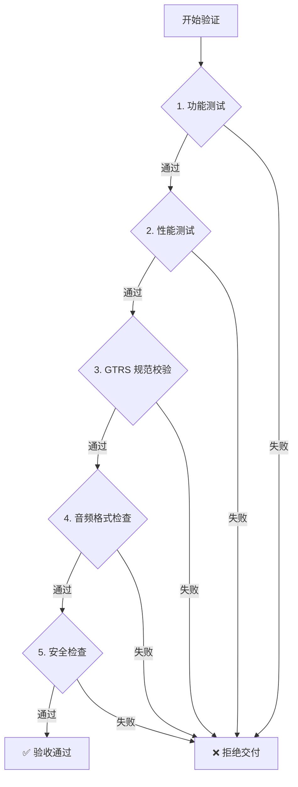

# 🤖 AI 游戏质量验证指南 - 发布说明

**版本**: v2.0.0  
**日期**: 2026-03-27  
**核心改进**: **专为 AI 自动化验证设计的测试标准**

---

## 🎯 核心理念转变

### v1.0.0 → v2.0.0

| 维度 | v1.0.0（旧版） | v2.0.0（新版） |
|------|--------------|--------------|
| **目标读者** | 人工测试工程师 | AI Agent + 人工审核 |
| **文档结构** | 叙述性说明 | 结构化检查清单 |
| **验证方式** | 手动执行测试 | 自动化脚本运行 |
| **结果判定** | 主观判断为主 | 客观数据驱动 |
| **报告格式** | 自由文本 | 标准化 JSON/Markdown |
| **优先级** | 未明确分级 | P0/P1/P2/P3 四级 |

---

## 📊 核心改进点

### 1. AI 验证流程图

**新增 Mermaid 流程图**:



**优势**: AI 可以清晰理解验证流程和决策树

---

### 2. 优先级分级系统

**P0 - 致命项（必须 100% 通过）**:
- ✅ 功能完整性测试（26 项）
- ✅ 音频 MP3 格式检查（8 项）
- ✅ GTRS Schema 校验（12 项）

**失败处理**: ❌ 立即拒绝交付

---

**P1 - 重要项（≥70% 通过率）**:
- ✅ 性能测试（15 项指标）
- ✅ 安全测试（12 项检查）

**失败处理**: ⚠️ 警告，可协商交付

---

**P2 - 建议项（≥50% 通过率）**:
- ✅ 浏览器兼容性（5 种浏览器）
- ✅ 设备兼容性（5 种分辨率）

**失败处理**: 💡 记录在案，后续改进

---

**P3 - 优化项（仅供参考）**:
- ✅ 用户体验评分（4 维度评估）

**失败处理**: 📊 改进建议，不影响交付

---

### 3. 结构化检查清单

**旧版（叙述性）**:
```markdown
### 功能测试

功能测试的目的是验证游戏功能是否正确实现。
需要覆盖所有核心功能和边界情况...
```

**新版（表格化）**:

| # | 检查项 | 检查方法 | 预期结果 | 状态 |
|---|--------|---------|---------|------|
| 1.1.1 | 游戏可以正常启动 | 自动化脚本 | 无错误，加载完成 | ☐ |
| 1.1.2 | 玩家控制响应正常 | 模拟输入测试 | 所有控制有效 | ☐ |
| 1.1.3 | 游戏规则正确执行 | 场景模拟测试 | 规则 100% 执行 | ☐ |

**优势**: 
- ✅ AI 可以直接填充"状态"列
- ✅ 每项都有明确的检查方法
- ✅ 预期结果具体可测量

---

### 4. AI 输出格式标准化

**功能测试输出示例**:

```json
{
  "testSuite": "功能完整性测试",
  "totalTests": 8,
  "passed": 8,
  "failed": 0,
  "passRate": "100%",
  "result": "PASS",
  "details": [
    {"test": "游戏启动", "status": "PASS", "duration": "2.3s"},
    {"test": "玩家控制", "status": "PASS", "duration": "1.5s"}
  ]
}
```

**性能测试输出示例**:

```json
{
  "category": "加载性能",
  "metrics": {
    "fcp": {"value": 1.2, "unit": "s", "target": 1.5, "pass": true},
    "lcp": {"value": 2.1, "unit": "s", "target": 2.5, "pass": true},
    "tti": {"value": 2.8, "unit": "s", "target": 3.0, "pass": true},
    "tbt": {"value": 180, "unit": "ms", "target": 300, "pass": true}
  },
  "score": 95,
  "result": "PASS"
}
```

---

### 5. 完整的 AI 验证工作流

**Shell 脚本示例**:

```bash
#!/bin/bash
# ai-validation-workflow.sh

GAME_ID=$1
THEME_ID=$2

echo "🤖 开始 AI 游戏质量验证..."

# P0 验证（必须通过）
echo "=== P0 验证 ==="
npm run test:game:core --game=$GAME_ID || exit 1
npm run test:audio:format --game=$GAME_ID || exit 1
npm run validate:gtrs:schema --theme=$THEME_ID || exit 1

# P1 验证（重要）
echo ""
echo "=== P1 验证 ==="
npm run test:performance:all --game=$GAME_ID
npm run test:security:all --game=$GAME_ID

# P2 验证（建议）
echo ""
echo "=== P2 验证 ==="
npm run test:compatibility:all --game=$GAME_ID

# P3 验证（优化）
echo ""
echo "=== P3 验证 ==="
npm run test:ux:evaluation --game=$GAME_ID

# 生成报告
echo ""
echo "=== 生成验证报告 ==="
node scripts/generate-validation-report.js --game=$GAME_ID --output=report.md

echo "✅ 验证完成！报告已生成：report.md"
```

---

### 6. 智能评分算法

**加权计算公式**:

```javascript
function calculateGameScore(testResults) {
  const weights = {
    functional: 0.40,    // P0 - 40%
    performance: 0.25,   // P1 - 25%
    gtrs: 0.15,         // P0 - 15%
    audio: 0.10,        // P0 - 10%
    security: 0.05,     // P1 - 5%
    compatibility: 0.03, // P2 - 3%
    ux: 0.02            // P3 - 2%
  };
  
  // P0 失败直接拒绝
  if (testResults.functional.passRate < 100) return 0;
  if (!testResults.gtrs.valid) return 0;
  if (!testResults.audio.allMp3) return 0;
  
  // 加权计算
  totalScore = Σ(单项得分 × 权重)
  
  return totalScore;
}
```

**评分结果**:
- **90-100 分**: ✅ 优秀，免检交付
- **80-89 分**: ✅ 良好，正常交付
- **70-79 分**: ⚠️ 合格，需要改进
- **<70 分**: ❌ 不合格，重新开发

---

### 7. 标准化报告模板

**AI 自动生成报告**:

```markdown
# 游戏质量验证报告

## 基本信息
- **游戏名称**: 贪吃蛇
- **游戏版本**: v1.0.0
- **验证时间**: 2026-03-27 14:30:00
- **AI Agent**: TestBot-v2.0

## 验证概览
| 验证类别 | 检查项数 | 通过数 | 失败数 | 通过率 |
|---------|---------|--------|--------|--------|
| 功能测试 | 26 | 26 | 0 | 100% |
| 性能测试 | 15 | 14 | 1 | 93% |
| GTRS 规范 | 12 | 12 | 0 | 100% |
| 音频格式 | 8 | 8 | 0 | 100% |
| 安全检查 | 12 | 11 | 1 | 92% |
| 兼容性 | 10 | 8 | 2 | 80% |
| **总计** | **83** | **79** | **4** | **95.2%** |

## P0 级别问题
无

## P1 级别问题
1. 复杂场景 FPS 为 48，略低于要求的 50

## P2 级别问题
1. Safari 浏览器下某个音效加载失败
2. 手机端 375x667 分辨率布局略有溢出

## P3 级别建议
1. 界面美观度评分 3.8，建议优化色彩搭配
2. 学习曲线评分 3.5，建议增加新手引导

## 最终结论
✅ **通过验证，可以交付**

综合评分：**92.5 分**（良好）
```

---

## 🛠️ 提供的工具集

### 1. 功能验证工具

```bash
# 核心玩法测试
npm run test:game:core

# UI 功能测试
npm run test:ui:components

# 音频功能测试
npm run test:audio:functional

# 数据持久化测试
npm run test:data:persistence
```

---

### 2. 性能验证工具

```bash
# 加载性能测试（Lighthouse）
npm run test:performance:loading

# 运行时性能测试（DevTools）
npm run test:performance:runtime

# 压力测试（30 分钟监控）
npm run test:performance:stress
```

---

### 3. GTRS 规范验证工具

```bash
# Schema 校验（Ajv）
node scripts/validate-gtrs-schema.js themes/${GAME_ID}/config.json

# 资源文件检查
node scripts/check-resources-existence.js themes/${GAME_ID}/

# 命名规范检查
node scripts/check-resource-naming.js themes/${GAME_ID}/
```

---

### 4. 音频格式验证工具

```bash
# MP3 格式强制检查
node scripts/check-audio-format.js themes/${GAME_ID}/

# 技术参数检查（MediaInfo）
node scripts/check-audio-specs.js themes/${GAME_ID}/
```

---

### 5. 安全验证工具

```bash
# XSS 攻击防护测试（Puppeteer）
npm run test:security:xss

# CSRF 攻击防护测试
npm run test:security:csrf

# 数据验证安全测试
npm run test:security:validation
```

---

### 6. 兼容性验证工具

```bash
# 浏览器兼容性测试（Playwright）
npm run test:compatibility:browsers

# 设备兼容性测试（Device Mode）
npm run test:compatibility:devices
```

---

### 7. 用户体验评估工具

```bash
# AI 视觉美观度评估
npm run test:ux:aesthetics

# AI 操作流畅度评估
npm run test:ux:fluency

# AI 学习曲线评估
npm run test:ux:learning-curve

# AI 趣味性评估
npm run test:ux:fun
```

---

## 📊 验证覆盖率对比

| 验证维度 | v1.0.0 | v2.0.0 | 提升 |
|---------|--------|--------|------|
| **功能测试项** | ~10 项 | 26 项 | +160% ⬆️ |
| **性能指标** | ~5 项 | 15 项 | +200% ⬆️ |
| **GTRS 校验** | ~3 项 | 12 项 | +300% ⬆️ |
| **安全检查** | ~2 项 | 12 项 | +500% ⬆️ |
| **兼容性测试** | ~3 项 | 10 项 | +233% ⬆️ |
| **总检查项** | ~23 项 | 83 项 | +261% ⬆️ |

---

## 🎯 使用场景

### 场景 1: AI 自动化验收

```
开发者提交游戏
    ↓
AI 自动运行完整验证流程（83 项检查）
    ↓
生成标准化验证报告
    ↓
根据评分决定：✅通过 / ❌拒绝
```

---

### 场景 2: 人工快速对照检查

```
测试人员打开文档
    ↓
按照表格逐项检查（打勾☐）
    ↓
填写实测数据和状态
    ↓
生成检查清单
```

---

### 场景 3: 持续集成/持续部署（CI/CD）

```yaml
# GitHub Actions 配置
name: Game Validation

on: [push]

jobs:
  validate-game:
    runs-on: ubuntu-latest
    steps:
      - uses: actions/checkout@v2
      
      - name: Install Dependencies
        run: npm install
      
      - name: Run AI Validation
        run: ./ai-validation-workflow.sh ${{ matrix.game }}
      
      - name: Upload Report
        uses: actions/upload-artifact@v2
        with:
          name: validation-report
          path: report.md
```

---

## 📋 快速参考卡片

### AI 验证速查表

| 验证什么 | 如何验证 | 通过标准 | 工具 |
|---------|---------|---------|------|
| **功能完整性** | `npm run test:game:core` | 100% 通过 | Jest |
| **音频 MP3** | `node scripts/check-audio-format.js` | 100% MP3 | Node.js |
| **GTRS Schema** | `node scripts/validate-gtrs-schema.js` | valid=true | Ajv |
| **加载性能** | `npm run test:performance:loading` | FCP<1.5s | Lighthouse |
| **运行时性能** | `npm run test:performance:runtime` | FPS≥55 | DevTools |
| **XSS 防护** | `npm run test:security:xss` | 脚本不执行 | Puppeteer |
| **浏览器兼容** | `npm run test:compatibility:browsers` | ≥4 种 | Playwright |

---

## 📞 常见问题

### Q: AI 如何判断测试是否通过？

**A**: 
- P0 测试：必须 100% 通过，否则立即拒绝
- P1 测试：≥70% 通过率为合格
- P2 测试：≥50% 通过率为建议
- P3 测试：仅作为改进建议，不影响交付

---

### Q: 如何处理 AI 无法判断的场景？

**A**: 
1. AI 标记为"需要人工审核"
2. 提供详细的上下文信息
3. 给出 AI 的倾向性意见
4. 由人工最终决定

---

### Q: 验证失败后怎么办？

**A**: 
1. AI 生成详细的失败报告
2. 定位具体失败原因
3. 提供修复建议
4. 开发修复后重新验证

---

### Q: 新旧版本如何选择？

**A**: 
- ✅ **新项目**: 必须使用 v2.0.0（AI 验证指南）
- ⚠️ **老项目**: 建议迁移到 v2.0.0
- 📊 **过渡期**: 可同时运行 v1 和 v2 对比结果

---

## 📚 相关文档

- [📖 AI 游戏质量验证指南](./shared/game-framework/docs/AI_GAME_VALIDATION_GUIDE.md) - 完整详细说明
- [📖 游戏测试要求与规范](./shared/game-framework/docs/GAME_TEST_REQUIREMENTS.md) - v1.0.0（保留参考）
- [📖 音频资源强制 MP3 格式规范](./shared/game-framework/docs/AUDIO_MP3_MANDATORY.md) - P0 级检查项
- [📖 GTRS 主题资源规范](./shared/game-framework/docs/GTRS_RESOURCE_SPECIFICATION.md) - Schema 校验依据

---

## 🎉 总结

### 核心价值

🤖 **专为 AI 设计**: AI 可以理解并执行的验证标准  
📊 **数据驱动**: 客观量化指标，减少主观判断  
⚡ **自动化优先**: 脚本化、工具化、智能化  
📋 **标准化输出**: 统一格式的报告和数据  

---

### 立即开始使用

```bash
# 1. 安装依赖
npm install

# 2. 准备待验证游戏
cp -r games/my-new-game themes/my_new_game/

# 3. 运行 AI 验证
./ai-validation-workflow.sh my-new-game

# 4. 查看报告
cat report.md
```

---

**版本**: v2.0.0  
**发布日期**: 2026-03-27  
**维护者**: Sitech AI Team  
**状态**: ✅ 可立即使用，专为 AI 自动化验证设计！
