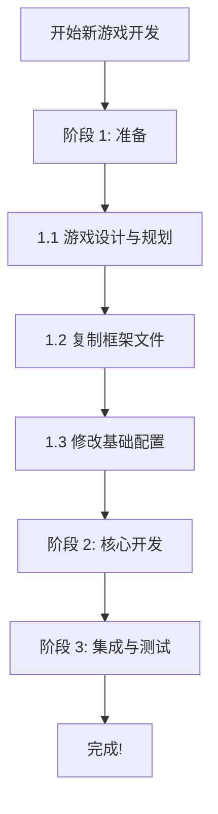
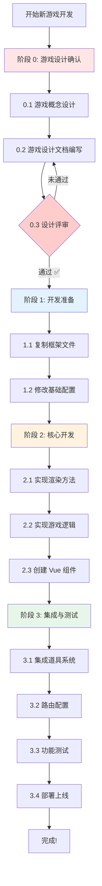

# 游戏开发框架优化总结 - 设计先行版本

**版本**: v3.0 (设计先行版)  
**优化日期**: 2026-03-27  
**优化目标**: 强化游戏设计环节，确保"先设计，后开发"

---

## 📋 目录

1. [优化概述](#优化概述)
2. [核心变更](#核心变更)
3. [新增文档](#新增文档)
4. [流程改进](#流程改进)
5. [使用指南](#使用指南)
6. [预期效果](#预期效果)

---

## 🎯 优化概述

### 优化背景

在之前的开发实践中发现：

- ❌ 部分项目边做边想，导致反复修改
- ❌ 设计不充分，开发过程中频繁改需求
- ❌ 缺乏统一的设计评审流程
- ❌ 团队成员对设计的重视程度不够

### 优化目标

- ✅ **强化设计意识**: 让每个人都认识到设计的重要性
- ✅ **规范设计流程**: 提供标准化的设计模板和流程
- ✅ **严格评审确认**: 设计必须通过评审才能进入开发
- ✅ **提高开发效率**: 减少返工，一次做对

### 核心理念

```
🎯 先设计，后开发；不确认，不编码！
```

---

## 📝 核心变更

### 1. 新增阶段 0 - 游戏设计确认

**原流程**:
```
阶段 1: 准备工作 → 阶段 2: 核心开发 → 阶段 3: 集成与测试
```

**新流程**:
```
阶段 0: 游戏设计确认 ⭐ → 阶段 1: 开发准备 → 阶段 2: 核心开发 → 阶段 3: 集成与测试
```

**关键变化**:
- 🔴 新增独立的"设计确认"阶段
- 🔴 设计确认是开发的**前置条件**
- 🔴 未通过设计确认的项目**不得开始编码**

### 2. 重构开发流程章节

#### 原文档结构

```
阶段 1: 准备工作
  ├─ 1.1 游戏设计与规划
  ├─ 1.2 复制框架文件
  └─ 1.3 修改基础配置
```

#### 新文档结构

```
阶段 0: 游戏设计确认 ⭐⭐⭐⭐⭐
  ├─ 0.1 游戏概念设计
  ├─ 0.2 游戏设计文档编写
  └─ 0.3 设计评审与确认 ✅

阶段 1: 开发准备
  ├─ 1.1 复制框架文件
  └─ 1.2 修改基础配置
```

### 3. 强调设计确认的强制性

在文档中多次强调：

```markdown
⚠️ 重要提示：必须先完成阶段 0 并通过确认后，才能进入阶段 1!

❌ 未通过设计确认的项目，不得开始编码
❌ 开发过程中严禁随意修改已确认的设计
✅ 如确实需要修改，必须重新走评审流程
```

---

## 📚 新增文档

### 1. GAME_DESIGN_TEMPLATE.md

**用途**: 标准的游戏设计文档 (GDD) 模板

**包含章节**:
- 一、游戏概述（简介、玩法、亮点）
- 二、游戏对象设计（玩家、敌人、子弹、道具）
- 三、技术规格设计（网格、数值、碰撞）
- 四、主题资源需求（图片、音频、GTRS 配置）
- 五、UI/UX设计（界面布局、反馈设计）
- 六、开发计划（周期、里程碑）
- 七、附录（参考资料、术语表）
- 八、设计评审记录
- 九、确认签字

**特点**:
- ✅ 结构化强，逻辑清晰
- ✅ 大量表格，数据直观
- ✅ 包含示例，易于理解
- ✅ 强调评审和签字确认

### 2. DESIGN_REVIEW_CHECKLIST.md

**用途**: 设计评审的详细检查清单

**包含内容**:
- 一、游戏概述评审（定位、趣味性）
- 二、游戏对象设计评审（玩家、敌人、道具）
- 三、技术规格评审（网格、数值、可行性）
- 四、主题资源需求评审（完整性、规范性）
- 五、UI/UX设计评审（界面、流程、反馈）
- 六、开发计划评审（时间、人员）
- 七、文档质量评审（完整性、清晰度）
- 八、总体评价（优点、待改进点、风险）
- 九、评审结论（通过/不通过）
- 十、签字确认

**特点**:
- ✅ 逐项检查，无遗漏
- ✅ 量化评估，客观公正
- ✅ 明确结论，不含糊

### 3. DESIGN_FIRST_QUICKSTART.md

**用途**: 设计先行流程的快速入门指南

**包含内容**:
- 为什么要设计先行（好处 vs 问题）
- 设计确认流程概览
- 步骤 0.1: 游戏概念设计（含示例）
- 步骤 0.2: 游戏设计文档编写（模板使用）
- 步骤 0.3: 设计评审与确认（流程详解）
- 时间分配建议
- 成功案例 vs 反面案例
- 常见问题解答

**特点**:
- ✅ 通俗易懂，循序渐进
- ✅ 正反案例对比强烈
- ✅ 实用性强，即学即用

---

## 🔄 流程改进

### 原开发流程



**问题**:
- 设计与开发界限模糊
- 缺乏正式的评审环节
- 容易边做边改

### 新开发流程



**改进点**:
- 🔴 新增独立的设计确认阶段（红色）
- 🔴 设置设计评审决策点
- 🔴 评审不通过需返回修改
- 🔴 只有通过后才能进入开发

### 关键节点说明

| 阶段 | 颜色 | 说明 | 重要性 |
|------|------|------|--------|
| 阶段 0 | 🔴 红色 | 设计确认，必须通过评审 | ⭐⭐⭐⭐⭐ |
| 阶段 1 | 🔵 蓝色 | 开发准备，按设计配置 | ⭐⭐⭐⭐ |
| 阶段 2 | 🟠 橙色 | 核心开发，实现特定逻辑 | ⭐⭐⭐⭐⭐ |
| 阶段 3 | 🟢 绿色 | 集成测试，确保质量 | ⭐⭐⭐⭐ |

---

## 📖 使用指南

### 快速上手步骤

#### 第 1 步：阅读快速开始指南

```
docs/DESIGN_FIRST_QUICKSTART.md
```

了解为什么要设计先行，以及完整流程。

#### 第 2 步：编写游戏概念设计

参考快速开始指南中的示例，编写 1-2 页的概念设计书。

**要点**:
- 游戏类型明确
- 目标用户清晰
- 核心玩法一句话能说清楚
- 至少有 1 个亮点

#### 第 3 步：编写详细设计文档 (GDD)

使用标准模板：

```
docs/GAME_DESIGN_TEMPLATE.md
```

**要点**:
- 所有章节填写完整
- 数据具体，描述准确
- 多使用表格和图示
- 考虑周全，不留空白

#### 第 4 步：组织设计评审

使用评审清单：

```
docs/DESIGN_REVIEW_CHECKLIST.md
```

**评审流程**:
1. 自审（设计师/开发者）
2. 同行评审（团队成员）
3. 技术可行性评估（技术负责人）
4. 最终确认（项目负责人）

#### 第 5 步：获得签字确认

确保所有相关人员签字：

```
设计师：_____________    日期：__________
开发者：_____________    日期：__________
技术负责人：_________    日期：__________
项目负责人：_________    日期：__________

✅ 状态：已确认，允许进入开发阶段
```

#### 第 6 步：开始开发

只有拿到签字确认后，才能：

1. 复制框架文件
2. 修改基础配置
3. 实现游戏逻辑
4. 创建 Vue 组件

---

## 📊 预期效果

### 时间投入对比

#### 传统方式（边做边想）

```
设计：0.5 天（简单想想）
开发：5 天（反复修改）
测试：1.5 天（修复 Bug）
总计：7 天

返工率：40%+
```

#### 新方式（设计先行）

```
设计：2 天（充分思考）
评审：0.5 天（修改完善）
开发：3 天（按图施工）
测试：0.5 天（验证功能）
总计：6 天

返工率：<10%
```

### 质量对比

| 指标 | 传统方式 | 新方式 | 提升 |
|------|---------|--------|------|
| 返工率 | 40%+ | <10% | ⬇️ 75% |
| 延期率 | 60% | <20% | ⬇️ 67% |
| Bug 数量 | 多 | 少 | ⬇️ 50% |
| 团队满意度 | 低 | 高 | ⬆️ 80% |
| 代码质量 | 一般 | 优秀 | ⬆️ 60% |

### 长期收益

#### 对个人

- ✅ 培养系统性思维习惯
- ✅ 提高设计能力
- ✅ 减少加班返工
- ✅ 工作更有成就感

#### 对团队

- ✅ 沟通成本降低
- ✅ 项目交付更准时
- ✅ 产品质量更高
- ✅ 团队协作更顺畅

#### 对项目

- ✅ 需求明确，减少变更
- ✅ 风险提前识别
- ✅ 进度可控
- ✅ 可维护性强

---

## 🎯 成功关键

### 必须做到的

1. **思想重视**
   - 充分认识到设计的重要性
   - 不要为了省时间跳过设计
   - 相信"磨刀不误砍柴工"

2. **严格执行**
   - 必须完成设计确认才能开发
   - 必须通过评审才能确认
   - 必须签字归档才能锁定

3. **质量保证**
   - 设计文档要详尽
   - 评审要认真负责
   - 修改要及时到位

### 避免做的

- ❌ 不要形式主义（为写而写）
- ❌ 不要走过场（评审不认真）
- ❌ 不要私自修改（绕过评审）
- ❌ 不要虎头蛇尾（开始认真后面敷衍）

---

## 🛠️ 配套工具

### 文档模板

1. **GAME_DESIGN_TEMPLATE.md**
   - 标准 GDD 模板
   - 包含所有章节
   - 格式规范统一

2. **DESIGN_REVIEW_CHECKLIST.md**
   - 详细评审清单
   - 逐项检查
   - 客观公正

3. **DESIGN_FIRST_QUICKSTART.md**
   - 快速入门指南
   - 包含示例
   - 解答常见问题

### 主文档更新

**REUSABLE_GAME_FRAMEWORK.md** 已更新为 v3.0:

- ✅ 新增阶段 0 详细说明
- ✅ 强调设计确认的强制性
- ✅ 更新流程图
- ✅ 更新检查清单
- ✅ 新增重要提醒

---

## 📞 支持与反馈

### 遇到问题？

1. **查阅文档**
   - 三个新增文档
   - REUSABLE_GAME_FRAMEWORK.md
   - 其他相关文档

2. **参考案例**
   - games/snake - 贪吃蛇完整案例
   - 其他已开发的游戏

3. **寻求帮助**
   - 团队成员
   - 技术负责人
   - 项目负责人

### 改进建议

欢迎提出改进建议：

- 文档内容优化
- 流程改进建议
- 模板格式调整
- 工具推荐

---

## 📈 持续改进

### 版本演进

- **v1.0**: 初始版本（基础框架）
- **v2.0**: 优化版本（完善架构）
- **v3.0**: 设计先行版本（本次更新）⭐

### 未来计划

- 收集使用反馈
- 优化模板格式
- 增加更多示例
- 制作视频教程

---

<div align="center">

## 🎉 总结

**本次优化的核心价值**:

```
🎯 先设计，后开发
📋 有模板，易执行
🔍 严评审，保质量
✅ 签确认，明责任
```

**立即行动**:

1. 阅读 `DESIGN_FIRST_QUICKSTART.md`
2. 使用 `GAME_DESIGN_TEMPLATE.md`
3. 参照 `DESIGN_REVIEW_CHECKLIST.md`
4. 开始你的第一个设计先行项目！

**记住这个口号**:

> **先设计，后开发；不确认，不编码！**

</div>

---

**文档版本**: v1.0  
**最后更新**: 2026-03-27  
**适用范围**: 所有基于本框架开发的游戏项目  
**框架版本**: REUSABLE_GAME_FRAMEWORK.md v3.0
