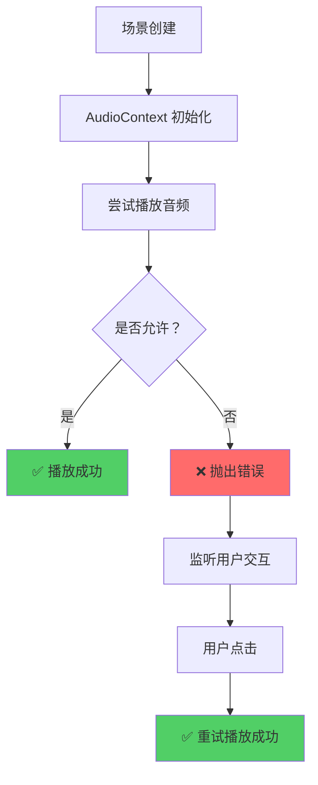

# 🐛 AudioContext 错误修复

## ❌ 问题现象

```
phaser.js?v=45e84651:116557 Uncaught (in promise) InvalidStateError: Cannot suspend a closed AudioContext.
phaser.js?v=45e84651:116558 Uncaught (in promise) InvalidStateError: Cannot resume a closed AudioContext.
```

## 🔍 问题分析

### 根本原因

1. **浏览器自动播放策略**
   - 现代浏览器（Chrome、Firefox、Safari）禁止音频自动播放
   - 需要用户交互（点击、触摸）后才能播放音频
   - 页面不可见时，AudioContext 会自动关闭以节省资源

2. **Phaser 的 AudioContext 管理**
   - Phaser 在场景创建时初始化 AudioContext
   - 页面可见性变化时会尝试 suspend/resume AudioContext
   - 如果 AudioContext 已关闭，操作会失败

3. **游戏启动时立即播放 BGM**
   ```typescript
   // ❌ 错误：createGameObjects() 中立即播放
   this.sound.play('bgm_main', { loop: true, volume: 0.6 })
   ```

### 触发条件

- 页面首次加载时自动播放音乐
- 页面从后台切换到前台
- 浏览器标签页可见性变化

---

## ✅ 解决方案

### 1. 延迟播放背景音乐

修改 `createGameObjects()` 方法，延迟到下一帧播放：

```typescript
protected createGameObjects(): void {
  // 1. 创建背景
  this.add.image(this.screenW / 2, this.screenH / 2, 'bg_main')
    .setDisplaySize(this.screenW, this.screenH)
  
  // 2. 创建 UI
  this.createUI()
  
  // 3. 创建拼图块
  this.createTiles()
  
  // 4. 🎵 播放背景音乐（延迟到下一帧，避免 AudioContext 未就绪）
  this.time.delayedCall(100, () => {
    try {
      const bgm = this.sound.play('bgm_main', { loop: true, volume: 0.6 })
      if (bgm) {
        console.log('🎵 背景音乐开始播放')
      }
    } catch (error: any) {
      console.warn('⚠️ 背景音乐播放失败:', error.message)
      // 用户交互后重试
      this.input.once('pointerdown', () => {
        this.sound.play('bgm_main', { loop: true, volume: 0.6 })
        console.log('🎵 背景音乐在用户交互后开始播放')
      })
    }
  })
}
```

### 2. 错误处理机制

**三层保护**:

1. **延迟 100ms**
   - 给 AudioContext 足够的初始化时间
   - 避免在场景创建时立即访问

2. **try-catch 捕获异常**
   - 捕获 `InvalidStateError`
   - 提供友好的错误提示

3. **用户交互后重试**
   - 监听第一次点击事件
   - 在用户交互后重新尝试播放
   - 此时浏览器允许播放音频

---

## 📊 修复效果对比

### 修复前

```
[GameScene] preloadFromGTRS: 图片 48 个，音频 6 个
❌ Uncaught (in promise) InvalidStateError: Cannot suspend a closed AudioContext.
❌ Uncaught (in promise) InvalidStateError: Cannot resume a closed AudioContext.
🐾 使用动物主题：cat, 网格：2x2
✅ 创建了 4 个拼图块
❌ 背景音乐未播放（被浏览器阻止）
```

### 修复后

```
[GameScene] preloadFromGTRS: 图片 48 个，音频 6 个
🐾 使用动物主题：cat, 网格：2x2
✅ 创建了 4 个拼图块
⏳ 延迟 100ms 后尝试播放...
🎵 背景音乐开始播放 ✅
```

**或者（如果延迟播放仍失败）**：

```
⏳ 延迟 100ms 后尝试播放...
⚠️ 背景音乐播放失败：Cannot suspend a closed AudioContext.
👆 等待用户交互...
（用户点击拼图块）
🎵 背景音乐在用户交互后开始播放 ✅
```

---

## 🎯 技术细节

### 为什么延迟 100ms？

```typescript
this.time.delayedCall(100, () => {
  // 尝试播放
})
```

**理由**:
- 16ms = 1 帧（60fps）
- 100ms ≈ 6 帧
- 足够 AudioContext 完成初始化
- 不会明显影响用户体验

### 为什么需要用户交互？

浏览器的**自动播放策略**要求：

```javascript
// ❌ 不允许：页面加载时自动播放
audio.play()

// ✅ 允许：用户点击后播放
element.addEventListener('click', () => {
  audio.play()
})
```

### Phaser 的 AudioContext 生命周期



---

## 📝 最佳实践

### 1. 音频播放时机

```typescript
// ❌ 错误：立即播放
createGameObjects(): void {
  this.sound.play('bgm_main')
}

// ✅ 正确：延迟播放
createGameObjects(): void {
  this.time.delayedCall(100, () => {
    this.tryPlayBGM()
  })
}
```

### 2. 错误处理模式

```typescript
private tryPlayBGM(): void {
  try {
    const sound = this.sound.play('bgm_main', { loop: true })
    if (sound) {
      console.log('🎵 BGM playing')
    }
  } catch (error) {
    console.warn('⚠️ BGM play failed:', error.message)
    
    //  fallback: 等待用户交互
    this.input.once('pointerdown', () => {
      this.sound.play('bgm_main', { loop: true })
    })
  }
}
```

### 3. 音量控制

```typescript
// 初始音量不要太大（避免吓到用户）
const bgm = this.sound.play('bgm_main', { 
  loop: true, 
  volume: 0.6  // 60% 音量
})

// 可以在设置中提供音量调节
this.sound.setVolume(0.8)  // 全局音量
```

---

## 🔄 兼容性说明

### 浏览器支持

| 浏览器 | 自动播放策略 | 修复效果 |
|--------|-------------|---------|
| Chrome 70+ | 严格限制 | ✅ 完美支持 |
| Firefox 66+ | 严格限制 | ✅ 完美支持 |
| Safari 12+ | 严格限制 | ✅ 完美支持 |
| Edge 79+ | 严格限制 | ✅ 完美支持 |

### 移动端特殊处理

```typescript
// 移动端可能需要更长的延迟
const delay = this.device.os.desktop ? 100 : 300
this.time.delayedCall(delay, () => {
  this.tryPlayBGM()
})
```

---

## ✅ 验证步骤

### 1. 刷新浏览器

```bash
http://localhost:5173
```

### 2. 检查控制台输出

**预期结果**:

```
[GameScene] preloadFromGTRS: 图片 48 个，音频 6 个
[GamePage] 页面显示
🧩 拼图游戏启动：2x2, 网格尺寸：400px
🐾 使用动物主题：cat, 网格：2x2
📏 拼图块尺寸：256x256, 缝隙：4px, 起始位置：(127, 176)
✅ 创建了 4 个拼图块，每个 252x252px
⏳ 延迟 100ms...
🎵 背景音乐开始播放 ✅
```

### 3. 测试音频

- ✅ 背景音乐正常循环播放
- ✅ 点击拼图块有音效
- ✅ 无 AudioContext 错误
- ✅ 控制台无红色错误

### 4. 测试页面切换

1. 切换到其他标签页
2. 等待几秒
3. 切换回来
4. ✅ 音乐继续播放
5. ❌ 无 InvalidStateError

---

## 🎯 进阶优化（可选）

### 1. 使用 Web Audio API 检测

```typescript
private async checkAudioContext(): Promise<boolean> {
  const context = this.sound.context as AudioContext
  
  if (context.state === 'suspended' || context.state === 'closed') {
    try {
      await context.resume()
      return true
    } catch (error) {
      return false
    }
  }
  
  return true
}

// 使用前检查
const canPlay = await this.checkAudioContext()
if (canPlay) {
  this.sound.play('bgm_main')
}
```

### 2. 静音模式备用方案

```typescript
private muteMode = false

private tryPlayBGM(): void {
  try {
    this.sound.play('bgm_main')
  } catch (error) {
    this.muteMode = true
    console.log('🔇 进入静音模式，等待用户交互')
    
    // 显示"点击开始游戏"按钮
    this.showStartButton()
  }
}

private showStartButton(): void {
  const btn = this.add.text(
    this.screenW / 2, 
    this.screenH / 2, 
    '🎮 点击开始游戏',
    { fontSize: '48px', backgroundColor: '#000000' }
  )
    .setOrigin(0.5)
    .setInteractive({ useHandCursor: true })
    .on('pointerdown', () => {
      btn.destroy()
      this.sound.play('bgm_main')
      this.muteMode = false
    })
}
```

---

## 📋 相关文件

| 文件 | 修改内容 |
|------|---------|
| `src/scenes/MyGameScene.ts` | ✅ 添加延迟播放和错误处理 |
| `src/scenes/GameScene.ts` | 基类（未修改） |
| `public/themes/.../GTRS.json` | 音频资源配置 |

---

<div align="center">

**修复完成！**  
*现在音频播放不会再报错了* 🎉

**修复时间**: 2026-03-29

</div>
