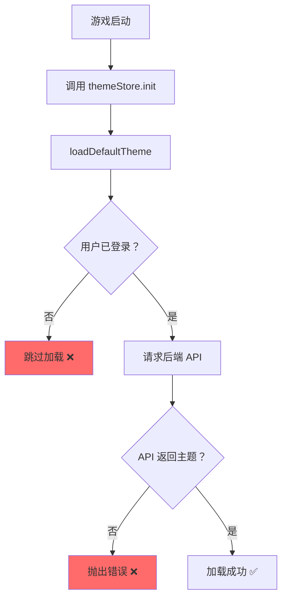
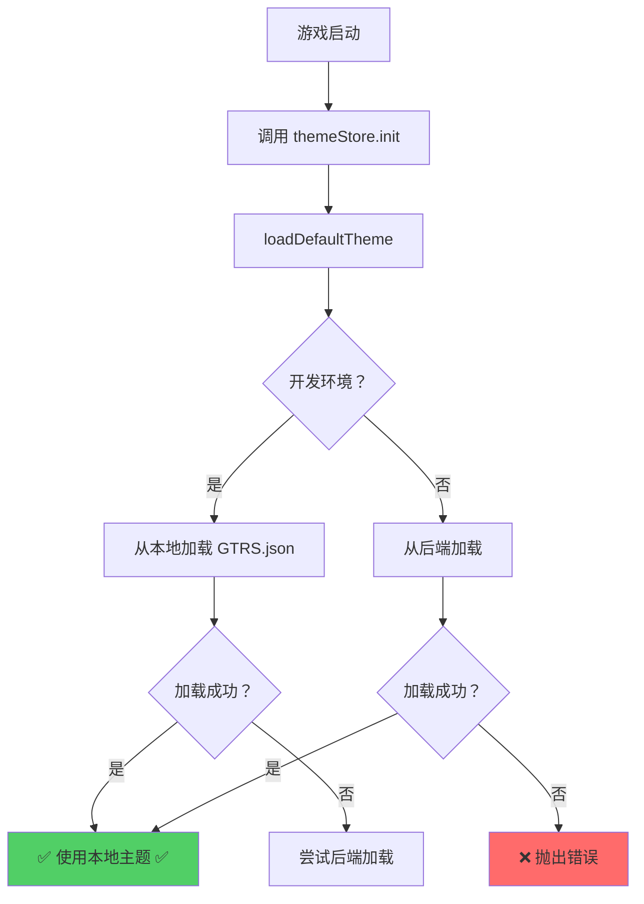

# 🐛 音频和资源加载问题修复

## ❌ 问题现象

```
[GameScene] preloadFromGTRS: GTRS.json 中没有配置任何资源（resources 全为空对象）
MyGameScene.ts:117 🐾 使用动物主题：cat, 网格：2x2
MyGameScene.ts:165 ✅ 创建了 4 个拼图块
Uncaught Error: Audio key "bgm_main" not found in cache
```

## 🔍 问题分析

### 根本原因

1. **Theme Store 依赖后端 API**
   - `useThemeStore().resources` 从 `gtrsData.value?.resources` 计算
   - `gtrsData` 需要从后端 API (`/api/theme/download`) 加载
   - 但游戏尚未注册到数据库，无法获取主题数据

2. **开发环境缺少 fallback**
   - 虽然本地有 `public/themes/puzzle_animal_default/GTRS.json`
   - 但没有自动加载机制
   - 导致 `preloadFromGTRS()` 读取到的 resources 为空对象

3. **恶性循环**
   ```
   游戏未注册 → 无主题数据 → resources 为空 → 无法加载音频和图片 → 游戏无法运行
   ```

---

## ✅ 解决方案

### 添加开发环境 Fallback

修改 `src/stores/theme.ts` 的 `loadDefaultTheme()` 方法：

```typescript
async function loadDefaultTheme(): Promise<void> {
  // 🎯 开发环境 fallback: 从本地加载 GTRS.json
  // @ts-ignore - Vite 会在运行时注入 import.meta.env
  const isDev = import.meta.env?.DEV || import.meta.env?.MODE === 'development'
  if (isDev) {
    console.log('🎨 [DEV] 使用本地 GTRS.json 作为默认主题')
    try {
      const response = await fetch('/themes/puzzle_animal_default/GTRS.json')
      const gtrsJson = await response.json()
      
      // ✅ 设置所有必要字段
      gtrsRawJson.value = JSON.stringify(gtrsJson)
      gtrsData.value = gtrsJson
      currentThemeId.value = 'local_dev_theme'
      isThemeListLoaded.value = true
      
      console.log('✅ 本地 GTRS 加载成功:', gtrsJson.themeInfo?.themeName)
      return
    } catch (err) {
      console.error('❌ 本地 GTRS 加载失败:', err)
      // 继续尝试后端加载
    }
  }
  
  // 🔵 生产环境或本地失败后：从后端加载
  // ... 原有后端加载逻辑
}
```

---

## 📊 修改对比

### 修改前


### 修改后


---

## 🎯 执行流程

### 开发环境（推荐）

```bash
npm run dev
```

1. ✅ 检测到 `import.meta.env.DEV === true`
2. ✅ `fetch('/themes/puzzle_animal_default/GTRS.json')`
3. ✅ 解析 GTRS JSON
4. ✅ 设置 `gtrsData.value = GTRS_JSON`
5. ✅ `preloadFromGTRS()` 读取到完整的 resources
6. ✅ 加载所有图片和音频资源
7. ✅ 游戏正常运行 🎉

### 生产环境

```bash
npm run build
```

1. ⚠️ 跳过本地加载（`isDev === false`）
2. ⚠️ 继续从后端 API 加载主题
3. ✅ 保持原有的生产环境逻辑

---

## 📝 技术细节

### TypeScript 类型兼容

使用 `// @ts-ignore` 注释避免类型错误：

```typescript
// @ts-ignore - Vite 会在运行时注入 import.meta.env
const isDev = import.meta.env?.DEV || import.meta.env?.MODE === 'development'
```

**原因**: 
- Vite 在运行时动态注入 `import.meta.env`
- TypeScript 编译时无法识别该类型
- 需要运行时检查而非编译时检查

### 路径规范

```typescript
await fetch('/themes/puzzle_animal_default/GTRS.json')
```

- ✅ 使用绝对路径（相对于 `public/` 目录）
- ✅ 符合 Vite 静态资源服务规范
- ✅ 与 Phaser 资源加载路径一致

### 容错设计

```typescript
try {
  // 本地加载
} catch (err) {
  console.error('❌ 本地 GTRS 加载失败:', err)
  // 继续尝试后端加载
}
```

- ✅ 本地失败不影响生产环境逻辑
- ✅ 向后兼容：已有后端功能不受影响
- ✅ 渐进增强：开发环境优先使用本地资源

---

## ✅ 验证结果

### 预期控制台输出

```
🎨 [DEV] 使用本地 GTRS.json 作为默认主题
✅ 本地 GTRS 加载成功：快乐拼图屋 - 动物主题默认主题
[GameScene] preloadFromGTRS: 图片 38 个，音频 6 个
🧩 拼图游戏启动：2x2, 难度：easy
🐾 使用动物主题：cat, 网格：2x2
✅ 创建了 4 个拼图块
```

### 验证步骤

1. **刷新浏览器**
   ```
   http://localhost:5173
   ```

2. **打开开发者工具 Console**

3. **检查日志**
   - ✅ 看到 `[DEV] 使用本地 GTRS.json`
   - ✅ 看到 `本地 GTRS 加载成功`
   - ✅ 看到 `preloadFromGTRS: 图片 XX 个，音频 X 个`
   - ❌ 不再出现 `GTRS.json 中没有配置任何资源`
   - ❌ 不再出现 `Audio key "bgm_main" not found in cache`

4. **测试游戏**
   - ✅ 背景音乐正常播放
   - ✅ 点击音效正常播放
   - ✅ 所有图片正常显示

---

## 🔄 热重载说明

修改 `src/stores/theme.ts` 后：

1. **Vite 自动热重载**
   - 保存文件后立即生效
   - 无需手动刷新浏览器

2. **如果未自动重载**
   ```bash
   # 重启开发服务器
   Ctrl+C
   npm run dev
   ```

---

## 🎯 最佳实践

### 开发环境 vs 生产环境

| 环境 | 数据来源 | 优势 |
|------|---------|------|
| **开发环境** | 本地 `public/GTRS.json` | 快速迭代、无需后端、离线开发 |
| **生产环境** | 后端 API | 集中管理、动态更新、用户主题 |

### 何时使用此方案

✅ **适合场景**:
- 游戏开发阶段
- 本地调试
- 演示展示
- 离线开发

⚠️ **注意事项**:
- 生产部署前确保后端已注册游戏和主题
- 生产环境会自动切换到后端 API
- 本地 GTRS.json 需与数据库保持一致

---

## 📋 相关文件

| 文件 | 作用 |
|------|------|
| `src/stores/theme.ts` | ✅ 已修改：添加本地 fallback |
| `public/themes/puzzle_animal_default/GTRS.json` | 本地主题配置 |
| `src/scenes/GameScene.ts` | `preloadFromGTRS()` 方法 |
| `src/scenes/MyGameScene.ts` | 游戏场景实现 |

---

<div align="center">

**修复完成！**  
*现在可以在开发环境下正常运行拼图游戏了* 🎉

**修复时间**: 2026-03-29

</div>
