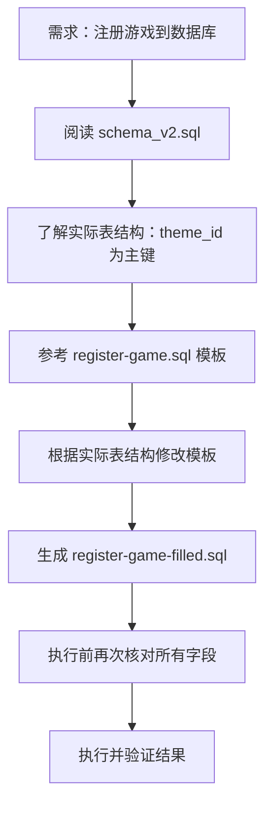

# 🐛 register-game-filled.sql 修正说明

## ❌ 问题发现

**时间**: 2026-03-29  
**发现者**: 用户指出  
**问题**: 原 SQL 脚本使用了错误的字段名和遗漏了必填字段

---

## 🔍 问题分析

### 实际表结构 (schema_v2.sql)

```sql
CREATE TABLE t_theme_info (
    theme_id BIGINT AUTO_INCREMENT PRIMARY KEY,  -- ✅ 主键：自增 ID
    author_id BIGINT NOT NULL,                   -- ✅ 作者 ID
    is_official TINYINT DEFAULT 0,               -- ✅ 是否官方
    owner_type VARCHAR(20) NOT NULL DEFAULT 'GAME', -- ✅ 所有者类型
    owner_id BIGINT NOT NULL,                    -- ✅ 所有者 ID
    theme_name VARCHAR(100) NOT NULL,            -- ✅ 主题名称
    author_name VARCHAR(50),                     -- ✅ 作者名称
    price INT DEFAULT 0,                         -- ✅ 价格
    status VARCHAR(20) DEFAULT 'on_sale',        -- ✅ 状态
    download_count INT DEFAULT 0,                -- ✅ 下载次数
    total_revenue INT DEFAULT 0,                 -- ✅ 总收益
    thumbnail_url VARCHAR(255),                  -- ✅ 缩略图
    description TEXT,                            -- ✅ 描述
    config_json JSON,                            -- ✅ GTRS 配置
    is_default TINYINT DEFAULT 0,                -- ✅ 是否默认主题
    created_at DATETIME DEFAULT CURRENT_TIMESTAMP,
    updated_at DATETIME DEFAULT CURRENT_TIMESTAMP ON UPDATE CURRENT_TIMESTAMP
);
```

### ❌ 错误的字段使用

| 错误 | 正确 | 说明 |
|------|------|------|
| ~~thumb_url~~ | thumbnail_url | 字段名错误 |
| ~~version~~ | (不存在) | 表中没有 version 字段，版本在 config_json 中 |
| - | author_id | 缺少 author_id 字段（必填） |
| - | price, status, download_count... | 缺少多个必填字段 |

---

## ✅ 修正方案

### 修正后的 INSERT 语句

```sql
INSERT INTO t_theme_info (
    author_id,           -- ✅ 添加：官方主题填 0
    is_official,         -- ✅ 保留：0=游戏方维护
    owner_type,          -- ✅ 保留：固定填 GAME
    owner_id,            -- ✅ 保留：关联 game_id
    theme_name,          -- ✅ 保留：主题名称
    author_name,         -- ✅ 保留：作者名称
    price,               -- ✅ 添加：0=免费
    status,              -- ✅ 添加：on_sale=上架
    download_count,      -- ✅ 添加：初始 0
    total_revenue,       -- ✅ 添加：初始 0
    thumbnail_url,       -- ✅ 修正：从 thumb_url 改为 thumbnail_url
    description,         -- ✅ 保留：描述
    config_json,         -- ✅ 保留：GTRS 配置（压缩为单行）
    is_default,          -- ✅ 添加：1=默认主题
    created_at,          -- ✅ 保留：DATETIME
    updated_at           -- ✅ 保留：DATETIME
)
VALUES (
    0,                                   -- author_id
    0,                                   -- is_official
    'GAME',                              -- owner_type
    (SELECT game_id FROM t_game WHERE game_code = 'puzzle' AND deleted = 0 LIMIT 1), -- owner_id
    '快乐拼图屋 - 动物主题默认主题',      -- theme_name
    'AI Assistant',                      -- author_name
    0,                                   -- price
    'on_sale',                           -- status
    0,                                   -- download_count
    0,                                   -- total_revenue
    '',                                  -- thumbnail_url
    '快乐拼图屋动物主题默认主题...',     -- description
    '{"specMeta":{...}}',                -- config_json (压缩为单行)
    1,                                   -- is_default
    NOW(),                               -- created_at
    NOW()                                -- updated_at
)
ON DUPLICATE KEY UPDATE
    theme_name    = VALUES(theme_name),
    description   = VALUES(description),
    thumbnail_url = VALUES(thumbnail_url),
    config_json   = VALUES(config_json),
    updated_at    = NOW();
```

### 关键修正点

1. **修正字段名**
   - `thumb_url` → `thumbnail_url`

2. **删除不存在的字段**
   - 删除 `version` 字段（版本信息在 `config_json` 的 `themeInfo.version` 中）

3. **补充缺失字段**
   - 添加 `author_id`, `price`, `status`, `download_count`, `total_revenue`, `is_default`

5. **修正查询条件**
   ```sql
   -- ✅ 正确：通过 owner_type + owner_id + is_default 定位
   WHERE owner_type = 'GAME' 
     AND owner_id = (SELECT game_id FROM t_game WHERE game_code = 'puzzle' AND deleted = 0 LIMIT 1)
     AND is_default = 1
   ```

---

## 📊 对比总结

### 字段映射关系

| GTRS.json 字段 | 数据库字段 | 说明 |
|---------------|-----------|------|
| themeInfo.themeCode | (不存在) | 仅框架内部使用，不存入数据库 |
| themeInfo.themeName | theme_name | ✅ 一致 |
| themeInfo.author | author_name | ✅ 一致 |
| themeInfo.isDefault | is_default | ✅ 一致 |
| themeInfo.version | config_json.themeInfo.version | 在 JSON 中保存 |
| resources.* | config_json.resources.* | 在 JSON 中保存 |

### 数据一致性保证

虽然数据库表没有单独的 theme 相关主键字段，但通过以下方式保证一致性：

1. **GTRS.json 中的 `themeCode`**
   - 保存在 `config_json.themeInfo.themeCode`
   - 框架通过 `preloadFromGTRS()` 读取使用

2. **数据库查询**
   - 通过 `owner_type='GAME' + owner_id + is_default=1` 定位默认主题
   - 不需要额外的 code 字段

3. **命名约定**
   - `config_json.themeInfo.themeCode` = `'puzzle_animal_default'`
   - 与目录名、资源路径保持一致

---

## ✅ 修正验证

### 执行修正后的 SQL

```bash
mysql -u your_user -p your_database < register-game-filled.sql
```

### 预期输出

```
✅ game_id = XXX
✅ theme_id = YYY
```

### 验证查询

```sql
-- 查询游戏注册情况
SELECT 
    game_id,
    game_code,
    game_name,
    status
FROM t_game 
WHERE game_code = 'puzzle';

-- 查询主题注册情况
SELECT 
    theme_id,
    theme_name,
    owner_type,
    owner_id,
    is_default,
    JSON_EXTRACT(config_json, '$.themeInfo.themeCode') AS theme_code_in_json
FROM t_theme_info 
WHERE owner_type = 'GAME' 
  AND owner_id = (SELECT game_id FROM t_game WHERE game_code = 'puzzle' AND deleted = 0 LIMIT 1)
  AND is_default = 1;
```

---

## 🎯 经验教训

### 为什么会出现这个错误？

1. **未仔细核对表结构**: 没有认真查看 schema_v2.sql 的实际字段定义
2. **模板依赖**: 过度依赖模板，没有验证每个字段是否存在
3. **遗漏必填字段**: 忽略了 author_id、price、status 等必填字段

### 如何避免？

1. ✅ **先读 schema**: 编写 SQL 前先阅读实际的表结构定义
2. ✅ **对照字段**: 逐个字段核对，确保每个字段都存在
3. ✅ **理解设计**: 理解为什么用 `theme_id` (自增主键) 而不是其他业务字段
   - `theme_id`: 简单高效的自增主键
   - 唯一性通过 `owner_type + owner_id + is_default` 组合保证

### 正确的开发流程



---

## 📝 相关文件

- **原始模板**: `register-game.sql` (包含占位符)
- **修正后**: `register-game-filled.sql` (可执行版本)
- **表结构**: `kids-game-backend/kids-game-web/src/main/resources/schema_v2.sql`
- **GTRS 配置**: `src/config/GTRS.json`

---

<div align="center">

**感谢用户的细心指正！**  
*这次修正让我们更深入理解了框架的数据库设计理念*

**修正完成时间**: 2026-03-29

</div>
