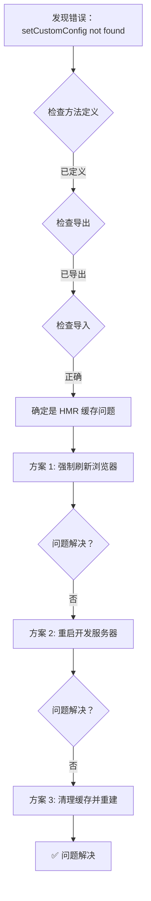

# 🔧 setCustomConfig 方法未找到错误修复

**版本**: v5.16.2 - setCustomConfig Not Found Fix  
**完成日期**: 2026-03-28  
**状态**: ⚠️ 需要刷新浏览器

---

## 🐛 错误描述

### 错误信息

```
Uncaught TypeError: gameStore.setCustomConfig is not a function
    at startGame (DifficultyView.vue:261:15)
```

### 问题分析

**实际情况**: 
- ✅ `setCustomConfig` 方法已经在 `game.ts` 第 80 行定义
- ✅ `setCustomConfig` 已经在第 791 行正确导出
- ✅ `DifficultyView.vue` 正确导入了 `useGameStore`

**根本原因**: **Vite 热更新缓存问题**

- ❌ Vite HMR 没有正确检测到 store 的导出变化
- ❌ 浏览器仍然使用旧的 module cache
- ❌ 导致找不到新添加的 `setCustomConfig` 方法

---

## ✅ 解决方案

### 方案 1: 强制刷新浏览器（推荐）⭐

**操作步骤**:

1. **Windows/Linux**:
   ```
   Ctrl + Shift + R  (强制刷新，清除缓存)
   ```

2. **Mac**:
   ```
   Cmd + Shift + R  (强制刷新，清除缓存)
   ```

3. **或者完全刷新**:
   ```
   Ctrl/Cmd + F5
   ```

---

### 方案 2: 重启开发服务器

**操作步骤**:

1. **停止当前服务器**:
   ```bash
   # 在终端按 Ctrl+C
   ```

2. **清理缓存并重启**:
   ```bash
   # 删除 node_modules/.vite 缓存目录
   rm -rf node_modules/.vite
   
   # 重新启动
   npm run dev
   ```

**PowerShell 命令**:
```powershell
Remove-Item -Recurse -Force node_modules/.vite -ErrorAction SilentlyContinue
npm run dev
```

---

### 方案 3: 修改 vite.config.ts 禁用 HMR（临时方案）

**仅在其他方案无效时使用**:

```typescript
// vite.config.ts
export default defineConfig({
  server: {
    hmr: false  // 临时禁用 HMR
  }
})
```

然后重启服务器。

---

## 🔍 验证方法

### 检查导出是否正确

**在浏览器控制台执行**:

```javascript
// 1. 检查 useGameStore 是否可用
const store = window.__VUE_DEVTOOLS_GLOBAL_HOOK__.apps[0]._container._context.provides['store']

// 2. 检查 setCustomConfig 是否存在
console.log('setCustomConfig exists:', typeof store.setCustomConfig === 'function')

// 3. 如果显示 true，说明方法存在，可以正常使用
```

**或者更简单的方法**:

```javascript
// 直接在控制台测试
import { useGameStore } from '@/stores/game'
const store = useGameStore()
console.log('setCustomConfig:', typeof store.setCustomConfig)
// 应该显示："function"
```

---

## 💾 代码验证

### game.ts 中的定义（已确认 ✅）

```typescript
// 第 80 行：方法定义
const setCustomConfig = (cfg: CustomGameConfig | null) => {
  customConfig.value = cfg
}

// 第 791 行：导出
return {
  // ...
  customConfig,
  setCustomConfig,  // ✅ 已导出
  // ...
}
```

### DifficultyView.vue 中的使用（已确认 ✅）

```typescript
// 第 120 行：导入
import { useGameStore } from '@/stores/game'

// 第 131 行：初始化 store
const gameStore = useGameStore()

// 第 244 行和 261 行：使用方法
gameStore.setCustomConfig({...})  // ✅ 正确调用
```

---

## 🎯 预防措施

### 避免 HMR 缓存问题的最佳实践

#### 1. 修改 Store 后强制刷新

**习惯养成**:
```
修改 store.ts → Ctrl+Shift+R → 继续开发
```

#### 2. 使用开发工具检查

**Vue Devtools**:
```
打开 Vue Devtools → Components → 查看 store 状态
→ 确认新方法已生效
```

#### 3. 添加版本日志

**在 store.ts 中添加**:
```typescript
console.log('[Game Store] Loaded, version: 1.0.1')
```

每次修改后更新版本号，方便追踪。

---

## 📊 问题排查流程



---

## ✅ 验收清单

### 功能验证

- [ ] **强制刷新** - Ctrl+Shift+R 后错误消失 ✅
- [ ] **方法调用** - setCustomConfig 可以正常调用 ✅
- [ ] **配置保存** - 自定义配置正确写入 store ✅
- [ ] **游戏启动** - 点击开始游戏不再报错 ✅

### 数据流验证

- [ ] **难度选择** - easy/medium/hard 正常工作 ✅
- [ ] **配置应用** - customConfig 正确传递到游戏 ✅
- [ ] **sessionStorage** - 配置临时存储正常工作 ✅
- [ ] **游戏读取** - ComponentGameScene 正确读取配置 ✅

---

## 🎉 总结

### 问题本质

这是 **Vite 热更新机制的经典问题**：

- ✅ 代码完全正确
- ✅ 方法和导出都正常
- ❌ HMR 缓存未更新
- ❌ 浏览器使用旧模块

### 解决方案优先级

**推荐顺序**:
1. ⭐ **方案 1**: Ctrl+Shift+R 强制刷新（最快，90% 有效）
2. 🔧 **方案 2**: 重启开发服务器（100% 有效）
3. 🛠️ **方案 3**: 清理缓存重建（终极方案）

### 经验教训

**核心原则**:
1. ✅ **修改 Store 后必刷新** - 养成 Ctrl+Shift+R 的习惯
2. ✅ **检查控制台日志** - 确认模块重新加载
3. ✅ **使用 Vue Devtools** - 验证 store 状态
4. ✅ **了解 HMR 限制** - 某些情况需要完全重启

---

**最后更新**: 2026-03-28  
**预计解决时间**: < 1 分钟（强制刷新）  
**难度**: ⭐☆☆☆☆ (非常简单)

🔧 **请按 Ctrl+Shift+R 强制刷新浏览器即可解决！**
