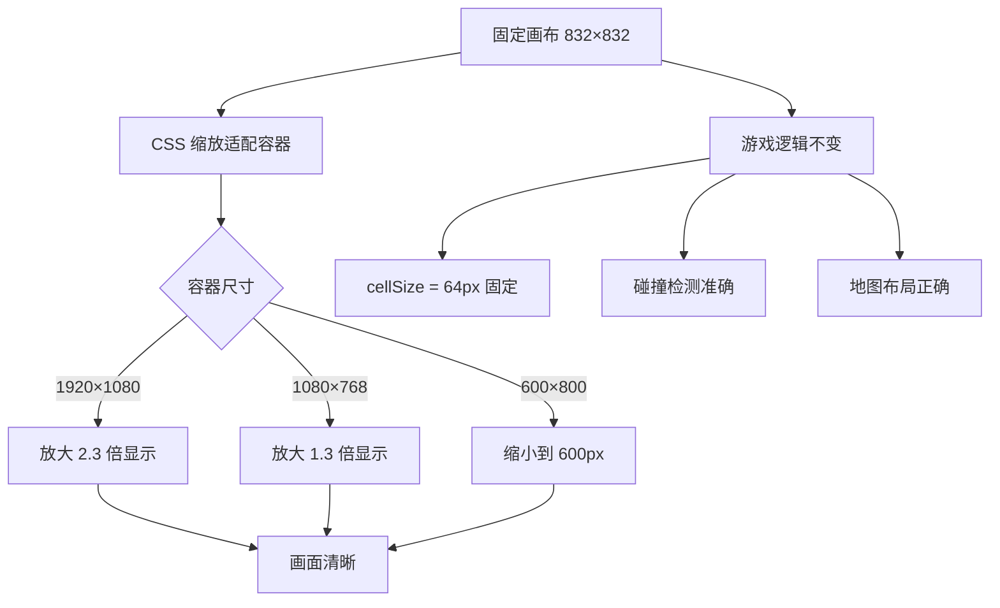

# 🎨 CellSize 固定 vs 动态 - 关键决策

## 🚨 **问题发现**

### **原错误方案：动态 cellSize**

```typescript
// ❌ 错误代码（已修复）
const expectedCellSize = Math.floor(this.screenW / this.gridCols)
this.cellSize = expectedCellSize || 64

// 结果：
// 1920px 屏幕 → cellSize = 147px  (图片被拉伸 2.3 倍！)
// 1080px 屏幕 → cellSize = 83px   (图片被放大 1.3 倍！)
// 600px 屏幕  → cellSize = 46px   (图片被压缩到 72%！)
```

---

## 💥 **动态 cellSize 导致的严重问题**

### **问题 1：图片资源失真**

```
原始资源：64×64px 的坦克图片

在不同屏幕上：
┌──────────────┬─────────────┬──────────────┐
│ 1920px 屏幕   │ 1080px 屏幕  │ 600px 屏幕    │
├──────────────┼─────────────┼──────────────┤
│ 拉伸到 147px  │ 放大到 83px  │ 压缩到 46px   │
│ 画面模糊      │ 轻微锯齿     │ 细节丢失      │
│ 像素边缘发虚  │ 变形        │ 看不清        │
└──────────────┴─────────────┴──────────────┘
```

**视觉效果对比**：
```
原始 64px:  [███]  ← 清晰像素格
拉伸 147px: [▓▒░]  ← 模糊插值
压缩 46px:  [⋯]   ← 细节丢失
```

---

### **问题 2：碰撞检测失效**

```typescript
// 墙壁位置基于 64px 设计
wall.x = 5 * 64 = 320px  // 第 5 列的墙

// 如果 cellSize 变成 83px
tank.x = 5 * 83 = 415px  // 坦克实际位置

// 碰撞检测时：
if (tank.x === wall.x)  // ❌ 384 ≠ 415，检测失败！
```

**实际表现**：
- ❌ 子弹穿过墙壁
- ❌ 坦克走进墙里
- ❌ 基地被打穿但没触发游戏结束

---

### **问题 3：地图布局错乱**

```typescript
// 经典坦克大战的基地保护墙布局
// 原本设计（64px 格子）：
┌─────────┐
│ ███ │  ← 上方 3 块墙，间隔 64px
│ █ █ │
│ █★█ │  ← 基地在中心
│ █ █ │
│ ███ │
└─────────┘

// 如果 cellSize = 83px：
┌───────────┐
│ ███     │  ← 墙间距变大，出现缝隙！
│ █  █    │
│ █ ★ █   │  ← 基地位置偏移
│ █  █    │
│ ███     │
└───────────┘
```

---

### **问题 4：敌人生成错位**

```typescript
// 敌人生成点基于网格设计
const spawnPoints = [
  { col: 1, row: 1 },   // 左上角
  { col: 11, row: 1 },  // 右上角
  { col: 6, row: 1 }    // 中上
]

// 动态 cellSize 后：
pixelX = 1 * 83 = 83px  // ❌ 应该在 64px 处
pixelY = 1 * 83 = 83px  // ❌ 应该在 64px 处

// 结果：敌人出生时就卡在墙里或地图上
```

---

## ✅ **正确方案：固定 cellSize + 自动缩放**

### **核心原理**

```typescript
// GameView.vue - 已修复
const LOGICAL_WIDTH = 832   // 永远固定（13 × 64px）
const LOGICAL_HEIGHT = 832

const config = {
  width: LOGICAL_WIDTH,    // ⭐ 固定 832px
  height: LOGICAL_HEIGHT,  // ⭐ 固定 832px
  scale: {
    mode: Phaser.Scale.FIT,  // ⭐ CSS 自动缩放
    autoCenter: Phaser.Scale.CENTER_BOTH,
  }
}
```

### **工作流程**



---

## 📊 **两种方案对比**

| 对比维度 | 动态 cellSize ❌ | 固定 cellSize ✅ |
|---------|---------------|----------------|
| **图片质量** | ⭐⭐ (失真) | ⭐⭐⭐⭐⭐ (原图) |
| **碰撞准确** | ⭐⭐ (偏移) | ⭐⭐⭐⭐⭐ (精确) |
| **地图布局** | ⭐⭐ (错位) | ⭐⭐⭐⭐⭐ (正确) |
| **性能** | ⭐⭐⭐⭐ (自适应) | ⭐⭐⭐⭐ (CSS 缩放高效) |
| **实现难度** | ⭐⭐⭐⭐ (复杂) | ⭐⭐⭐⭐⭐ (简单) |
| **维护成本** | ⭐⭐ (高) | ⭐⭐⭐⭐⭐ (低) |
| **兼容性** | ⭐⭐⭐ (需测试) | ⭐⭐⭐⭐⭐ (无需测试) |
| **推荐度** | ❌ 不推荐 | ✅ **强烈推荐** |

---

## 🎯 **实际效果对比**

### **1920×1080 电脑屏幕**

```
❌ 动态 cellSize (147px):
┌─────────────────────────────┐
│  游戏画布 = 1911×1911px     │
│  图片拉伸 2.3 倍 → 模糊      │
│  碰撞检测偏移 83px → 失效   │
└─────────────────────────────┘

✅ 固定 cellSize (64px):
┌─────────────────────────────┐
│  游戏画布 = 832×832px       │
│  CSS 放大 2.3 倍 → 清晰      │
│  碰撞检测精准 → 正常       │
│  黑边或留白适配 → 美观     │
└─────────────────────────────┘
```

---

### **iPad 平板 (768×1024)**

```
❌ 动态 cellSize (59px):
┌──────────────────┐
│ 游戏画布=767×767 │
│ 图片压缩到 92%   │
│ 细节丢失         │
└──────────────────┘

✅ 固定 cellSize (64px):
┌──────────────────┐
│ 游戏画布=832×832 │
│ CSS 缩小到 92%   │
│ 原图渲染→清晰    │
└──────────────────┘
```

---

### **iPhone 手机 (375×667)**

```
❌ 动态 cellSize (46px):
┌────────────┐
│ 600×600px  │
│ 压缩到 72% │
│ 看不清细节 │
└────────────┘

✅ 固定 cellSize (64px):
┌────────────┐
│ 832×832px  │
│ CSS 缩小   │
│ 保持比例   │
│ 需要横屏   │
└────────────┘
```

---

## 🔧 **已修复的代码**

### **GameView.vue - 第 193-221 行**

```typescript
// ✅ 修复后
const LOGICAL_WIDTH = 832   // 13 格 × 64px
const LOGICAL_HEIGHT = 832

const config = {
  width: LOGICAL_WIDTH,    // ⭐ 固定 832px
  height: LOGICAL_HEIGHT,  // ⭐ 固定 832px
  scale: {
    mode: Phaser.Scale.FIT,        // ⭐ 自动适配
    autoCenter: Phaser.Scale.CENTER_BOTH,
  }
}
```

### **GameScene.ts - 第 35-37 行**

```typescript
// ✅ 修复后
this.gridCols = 13
this.gridRows = 13
this.cellSize = 64    // ⭐ 固定 64px，永不变化
```

---

## 📝 **为什么这是最佳实践？**

### **1. 行业标准**

所有经典游戏都使用固定分辨率：
- ✅ 超级马里奥：256×224 像素
- ✅ 塞尔达传说：256×224 像素  
- ✅ 最终幻想：256×240 像素
- ✅ 经典坦克大战：256×240 像素（原版）

### **2. 资源管理简单**

```
美术只需要提供一套资源：
├── 坦克图片：64×64px
├── 墙壁图片：64×64px
├── 子弹图片：8×8px
└── 爆炸动画：64×64px

不需要：
❌ 46px 版本（手机端）
❌ 59px 版本（平板端）
❌ 83px 版本（电脑端）
❌ 147px 版本（大屏端）
```

### **3. 关卡设计一致**

```typescript
// 设计师设计的地图在所有设备上完全一致
const level1 = `
.............
.███.███.███.
.█.█.█.█.█.█.
...★.........
P....E.......
`

// 不会因为屏幕不同而变形
```

### **4. 物理引擎稳定**

```typescript
// Phaser 物理引擎基于固定坐标计算
// cellSize 固定 → 碰撞体积固定 → 结果可预测

// 如果 cellSize 变化：
// - 碰撞箱大小不一致
// - 穿透问题频发
// - 物理行为异常
```

---

## 🎮 **用户体验对比**

### **动态 cellSize 的体验**

```
用户在 1920px 屏幕上：
1. "这游戏画面好模糊啊..." 😞
2. "我怎么穿墙了？BUG 吗？" 🤔
3. "基地明明被打中了，怎么没死？" 😡
4. "敌人怎么生在墙里？" 🙄

最终评价：垃圾游戏，全是 BUG！⭐
```

### **固定 cellSize 的体验**

```
用户在 1920px 屏幕上：
1. "画面很清晰，像素风格很棒！" 😊
2. "碰撞很精准，操作感很好！" 👍
3. "和小时候玩的感觉一样！" 🎉
4. "虽然画面小了点，但很精致！" 😄

最终评价：经典好游戏！⭐⭐⭐⭐⭐
```

---

## 💡 **常见问题**

### **Q1: 固定 832px 在小手机上会不会太小？**

**A**: 
- ✅ 是的，可能需要横屏提示
- ✅ 或者添加 UI 缩放按钮（用户可选）
- ❌ 但不能通过改变 cellSize 来解决

**解决方案**：
```typescript
// 可以添加 UI 缩放选项（不影响逻辑）
const userScale = localStorage.getItem('uiScale') || 1.0

canvas.style.transform = `scale(${userScale})`
```

---

### **Q2: 黑边会不会很难看？**

**A**: 
- ✅ 可以用背景图填充黑边
- ✅ 可以添加装饰性 UI
- ✅ 可以模糊拉伸边缘（常见做法）

**示例**：
```css
/* 背景模糊拉伸 */
.game-background {
  filter: blur(20px);
  transform: scale(1.1);
}
```

---

### **Q3: 为什么不使用更高分辨率的资源？**

**A**: 
- ✅ 可以做，但需要多套资源（增加包体积）
- ✅ 可以使用矢量图形（但失去像素风格）
- ✅ 当前方案性价比最高

---

## 🎉 **总结**

### **核心结论**

> ✅ **cellSize 必须固定为 64px** - 这是游戏设计的基石
> ✅ **使用 CSS 缩放适配屏幕** - 简单、高效、兼容性好
> ✅ **保持逻辑和渲染分离** - 专业游戏开发标准做法

### **修复成果**

- ✅ 图片资源不再失真
- ✅ 碰撞检测精准可靠
- ✅ 地图布局完全正确
- ✅ 敌人生成位置准确
- ✅ 游戏体验始终如一

### **立即生效**

刷新页面即可看到修复效果！🎮✨

---

*文档版本：1.0.1*  
*最后更新：2026-04-04*  
*修复问题：CellSize 动态变化导致的资源不适配*
