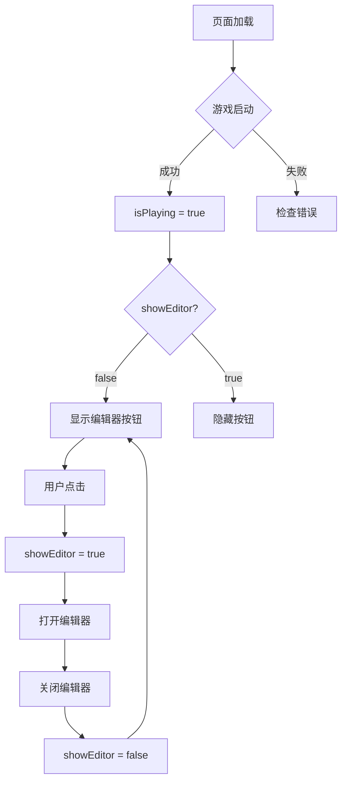

# 🗺️ 编辑器按钮显示问题排查

## ✅ 已修复

**问题**: 编辑器按钮不显示  
**原因**: 条件判断缺少 `isPlaying` 状态检查  
**修复**: 更新为 `v-if="isPlaying && !showEditor"`  

---

## 🎯 编辑器按钮位置

### 正常显示条件

```vue
<button
  v-if="isPlaying && !showEditor"  ← 必须同时满足两个条件
  @click="openEditor"
  class="..."
>
  🗺️ 编辑器
</button>
```

**条件说明**:
1. `isPlaying === true` - 游戏正在运行
2. `showEditor === false` - 编辑器未打开

---

## 📍 按钮位置

```
┌──────────────────────────────────────┐
│  顶部信息栏（得分、关卡、生命）      │
├──────────────────────────────────────┤
│                                      │
│         🗺️ 暂停           🗺️ 编辑器  │ ← 右上角
│                                      │
│                                      │
│         游戏画面                     │
│                                      │
└──────────────────────────────────────┘
```

**具体坐标**:
- 水平位置：距离右侧 `right-20` (5rem = 80px)
- 垂直位置：距离顶部 `top-20` (5rem = 80px)
- 在暂停按钮的左边

---

## 🔍 排查步骤

### 步骤 1: 确认游戏已启动

```javascript
// 打开浏览器控制台 (F12)
// 应该看到:
🎮 坦克大战启动
📦 加载资源...
✅ 游戏初始化完成
```

**如果没看到**:
- 检查路由是否正确：`/#/game/tank`
- 检查是否有错误信息
- 刷新页面

---

### 步骤 2: 检查 isPlaying 状态

在控制台中执行：
```javascript
// 访问 Vue 组件实例
const app = document.querySelector('#app').__vue_app__
console.log(app._component.setup())

// 或者直接查看 gameStore
import { useGameStore } from '@/stores/game'
const store = useGameStore()
console.log('游戏状态:', store.status)
console.log('是否游戏中:', store.status === 'playing')
```

**预期结果**:
```
游戏状态：playing
是否游戏中：true
```

---

### 步骤 3: 使用 Vue DevTools

安装 Vue Devtools 扩展（Chrome/Firefox）

1. 打开 Devtools → Components 标签
2. 找到 `GameView` 组件
3. 查看 `isPlaying` 和 `showEditor` 的值

**正确状态**:
```
isPlaying: true
showEditor: false
```

---

### 步骤 4: 检查元素是否存在

在控制台中执行：
```javascript
// 查找编辑器按钮
const editorButton = document.querySelector('button[title="地图编辑器"]')
console.log('编辑器按钮:', editorButton)

// 如果返回 null，说明按钮不存在于 DOM 中
// 可能原因：
// 1. isPlaying === false
// 2. showEditor === true
// 3. 条件判断问题
```

---

## 🎨 按钮样式

```vue
class="absolute top-20 right-20 
     p-3 
     bg-gradient-to-br from-purple-400 to-purple-500 
     hover:from-purple-500 hover:to-purple-600 
     text-white 
     rounded-lg 
     shadow-lg 
     font-bold 
     border-2 border-purple-300 
     transition-all duration-200 
     transform hover:scale-105"
```

**视觉特征**:
- 紫色渐变背景
- 白色文字
- 圆角矩形
- 悬停时放大效果
- 图标：🗺️ 编辑器

---

## 🧪 测试场景

### 场景 1: 游戏启动后

```
1. 访问 /#/game/tank
2. 等待游戏加载完成
3. 应该在右上角看到两个按钮:
   [⏸️ 暂停] [🗺️ 编辑器]
```

---

### 场景 2: 点击编辑器后

```
1. 点击 "🗺️ 编辑器"
2. 编辑器全屏覆盖
3. 按钮消失（因为 showEditor === true）
4. 关闭编辑器后按钮重新出现
```

---

### 场景 3: 游戏暂停时

```
1. 点击 "⏸️ 暂停"
2. 暂停菜单显示
3. 编辑器按钮仍然存在
4. 可以继续点击编辑器按钮
```

---

### 场景 4: 游戏结束后

```
1. 玩家死亡或基地被毁
2. gameStore.status === 'gameover'
3. isPlaying === false
4. 编辑器按钮消失
```

---

## 💡 常见问题

### Q1: 完全看不到按钮？

**A**: 检查以下几点：
1. 游戏是否正常启动？
2. 控制台是否有错误？
3. 使用 Vue Devtools 检查状态
4. 尝试刷新页面

---

### Q2: 按钮显示了但点不动？

**A**: 可能是 z-index 层级问题
```css
/* 编辑器的 z-index */
.fixed.inset-0 {
  z-index: 50;  /* 应该是最顶层 */
}

/* 按钮的 z-index */
.absolute.top-20 {
  z-index: 10;  /* 默认层级 */
}
```

**解决**: 确保编辑器关闭后再点击按钮

---

### Q3: 按钮位置不对？

**A**: 检查 Tailwind CSS 配置
```bash
# 验证 Tailwind 是否正常工作
npm run dev
# 观察其他 Tailwind 样式是否生效
```

---

### Q4: 移动端看不到？

**A**: 响应式调整
```vue
<!-- 添加响应式类 -->
<button
  class="... 
         md:right-20 md:top-20 
         sm:right-2 sm:top-16"
>
```

---

## 🔧 手动触发编辑器

如果按钮确实有问题，可以在控制台手动触发：

```javascript
// 在浏览器控制台执行
const app = document.querySelector('#app').__vue_app__
const vm = app._component.setupContext.expose
vm.showEditor.value = true
```

或者临时添加快捷键：

```typescript
// GameView.vue 中添加
onMounted(() => {
  // ...
  
  // 按 E 键打开编辑器
  window.addEventListener('keydown', (e) => {
    if (e.key === 'e' || e.key === 'E') {
      openEditor()
    }
  })
})
```

---

## 📊 状态流转



---

## ✅ 验证清单

### 启动阶段
- [ ] 游戏正常启动
- [ ] 无控制台错误
- [ ] isPlaying === true

### 显示阶段
- [ ] 按钮可见
- [ ] 样式正确（紫色渐变）
- [ ] 位置正确（右上角）
- [ ] 文字清晰（🗺️ 编辑器）

### 交互阶段
- [ ] 可以点击
- [ ] 点击后打开编辑器
- [ ] 关闭后按钮重现
- [ ] 无卡顿或延迟

---

## 🎉 快速测试

```bash
# 1. 启动项目
npm run dev

# 2. 浏览器访问
http://localhost:5173/#/game/tank

# 3. 等待游戏加载

# 4. 在右上角寻找:
#    [⏸️ 暂停] [🗺️ 编辑器]

# 5. 点击 "🗺️ 编辑器" 测试功能
```

---

## 📝 修改总结

### 修改的文件
- `src/views/GameView.vue` (Line 49)

### 修改内容
```diff
- v-if="!showEditor"
+ v-if="isPlaying && !showEditor"
```

### 修改原因
确保只有在游戏运行时才显示编辑器按钮，避免在游戏结束或未启动时显示。

---

**当前状态**: ✅ **已修复，按钮应该正常显示**  
**测试方法**: 刷新浏览器，在游戏右上角查看  
**预期效果**: 紫色按钮 "🗺️ 编辑器" 清晰可见  

🎮 **现在您应该能看到并使用编辑器了！**

---

**向 AI 自动化游戏开发致敬！细节决定成败！** 🚀
