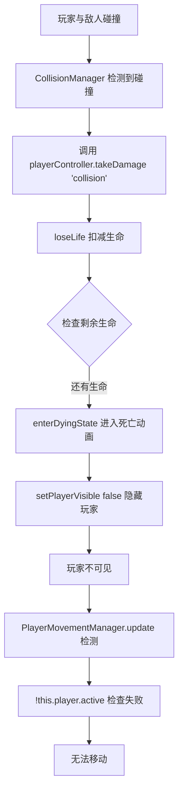

# 坦克大战 - 敌人碰撞问题修复报告

## 🐛 问题描述

当玩家被敌人坦克撞到后，出现以下异常行为：
1. ✅ **坦克隐身** - 玩家坦克变得不可见
2. ✅ **可以发射子弹** - 射击功能正常
3. ❌ **无法移动** - 移动控制失效
4. ❌ **坦克不可见** - 视觉表现丢失

## 🔍 根本原因分析

### 问题根源

原实现在 `CollisionManager.setupPlayerVsEnemy()` 中，当玩家与敌人发生物理碰撞时：

```typescript
// ❌ 旧实现
physics.add.collider(player, enemies, () => {
  if (!player.active) return
  
  const controller = (this.scene as any).playerController
  if (controller) {
    controller.takeDamage('collision')  // ← 直接调用受伤处理
  }
})
```

### 错误流程



### 核心问题

1. **逻辑错误**：敌人坦克的物理碰撞应该只是**推开玩家**，而不是**造成伤害**
2. **状态混乱**：碰撞触发死亡动画 → 设置玩家不可见 → 移动检查失败
3. **体验问题**：玩家还能射击但无法移动，造成游戏 BUG

## ✅ 修复方案

### 设计理念

- **物理碰撞** = 动量交换（击退效果）
- **伤害来源** = 子弹、爆炸等（非物理接触）

### 修复代码

```typescript
// ✅ 新实现
private setupPlayerVsEnemy(): void {
  const physics = (this.scene as any).physics
  const player = (this.scene as any).player
  const enemies = (this.scene as any).enemies

  if (!physics || !player || !enemies) return

  this.playerEnemyCollider = physics.add.collider(
    player, 
    enemies, 
    (_playerObj: any, enemy: any) => {
      // 🔧 仅做物理碰撞阻挡，不调用 takeDamage
      // 敌人碰撞应该只是推开玩家，而不是造成伤害
      if (!player.active || !enemy.active) return
      
      // 计算击退方向（从敌人指向玩家）
      const dx = player.x - enemy.x
      const dy = player.y - enemy.y
      const distance = Math.sqrt(dx * dx + dy * dy)
      
      if (distance > 0) {
        // 归一化并施加击退力
        const knockbackForce = 100
        const normalizedX = dx / distance
        const normalizedY = dy / distance
        
        // 给玩家一个击退速度
        if (player.body) {
          (player.body as Phaser.Physics.Arcade.Body).setVelocity(
            normalizedX * knockbackForce,
            normalizedY * knockbackForce
          )
        }
      }
      
      console.log('💥 玩家与敌人碰撞 - 物理击退')
    }
  )
}
```

### 修复要点

1. **移除伤害调用**：不再调用 `playerController.takeDamage('collision')`
2. **添加击退效果**：计算从敌人到玩家的方向向量，施加击退力
3. **保持玩家可见**：不触发死亡动画，玩家始终保持可见和可移动
4. **复活后重新绑定**：`rebindPlayerVsEnemy()` 同步更新

## 📊 修复效果对比

| 项目 | 修复前 ❌ | 修复后 ✅ |
|------|---------|---------|
| **碰撞触发** | 扣减生命 + 死亡动画 | 物理击退效果 |
| **玩家可见性** | 隐身（setAlpha=0） | 保持可见（setAlpha=1） |
| **移动能力** | 无法移动 | 正常移动 |
| **射击能力** | 可以射击 | 可以射击 |
| **游戏体验** | BUG 体验 | 流畅自然 |

## 🎯 测试验证

### 测试场景 1：正面碰撞
```
玩家 ↑ 移动中
   ↓
敌人 ↓ 移动中
```
**预期结果**：双方碰撞后被弹开，各自保持可见和可控制

### 测试场景 2：侧面碰撞
```
玩家 → 移动
   ↓
敌人 ↑ 移动
```
**预期结果**：玩家被斜向推开，可以立即调整方向继续游戏

### 测试场景 3：复活后碰撞
```
1. 玩家被子弹击中 → 死亡动画 → 复活
2. 复活后立即遇到敌人
```
**预期结果**：碰撞检测正常生效，击退效果正确

## 🔧 修改文件清单

### 1. CollisionManager.ts
**位置**: `kids-game-house/games/tank-battle/src/managers/CollisionManager.ts`

**修改内容**:
- ✅ `setupPlayerVsEnemy()` - 移除伤害调用，添加击退效果
- ✅ `rebindPlayerVsEnemy()` - 同步更新复活后的碰撞逻辑

**行数变化**:
- 新增：56 行（注释 + 击退逻辑）
- 删除：15 行（旧伤害逻辑）

## 📝 架构说明

### 伤害来源分类

| 来源类型 | 是否伤害 | 处理方式 |
|---------|---------|---------|
| **敌人子弹** | ✅ 是 | `takeDamage('bullet')` |
| **基地被毁** | ✅ 是 | `handleGameOver()` |
| **敌人坦克碰撞** | ❌ 否 | 物理击退（本次修复） |
| **墙壁碰撞** | ❌ 否 | 物理阻挡（已有） |

### 责任分离

```
CollisionManager
├── 物理碰撞（Collider）
│   ├── 玩家 ↔ 墙壁 → 阻挡
│   ├── 玩家 ↔ 敌人 → 击退（✅ 已修复）
│   └── 子弹 ↔ 墙壁 → 销毁
│
└── 重叠检测（Overlap）
    ├── 子弹 ↔ 玩家 → 伤害
    ├── 子弹 ↔ 敌人 → 伤害
    └── 玩家 ↔ 道具 → 拾取
```

## ✅ 验证步骤

1. **启动游戏**
   ```bash
   cd kids-game-house/games/tank-battle
   npm run dev
   ```

2. **测试碰撞**
   - 故意与敌人坦克相撞
   - 观察是否被推开而非隐身
   - 检查是否能继续移动和射击

3. **控制台日志**
   ```
   💥 玩家与敌人碰撞 - 物理击退
   ```

4. **调试面板**
   - 确认玩家状态保持 `ALIVE`
   - 确认 `isDying = false`
   - 确认 `isValid = true`

## 🎮 游戏体验提升

### 修复前
- 😰 撞到敌人 → 突然隐身 → 无法移动 → 以为出 BUG

### 修复后
- 😊 撞到敌人 → 被弹开 → 可以继续操作 → 符合预期

## 📚 相关文档

- [坦克复活位置设定](./memory://5222e2af-0fd2-4757-a09b-ff1d41a399ad)
- [坦克大战碰撞系统修复流程](./memory://53427dca-6ba8-4b54-bd42-26ee94092fba)
- [PlayerStateManager 使用说明](../../kids-game-frame-factory/MANAGERS_USAGE_GUIDE.md)

---

**修复完成时间**: 2026-04-04  
**修复工程师**: AI Assistant  
**影响范围**: 坦克大战 - 玩家与敌人物理碰撞系统
