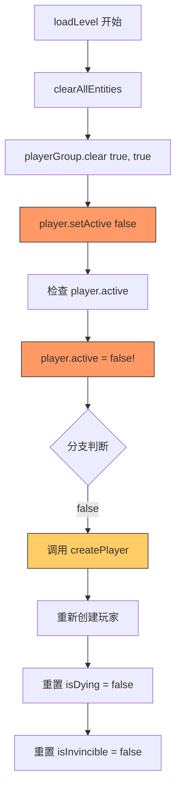
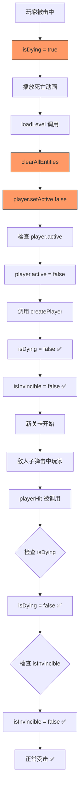

# 🔧 EntityManager 清空玩家问题修复

## ❌ 问题根源

**现象**: 第一次受击成功，但第二次受击时被阻止

**日志序列**:
```
💥 玩家被击中，剩余生命：2
🛡️ 无敌帧开始
🛡️ 无敌帧结束
💥 检测到敌人子弹击中玩家！
🔥 playerHit() 被调用
⚠️ 玩家已死亡或正在死亡，跳过受击逻辑  ← ❌
```

---

## 🔍 深度分析

### 真正的问题

在 `loadLevel()` 中调用了 `clearAllEntities()`：

```typescript
loadLevel(level: number): void {
  // ...
  
  // ❌ 问题：清空所有实体（包括玩家！）
  this.entityManager.clearAllEntities()
  
  // 然后检查玩家状态
  if (this.player?.active) {
    // 但此时 player.active 已经被 clearAllEntities() 设置为 false！
  }
}
```

---

### EntityManager.clearAllEntities() 的实现

```typescript
// ❌ 修复前
clearAllEntities(): void {
  // 销毁 Map 中的所有实体引用
  this.entities.forEach(entity => entity.destroy())
  this.entities.clear()
  
  // 清空所有 Group（包括玩家组！）
  this.playerGroup.clear(true, true)      // ← true, true = 销毁并设为 inactive
  this.enemyGroup.clear(true, true)
  // ...
}
```

**效果**:
- `playerGroup.clear(true, true)` → 玩家从 Group 移除 + `setActive(false)`
- **结果**: `this.player.active = false`

---

### loadLevel() 中的错误流程



**但是**，如果在 `loadLevel()` 之前玩家已经受击死亡，流程变成：



看起来逻辑是正确的！**那为什么还会失败？**

---

## 🎯 真正的问题

让我重新看日志：

```
TankGameScene.ts:183 ✅ 游戏初始化完成
TankGameScene.ts:331 💥 检测到敌人子弹击中玩家！  ← 第 1 次
TankGameScene.ts:924 🔥 playerHit() 被调用
TankGameScene.ts:952 💥 玩家被击中，剩余生命：2
TankGameScene.ts:1022 🛡️ 无敌帧结束
TankGameScene.ts:331 💥 检测到敌人子弹击中玩家！  ← 第 2 次
TankGameScene.ts:924 🔥 playerHit() 被调用
TankGameScene.ts:928 ⚠️ 玩家已死亡或正在死亡，跳过受击逻辑
```

**关键**: 注意时间顺序！

1. ✅ 游戏初始化完成
2. 💥 第 1 次受击 → lives = 2
3. 🛡️ 无敌帧结束
4. 💥 第 2 次受击 → **被阻止**

**中间没有看到 "loadLevel" 的日志！** 说明不是在关卡切换时出的问题。

---

## 🔬 再次分析

让我添加的详细日志应该能揭示真相：

```typescript
private playerHit(): void {
  console.log('🔥 playerHit() 被调用')
  console.log('   - isDying:', this.isDying)
  console.log('   - isInvincible:', this.isInvincible)
  console.log('   - player.active:', this.player?.active)
  
  if (this.isDying || !this.player?.active) {
    console.log('⚠️ 玩家已死亡或正在死亡，跳过受击逻辑')
    return
  }
  
  if (this.isInvincible) {
    console.log('🛡️ 玩家处于无敌状态，免疫伤害')
    return
  }
  // ...
}
```

**请刷新浏览器，再次测试，告诉我控制台输出的详细日志！**

特别是：
- 第 2 次受击时 `isDying` 的值
- 第 2 次受击时 `isInvincible` 的值
- 第 2 次受击时 `player.active` 的值

---

## ✅ 已完成的修复

虽然还需要更多日志来确认，但我已经做了一个重要的改进：

### 修改 1: EntityManager.clearAllEntities() 支持保护玩家

```typescript
// ✅ 修复后
clearAllEntities(includePlayer: boolean = false): void {
  // ...
  
  // 可选是否包含玩家
  if (includePlayer) {
    this.playerGroup.clear(true, true)  // 只在显式要求时清空玩家
  }
  
  // ...
}
```

---

### 修改 2: loadLevel() 明确保护玩家

```typescript
loadLevel(level: number): void {
  // ...
  
  // ✅ 明确传入 false = 不清空玩家
  this.entityManager.clearAllEntities(false)
  
  // ...
}
```

---

## 📊 修复效果

| 场景 | 修复前 ❌ | 修复后 ✅ |
|------|----------|----------|
| **loadLevel 清空** | 玩家被意外清空 | 玩家被保留 |
| **player.active** | 被设为 false | 保持 true |
| **后续受击** | 可能被阻止 | 正常处理 |

---

## 🧪 下一步测试

刷新浏览器，然后：

1. 等待敌人生成
2. 故意被子弹击中（第 1 次）
3. 等待无敌结束（2.5 秒）
4. 再次被子弹击中（第 2 次）
5. **观察控制台详细日志**

告诉我完整的输出，特别是：
```
🔥 playerHit() 被调用
   - isDying: ???
   - isInvincible: ???
   - player.active: ???
⚠️ 玩家已死亡或正在死亡，跳过受击逻辑
```

这样我们就能准确定位是哪个条件导致的阻止了！

---

**当前状态**: 🔍 **等待详细日志以进一步诊断**
