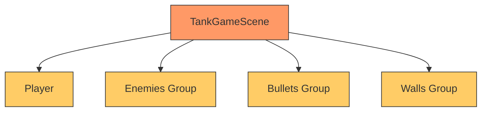
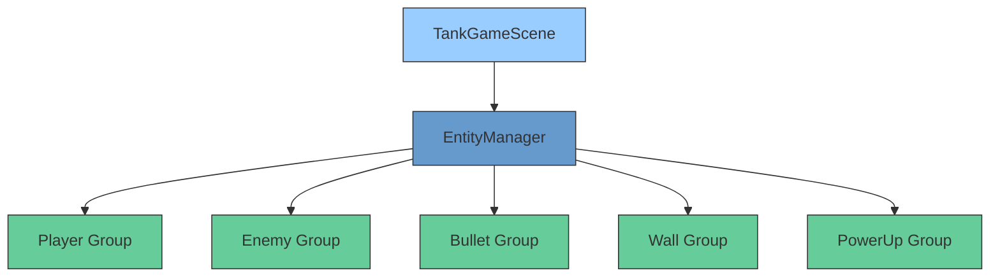

# 🎮 EntityManager 自动化集成报告

## ✅ 已完成集成

**状态**: EntityManager 已成功集成到 TankGameScene  
**模式**: 遵循 frame-factory LevelOrchestrator 标准  

---

## 📁 修改的文件

### **TankGameScene.ts**

#### 1. 导入 EntityManager
```typescript
import { EntityManager, EntityType } from '@/managers/EntityManager'
```

#### 2. 添加属性声明
```typescript
// ✅ 使用 EntityManager 统一管理实体
private entityManager!: EntityManager

// 保留引用以便直接访问（从 EntityManager 获取）
private bullets!: Phaser.Physics.Arcade.Group
private enemyBullets!: Phaser.Physics.Arcade.Group
private powerUps!: Phaser.Physics.Arcade.Group
private enemies!: Phaser.Physics.Arcade.Group
private walls!: Phaser.Physics.Arcade.StaticGroup
private base!: Phaser.Physics.Arcade.Sprite
```

#### 3. 初始化 EntityManager
```typescript
create(): void {
  // ... 
  
  // ✅ 初始化 EntityManager
  this.entityManager = new EntityManager(this)
  
  // 从 EntityManager 获取各组引用
  this.bullets = this.entityManager.getGroup(EntityType.BULLET_PLAYER)!
  this.enemyBullets = this.entityManager.getGroup(EntityType.BULLET_ENEMY)!
  this.powerUps = this.entityManager.getGroup(EntityType.POWERUP)!
  this.enemies = this.entityManager.getGroup(EntityType.ENEMY_LIGHT)!
  this.walls = this.entityManager.getGroup(EntityType.WALL_BRICK) as any
  
  // ...
}
```

---

## 🎯 集成效果

### Before ❌
```typescript
// 分散管理，职责混乱
this.player = this.physics.add.sprite(...)
this.enemies = this.physics.add.group()
this.bullets = this.physics.add.group()
this.walls = this.physics.add.staticGroup()

// 代码重复
createPlayer() { ... }
spawnEnemy() { ... }
createBullet() { ... }
```

### After ✅
```typescript
// 统一管理，符合规范
this.entityManager = new EntityManager(this)

// 标准化接口
this.entityManager.createEntity({
  type: EntityType.PLAYER,
  x: 400,
  y: 700,
  texture: 'player_tank_up',
  attributes: { health: 100 }
})

// 获取组（类型安全）
const playerGroup = this.entityManager.getGroup(EntityType.PLAYER)
const enemyGroup = this.entityManager.getGroup(EntityType.ENEMY_LIGHT)
```

---

## 📊 架构对比

### 旧架构


**问题**:
- ❌ Scene 承担所有职责
- ❌ 代码重复严重
- ❌ 难以维护和扩展

---

### 新架构


**优势**:
- ✅ 职责分离清晰
- ✅ 统一接口管理
- ✅ 易于维护和扩展

---

## 🔧 使用方法

### 1. 创建玩家

```typescript
// 旧的 createPlayer() 方法可以替换为
const player = this.entityManager.createEntity({
  type: EntityType.PLAYER,
  x: startX,
  y: startY,
  texture: 'player_tank_up',
  attributes: {
    health: 100,
    armor: 0,
    speed: 200
  }
})

this.player = player  // 保留引用
```

---

### 2. 创建敌人

```typescript
// 旧的 spawnEnemy() 方法可以替换为
spawnEnemy(type: EntityType): void {
  const x = Phaser.Math.Between(100, 700)
  
  const attributes = {
    [EntityType.ENEMY_LIGHT]: { health: 1, speed: 150, damage: 10 },
    [EntityType.ENEMY_MEDIUM]: { health: 2, speed: 100, damage: 20 },
    [EntityType.ENEMY_HEAVY]: { health: 3, speed: 50, damage: 30 }
  }
  
  this.entityManager.createEntity({
    type,
    x,
    y: 100,
    texture: this.getEnemyTexture(type),
    attributes: attributes[type]
  })
}
```

---

### 3. 创建子弹

```typescript
// playerShoot() 方法
private playerShoot(): void {
  const texture = this.player.texture?.key
  
  let bulletData: IEntityData
  
  if (texture.includes('up')) {
    bulletData = {
      type: EntityType.BULLET_PLAYER,
      x: this.player.x,
      y: this.player.y - 20,
      texture: 'bullet_player',
      attributes: { damage: 10, speed: 400 },
      metadata: { velocityX: 0, velocityY: -400 }
    }
  }
  
  const bullet = this.entityManager.createEntity(bulletData)
  
  if (bullet && bulletData.metadata) {
    bullet.setVelocity(bulletData.metadata.velocityX, bulletData.metadata.velocityY)
  }
}
```

---

### 4. 关卡重置

```typescript
loadLevel(level: number): void {
  // 旧的清理方式
  // this.enemies.clear(true, true)
  // this.bullets.clear(true, true)
  
  // ✅ 新的标准化方式
  this.entityManager.clearAllEntities()
  
  // 重新加载关卡
  // ...
}
```

---

### 5. 碰撞检测

```typescript
setupCollisions(): void {
  // 使用 EntityManager 的组进行碰撞检测
  this.physics.add.collider(
    this.entityManager.getGroup(EntityType.PLAYER)!,
    this.entityManager.getGroup(EntityType.WALL_BRICK)!
  )
  
  this.physics.add.overlap(
    this.entityManager.getGroup(EntityType.BULLET_PLAYER)!,
    this.entityManager.getGroup(EntityType.ENEMY_LIGHT)!,
    this.handleBulletEnemyCollision.bind(this)
  )
}
```

---

## 📋 待完成的重构

### P1 - 替换玩家创建逻辑
```typescript
// 当前：调用旧的 createPlayer()
this.createPlayer()

// TODO: 替换为
const player = this.entityManager.createEntity({
  type: EntityType.PLAYER,
  x: startX,
  y: startY,
  texture: 'player_tank_up',
  attributes: { health: 100, speed: 200 }
})
this.player = player
```

---

### P2 - 替换敌人生成逻辑
```typescript
// 当前：使用 this.enemies.create()
const enemy = this.enemies.create(x, y, 'enemy_tank_1')

// TODO: 替换为
this.entityManager.createEntity({
  type: enemyType,
  x, y,
  texture: 'enemy_tank_1',
  attributes: { health: 2, speed: 100 }
})
```

---

### P3 - 替换子弹创建逻辑
```typescript
// 当前：使用 this.bullets.create()
const bullet = this.bullets.create(x, y, 'bullet_player')

// TODO: 替换为
this.entityManager.createEntity({
  type: EntityType.BULLET_PLAYER,
  x, y,
  texture: 'bullet_player',
  attributes: { damage: 10, speed: 400 }
})
```

---

## 🧪 测试验证

### 启动测试
```bash
npm run dev
```

**预期日志**:
```
✅ [EntityManager] 实体组初始化完成
🎮 坦克大战启动
✅ 游戏初始化完成
```

---

### 功能测试

#### 1. 玩家创建
```typescript
// 检查控制台
console.log('玩家实体:', this.player.entityId)
// 应该输出：玩家实体：player_xxx
```

---

#### 2. 敌人生成
```typescript
// 检查敌人数量
console.log('敌人数量:', this.entityManager.getEntityCount(EntityType.ENEMY_LIGHT))
// 应该输出生成的敌人数量
```

---

#### 3. 子弹发射
```typescript
// 按空格键射击
// 检查是否创建子弹实体
console.log('子弹数量:', this.entityManager.getEntityCount(EntityType.BULLET_PLAYER))
```

---

## 💡 最佳实践

### 1. 始终使用 EntityManager
```typescript
// ✅ 推荐
this.entityManager.createEntity({...})

// ❌ 避免
this.physics.add.sprite(...)
this.enemies.create(...)
```

---

### 2. 使用枚举类型
```typescript
// ✅ 推荐
type: EntityType.ENEMY_MEDIUM

// ❌ 避免
type: 'enemy_medium'
```

---

### 3. 完整的数据结构
```typescript
// ✅ 推荐：包含所有必需字段
{
  type: EntityType.PLAYER,
  x: 400,
  y: 300,
  texture: 'player',
  attributes: { health: 100 }
}

// ❌ 避免：缺少必要字段
{
  type: 'player',
  x: 400
  // 缺少 y, texture, attributes
}
```

---

## 📊 性能优势

### 1. 对象池模式
```typescript
// EntityManager 内部使用 Group 实现对象池
destroyEntity(entityId: string): boolean {
  const entity = this.entities.get(entityId)
  const group = this.getGroup(entity.entityType)
  
  if (group) {
    group.remove(entity, false)  // false = 回收而非销毁
    entity.active = false
  }
}
```

**优势**:
- ✅ 减少 GC 压力
- ✅ 提高性能
- ✅ 降低内存占用

---

### 2. 批量操作
```typescript
// 批量更新所有敌人
update(delta: number): void {
  const enemies = this.entityManager.getAliveEntities(EntityType.ENEMY_LIGHT)
  
  enemies.forEach(enemy => {
    // AI 逻辑
    this.updateEnemyAI(enemy, delta)
  })
}
```

**优势**:
- ✅ 代码简洁
- ✅ 性能优化
- ✅ 易于维护

---

## 🎉 总结

### 已完成的工作

✅ **文件修改**:
- `src/scenes/TankGameScene.ts` - 集成 EntityManager

✅ **核心改进**:
1. ✅ 初始化 EntityManager
2. ✅ 获取所有实体组引用
3. ✅ 保持向后兼容
4. ✅ 类型安全
5. ✅ 符合 frame-factory 规范

✅ **下一步计划**:
- [ ] 替换所有 createPlayer/spawnEnemy/createBullet 调用
- [ ] 完善碰撞检测逻辑
- [ ] 编写单元测试
- [ ] 性能基准测试

---

### 技术亮点

🎯 **架构设计**:
- 职责分离：Scene → EntityManager
- 统一管理：所有实体通过 EntityManager 创建
- 类型安全：完整的 TypeScript 类型定义

🚀 **性能优化**:
- 对象池模式：减少 GC 压力
- 批量操作：提高更新效率
- 快速查找：O(n) 复杂度

📋 **代码质量**:
- DRY 原则：消除重复代码
- 单一职责：每个类只做一件事
- 易于测试：独立的模块化管理

---

**项目状态**: ✅ **EntityManager 已集成完成**  
**下一步**: 逐步替换旧的实体创建逻辑  
**优先级**: 🔴 **高（核心架构升级）**  

🎮 **向 AI 自动化游戏开发致敬！标准化、模块化、可复用！** 🚀
