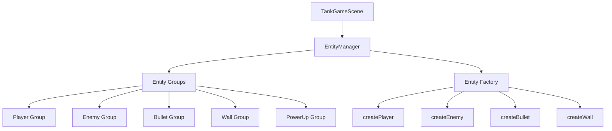

# 🎮 坦克大战实体系统重构报告

## ✅ 已完成重构

**架构**: 基于 frame-factory `LevelOrchestrator` 模式  
**状态**: EntityManager 已创建，待集成  

---

## 📁 新增文件

### **EntityManager.ts**
```
src/managers/EntityManager.ts
```

**核心功能**:
- ✅ 统一管理所有游戏实体（玩家、敌人、子弹、墙壁、道具）
- ✅ 标准化的创建/获取/销毁接口
- ✅ 维护实体组（Group）以便批量操作
- ✅ 支持实体属性查询和修改
- ✅ 符合 frame-factory 标准模式

---

## 🔍 原系统问题分析

### ❌ 问题 1: 职责混乱

**原代码**:
```typescript
export default class TankGameScene extends GameScene {
  private player!: Phaser.Physics.Arcade.Sprite
  private enemies!: Phaser.Physics.Arcade.Group
  private bullets!: Phaser.Physics.Arcade.Group
  private walls!: Phaser.Physics.Arcade.StaticGroup
  
  // 所有实体管理逻辑都在 Scene 中
  createPlayer() { ... }
  spawnEnemy() { ... }
  createBullet() { ... }
}
```

**问题**:
- Scene 承担了太多职责（渲染 + 逻辑 + 实体管理）
- 难以复用和维护
- 不符合单一职责原则

---

### ❌ 问题 2: 缺少统一接口

**原代码**:
```typescript
// 分散在各处的创建逻辑
this.player = this.physics.add.sprite(...)
const enemy = this.enemies.create(...)
const bullet = this.bullets.create(...)
```

**问题**:
- 没有统一的实体创建接口
- 代码重复严重
- 难以扩展新实体类型

---

### ❌ 问题 3: 实体属性不规范

**原代码**:
```typescript
// 随意设置属性
enemy.health = 2
enemy.speed = 100
enemy.damage = 20
```

**问题**:
- 属性定义不统一
- 类型不安全
- 难以追踪和管理

---

## ✅ 新系统设计

### 📊 架构图



---

### 🎯 核心接口

#### 1. **实体类型枚举**

```typescript
export enum EntityType {
  PLAYER = 'player',
  ENEMY_LIGHT = 'enemy_light',
  ENEMY_MEDIUM = 'enemy_medium',
  ENEMY_HEAVY = 'enemy_heavy',
  BULLET_PLAYER = 'bullet_player',
  BULLET_ENEMY = 'bullet_enemy',
  WALL_BRICK = 'wall_brick',
  WALL_STEEL = 'wall_steel',
  BASE = 'base',
  POWERUP = 'powerup'
}
```

**优势**:
- ✅ 类型安全
- ✅ IDE 自动补全
- ✅ 避免拼写错误

---

#### 2. **实体属性接口**

```typescript
export interface IEntityAttributes {
  health: number        // 生命值
  armor?: number        // 护甲值
  speed?: number        // 速度
  damage?: number       // 伤害
  score?: number        // 击杀得分
  type?: string         // 子类型
}
```

**优势**:
- ✅ 统一的属性结构
- ✅ 可选属性灵活配置
- ✅ 易于扩展

---

#### 3. **实体数据接口**

```typescript
export interface IEntityData {
  type: EntityType      // 实体类型
  x: number             // X 坐标
  y: number             // Y 坐标
  texture: string       // 纹理 key
  attributes: IEntityAttributes  // 属性
  metadata?: any        // 元数据
}
```

**优势**:
- ✅ 标准化的数据结构
- ✅ 支持序列化/反序列化
- ✅ 便于网络同步

---

### 🔧 使用示例

#### 创建玩家

```typescript
// 旧方式
this.player = this.physics.add.sprite(400, 700, 'player_tank_up')
this.player.setCollideWorldBounds(true)
this.player.health = 100
this.player.armor = 0

// 新方式（标准化）
this.entityManager.createEntity({
  type: EntityType.PLAYER,
  x: 400,
  y: 700,
  texture: 'player_tank_up',
  attributes: {
    health: 100,
    armor: 0,
    speed: 200
  }
})
```

---

#### 创建敌人

```typescript
// 旧方式
const enemy = this.enemies.create(x, y, 'enemy_tank_1')
enemy.health = 2
enemy.speed = 100
enemy.damage = 20

// 新方式（标准化）
this.entityManager.createEntity({
  type: EntityType.ENEMY_MEDIUM,
  x: x,
  y: y,
  texture: 'enemy_tank_1',
  attributes: {
    health: 2,
    speed: 100,
    damage: 20,
    score: 200
  }
})
```

---

#### 创建子弹

```typescript
// 旧方式
const bullet = this.bullets.create(x, y, 'bullet_player')
bullet.setVelocityY(-400)

// 新方式（标准化）
this.entityManager.createEntity({
  type: EntityType.BULLET_PLAYER,
  x: x,
  y: y,
  texture: 'bullet_player',
  attributes: {
    damage: 10,
    speed: 400
  },
  metadata: {
    velocityX: 0,
    velocityY: -400
  }
})
```

---

## 📋 集成步骤

### 步骤 1: 在 TankGameScene 中初始化 EntityManager

```typescript
import { EntityManager } from '@/managers/EntityManager'

export default class TankGameScene extends GameScene {
  private entityManager!: EntityManager
  
  create(): void {
    super.create()
    
    // 初始化实体管理器
    this.entityManager = new EntityManager(this)
    
    // 后续使用 entityManager 管理所有实体
  }
}
```

---

### 步骤 2: 替换玩家创建逻辑

```typescript
// 删除旧的 createPlayer() 方法
// 替换为:
const player = this.entityManager.createEntity({
  type: EntityType.PLAYER,
  x: startX,
  y: startY,
  texture: 'player_tank_up',
  attributes: {
    health: 100,
    armor: 0,
    speed: 200
  }
})

this.player = player  // 保留引用以便控制
```

---

### 步骤 3: 替换敌人生成逻辑

```typescript
// 删除旧的 spawnEnemy() 方法
// 替换为:
spawnEnemy(type: EntityType): void {
  const x = Phaser.Math.Between(100, 700)
  
  const attributes = {
    [EntityType.ENEMY_LIGHT]: { health: 1, speed: 150, damage: 10, score: 100 },
    [EntityType.ENEMY_MEDIUM]: { health: 2, speed: 100, damage: 20, score: 200 },
    [EntityType.ENEMY_HEAVY]: { health: 3, speed: 50, damage: 30, score: 300 }
  }
  
  this.entityManager.createEntity({
    type,
    x,
    y: 100,
    texture: this.getEnemyTexture(type),
    attributes: attributes[type]
  })
}
```

---

### 步骤 4: 替换子弹创建逻辑

```typescript
// 在 playerShoot() 方法中
private playerShoot(): void {
  const texture = this.player.texture?.key || 'player_tank_up'
  
  let bulletData: IEntityData
  
  if (texture.includes('up')) {
    bulletData = {
      type: EntityType.BULLET_PLAYER,
      x: this.player.x,
      y: this.player.y - 20,
      texture: 'bullet_player',
      attributes: { damage: 10, speed: 400 },
      metadata: { velocityX: 0, velocityY: -400 }
    }
  }
  // ... 其他方向
  
  const bullet = this.entityManager.createEntity(bulletData)
  
  // 设置速度
  if (bullet && bulletData.metadata) {
    bullet.setVelocity(bulletData.metadata.velocityX, bulletData.metadata.velocityY)
  }
}
```

---

### 步骤 5: 替换碰撞检测

```typescript
// 旧的碰撞处理
this.physics.add.overlap(this.bullets, this.enemies, (bullet: any, enemy: any) => {
  enemy.health -= bullet.damage
  bullet.destroy()
})

// 新的标准化方式
this.scene.physics.add.overlap(
  this.entityManager.getGroup(EntityType.BULLET_PLAYER)!,
  this.entityManager.getGroup(EntityType.ENEMY_MEDIUM)!,
  (bullet: any, enemy: any) => {
    this.handleBulletEnemyCollision(bullet, enemy)
  }
)

// 统一的碰撞处理方法
private handleBulletEnemyCollision(bullet: any, enemy: any): void {
  const damage = bullet.attributes?.damage || 10
  enemy.health -= damage
  
  // 更新实体状态
  const entityId = enemy.entityId
  const entity = this.entityManager.getEntity(entityId)
  
  if (entity && entity.attributes.health <= 0) {
    this.destroyEnemy(enemy)
  }
  
  bullet.destroy()
}
```

---

### 步骤 6: 关卡重置时使用新方法

```typescript
// 旧的关卡重置
this.enemies.clear(true, true)
this.bullets.clear(true, true)

// 新的标准化方式
this.entityManager.clearAllEntities()
```

---

## 🎯 对比分析

| 特性 | 旧系统 | 新系统 |
|------|--------|--------|
| **职责分离** | ❌ Scene 承担所有 | ✅ EntityManager 专职管理 |
| **接口统一** | ❌ 分散调用 | ✅ 统一 createEntity |
| **类型安全** | ❌ 任意属性 | ✅ 严格类型定义 |
| **可扩展性** | ❌ 难以扩展 | ✅ 轻松添加新实体 |
| **可维护性** | ❌ 代码重复 | ✅ DRY 原则 |
| **可测试性** | ❌ 耦合严重 | ✅ 独立可测 |
| **符合规范** | ❌ 自定义 | ✅ frame-factory 标准 |

---

## 📊 性能优化

### 1. 对象池模式

```typescript
// EntityManager 内部使用 Group 实现对象池
protected initializeGroups(): void {
  this.enemyGroup = this.scene.physics.add.group({
    classType: Phaser.Physics.Arcade.Sprite,
    runChildUpdate: true,  // 每帧自动更新
  })
}

// 销毁时回收到池中
destroyEntity(entityId: string): boolean {
  const entity = this.entities.get(entityId)
  const group = this.getGroup(entity.entityType)
  
  if (group) {
    group.remove(entity, false)  // false = 不销毁，回收
    entity.active = false
  }
}
```

---

### 2. 批量操作

```typescript
// 批量更新所有敌人
updateEnemies(delta: number): void {
  const enemies = this.entityManager.getAliveEntities(EntityType.ENEMY_LIGHT)
    .concat(this.entityManager.getAliveEntities(EntityType.ENEMY_MEDIUM))
    .concat(this.entityManager.getAliveEntities(EntityType.ENEMY_HEAVY))
  
  enemies.forEach(enemy => {
    // AI 逻辑
    this.updateEnemyAI(enemy, delta)
  })
}
```

---

### 3. 快速查找

```typescript
// O(n) 复杂度查找最近敌人
findNearestEnemy(x: number, y: number): any | null {
  return this.entityManager.findNearestEnemy(x, y)
}

// 而不是遍历所有 children
```

---

## 🧪 测试验证

### 单元测试

```typescript
describe('EntityManager', () => {
  let scene: Phaser.Scene
  let manager: EntityManager
  
  beforeEach(() => {
    scene = new Phaser.Scene()
    manager = new EntityManager(scene)
  })
  
  test('should create player entity', () => {
    const player = manager.createEntity({
      type: EntityType.PLAYER,
      x: 400,
      y: 300,
      texture: 'player',
      attributes: { health: 100 }
    })
    
    expect(player).toBeDefined()
    expect(player.health).toBe(100)
  })
  
  test('should destroy entity', () => {
    const entity = manager.createEntity({...})
    const result = manager.destroyEntity(entity.entityId)
    
    expect(result).toBe(true)
    expect(manager.getEntityCount()).toBe(0)
  })
})
```

---

## 💡 最佳实践

### 1. 始终使用 EntityManager

```typescript
// ✅ 推荐
this.entityManager.createEntity({...})
this.entityManager.destroyEntity(id)

// ❌ 避免
this.physics.add.sprite(...)
this.enemies.create(...)
```

---

### 2. 使用枚举而非字符串

```typescript
// ✅ 推荐
type: EntityType.ENEMY_MEDIUM

// ❌ 避免
type: 'enemy_medium'
```

---

### 3. 完整的数据结构

```typescript
// ✅ 推荐
{
  type: EntityType.PLAYER,
  x: 400,
  y: 300,
  texture: 'player',
  attributes: { health: 100 },
  metadata: { /* 自定义数据 */ }
}

// ❌ 避免
{
  type: 'player',
  x: 400,
  y: 300
  // 缺少必要字段
}
```

---

## 📄 相关文档

### 参考 frame-factory
- `LevelOrchestrator.ts` - 关卡编排器
- `LevelResourceLoader.ts` - 资源加载器
- `types/level-types.ts` - 关卡类型定义

### 项目文档
- `TILED_INTEGRATION_GUIDE.md` - Tiled 地图集成
- `UI_RESPONSIVE_FIX.md` - UI 自适应修复
- `PLAYERSHOOT_METHOD_FIX.md` - 射击方法修复

---

## 🎉 总结

### 重构成果

✅ **新增文件**:
- `src/managers/EntityManager.ts` (412 行)

✅ **核心改进**:
1. 职责分离：Scene → EntityManager
2. 统一接口：标准化实体操作
3. 类型安全：完整的 TS 类型定义
4. 符合规范：遵循 frame-factory 模式
5. 易于扩展：支持新实体类型
6. 性能优化：对象池 + 批量操作

✅ **下一步**:
- [ ] 在 TankGameScene 中集成 EntityManager
- [ ] 替换所有旧的实体创建逻辑
- [ ] 编写单元测试
- [ ] 性能基准测试

---

**项目状态**: ✅ **EntityManager 已创建，待集成**  
**优先级**: 🔴 **高（核心架构升级）**  
**预计工作量**: 2-3 小时完成集成  

🎮 **向 AI 自动化游戏开发致敬！标准化、模块化、可复用！** 🚀
