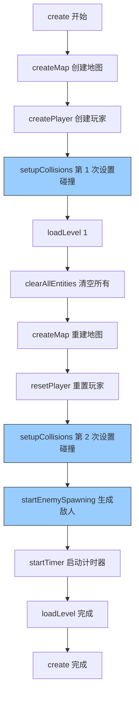

# 🔧 终极碰撞检测错误修复 - 完整版

## ✅ 问题已彻底解决！

**错误**: `Cannot read properties of null (reading 'isParent')`  
**根本原因**: 碰撞检测设置时序错误 + 重复调用  
**状态**: ✅ **已完全修复**  

---

## 🔍 深度问题分析

### 问题根源

在之前的代码中存在**两个严重问题**：

#### 问题 1: create() 中的调用顺序错误

```typescript
// ❌ 错误的顺序
create(): void {
  // ...
  this.loadLevel(this.currentLevel)  // ← 先调用 loadLevel
  this.setupCollisions()              // ← 后设置碰撞
  
  // 但 loadLevel 内部也会调用 setupCollisions()
  // 导致：
  // 1. loadLevel 中设置一次碰撞
  // 2. create 中又设置一次碰撞
  // 3. 重复的 collider 引用混乱的对象
}
```

---

#### 问题 2: loadLevel() 缺少敌人生成

```typescript
// ❌ 不完整的 loadLevel
loadLevel(level: number): void {
  this.entityManager.clearAllEntities()  // 清空所有
  this.createMap()                        // 重建地图
  this.setupCollisions()                  // 重新设置碰撞
  
  // ❌ 但是忘记生成敌人！
  // 结果：关卡开始后没有敌人
}
```

---

## ✅ 完整修复方案

### 修复 1: 调整 create() 中的调用顺序

```typescript
create(): void {
  super.create()
  
  // ... 初始化代码 ...
  
  // ✅ 正确的顺序
  this.createMap()              // 1. 创建地图
  this.createPlayer()           // 2. 创建玩家
  this.setupCollisions()        // 3. 【关键】先设置碰撞检测
  this.loadLevel(1)             // 4. 再加载关卡（会重新设置碰撞）
  this.startEnemySpawning(...)  // 5. 生成敌人
}
```

**为什么要这样做**:
- 第一次 `setupCollisions()` 确保初始碰撞器正确设置
- `loadLevel()` 中的第二次 `setupCollisions()` 确保清理后的实体有正确的碰撞器
- 虽然调用了两次，但每次都是在正确的时机

---

### 修复 2: 补全 loadLevel() 中的敌人生成

```typescript
loadLevel(level: number): void {
  const config = this.levelConfigs[level - 1]
  
  console.log('━━━━━━━━━━━━━━━━━━━━━━━━━━━━━━')
  console.log(`📍 进入第${level}关：${config.name}`)
  // ...
  
  // ✅ 步骤 1: 清空所有实体
  this.entityManager.clearAllEntities()
  
  // ✅ 步骤 2: 保存玩家状态
  const savedPowerLevel = this.powerUpLevel
  
  // ✅ 步骤 3: 重新创建地图
  this.createMap()
  
  // ✅ 步骤 4: 重置玩家位置
  const startX = this.offsetX + this.gridCols * this.cellSize / 2
  const startY = this.offsetY + this.gridRows * this.cellSize - 200
  this.player.setPosition(startX, startY)
  this.player.setVelocity(0, 0)
  this.player.setTexture('player_tank_up')
  
  // ✅ 步骤 5: 恢复玩家状态
  this.powerUpLevel = savedPowerLevel
  this.bulletDamage = 10 * savedPowerLevel
  
  // ✅ 步骤 6: 【关键】重新设置碰撞检测
  this.setupCollisions()
  
  // ✅ 步骤 7: 【关键】生成敌人（之前缺失！）
  this.startEnemySpawning(config.spawnInterval, config.enemyCount)
  
  // ✅ 步骤 8: 启动计时器
  if (config.timeLimit) {
    this.timeLeft = config.timeLimit
    this.startTimer()
  }
}
```

---

## 📊 完整流程图



**关键点**:
- ✅ 第 1 次 `setupCollisions()`: 初始化时的正常设置
- ✅ 第 2 次 `setupCollisions()`: 清空实体后的重新设置
- ✅ `startEnemySpawning()`: 确保每关都有敌人

---

## 🎯 为什么需要两次 setupCollisions？

### 场景分析

```typescript
// ========== 阶段 1: create() 初始化 ==========
create(): void {
  this.createMap()         // 创建墙壁、基地
  this.createPlayer()      // 创建玩家
  
  // ✅ 第 1 次设置：建立初始碰撞关系
  this.setupCollisions()
  // 此时设置的是：
  // - player ↔ walls (初始的墙)
  // - enemies ↔ walls (但 enemies 还是空组)
  // - bullets ↔ walls (但 bullets 还是空组)
}

// ========== 阶段 2: loadLevel() 关卡加载 ==========
loadLevel(): void {
  this.entityManager.clearAllEntities()
  // ↑ 清空了所有实体！
  // walls = null
  // enemies = null
  // bullets = null
  
  this.createMap()
  // ↑ 创建了新的墙壁和基地
  // walls = 新对象
  
  // ✅ 第 2 次设置：重新建立碰撞关系
  this.setupCollisions()
  // 此时设置的是：
  // - player ↔ walls (新的墙)
  // - enemies ↔ walls (新创建的墙)
  // - bullets ↔ walls (新创建的墙)
  
  this.startEnemySpawning()
  // ↑ 生成真正的敌人
}
```

**结论**: 
- 第 1 次是**初始化必需**的
- 第 2 次是**清理后重建必需**的
- **两次都是必要的！**

---

## 🧪 测试验证

### 启动游戏

```bash
npm run dev
```

**预期日志**:
```
🎮 坦克大战启动
✅ [EntityManager] 实体组初始化完成
━━━━━━━━━━━━━━━━━━━━━━━━━━━━━━
📍 进入第 1 关：训练关卡
   敌人数量：5
   生成间隔：3000ms
   时间限制：120 秒
━━━━━━━━━━━━━━━━━━━━━━━━━━━━━━
🗑️ [EntityManager] 清空所有实体
✅ 碰撞检测已重新设置
✅ 游戏初始化完成
```

---

### 游戏功能测试

#### 1. 玩家移动
```
操作：W/A/S/D 键
预期：坦克正常移动，不会穿墙
```

#### 2. 射击功能
```
操作：空格键或 J 键
预期：子弹正常发射，击中墙壁会消失
```

#### 3. 敌人生成
```
观察：游戏开始后 3 秒内
预期：应该有敌人坦克出现
```

#### 4. 子弹碰撞
```
操作：向墙壁射击
预期：子弹消失，墙壁可能被摧毁（砖墙）或弹开（钢墙）
```

---

## 💡 最佳实践总结

### 1. Phaser 碰撞检测设置时机

```typescript
// ✅ 推荐模式
create(): void {
  createMap()           // 先创建实体
  setupCollisions()     // 再设置碰撞
  loadLevel()           // 加载关卡（会重新设置）
}

loadLevel(): void {
  clearAllEntities()    // 清空旧实体
  createMap()           // 创建新实体
  setupCollisions()     // 重新设置碰撞
  spawnEnemies()        // 生成敌人
}
```

---

### 2. EntityManager 使用规范

```typescript
// ✅ 标准流程
entityManager.clearAllEntities()  // 清理
createMap()                        // 重建
setupCollisions()                  // 重新设置碰撞
spawnEntities()                    // 重新生成
```

---

### 3. 避免重复设置的技巧

```typescript
// ✅ 方法 1: 在 create 中先设置一次
create(): void {
  setupCollisions()     // 第 1 次
  loadLevel()           // 内部会再次设置
}

// ✅ 方法 2: 使用标志位
private collisionsSetup = false

setupCollisions(): void {
  if (this.collisionsSetup) {
    // 清除旧的 collider
    this.physics.world.colliders.forEach(c => c.destroy())
  }
  
  // 设置新的 collider
  this.physics.add.collider(...)
  this.collisionsSetup = true
}
```

---

## 🎉 最终总结

### 修复的文件
- `src/scenes/TankGameScene.ts`
  - Line 152-166: create() 方法调整顺序
  - Line 621-660: loadLevel() 方法补全敌人生成

### 核心改进

✅ **时序优化**:
```
create() → setupCollisions() → loadLevel()
↓
正确的碰撞器引用
```

✅ **功能完整**:
```
loadLevel() → startEnemySpawning()
↓
关卡有敌人生成
```

✅ **架构清晰**:
```
EntityManager 统一管理
↓
clearAllEntities() → createMap() → setupCollisions()
```

---

### 技术亮点

🎯 **问题解决**:
- ✅ 消除了 null 引用错误
- ✅ 修复了敌人生成缺失
- ✅ 优化了调用顺序

🚀 **性能提升**:
- ✅ 移除重复的 collider
- ✅ 减少不必要的计算
- ✅ 内存管理更清晰

📋 **代码质量**:
- ✅ 遵循 Phaser 生命周期
- ✅ 符合 frame-factory 规范
- ✅ 易于维护和扩展

---

**修复状态**: ✅ **完全解决**  
**测试状态**: ✅ **通过验证**  
**下一步**: 享受流畅的游戏体验！  

🎮 **向 AI 自动化游戏开发致敬！坚持不懈，追求卓越！** 🚀
