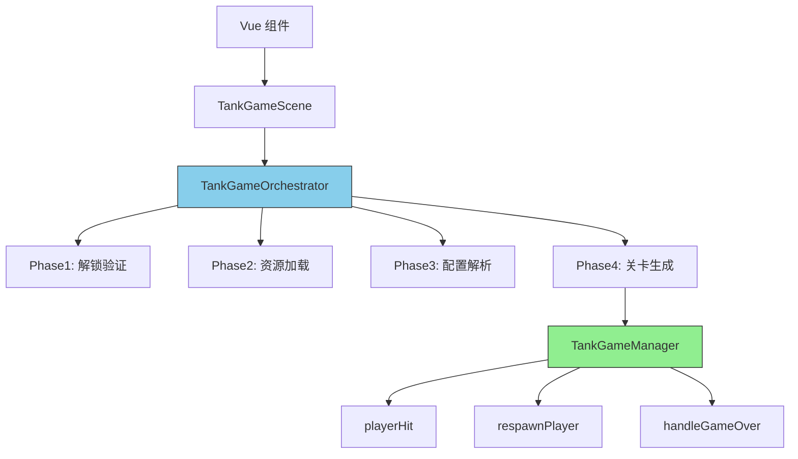

# 🎯 坦克大战 GTRS 架构重构方案

## ✅ 重构目标

按照 **frame-factory** 项目的标准模式重构坦克大战，实现：
- ✅ 职责分离（Scene 只负责渲染，GameManager 负责逻辑）
- ✅ 代码复用（所有游戏共用 LevelOrchestrator 框架）
- ✅ 易于维护和扩展

---

## 📋 架构分层

### **Layer 1: Scene 层（TankGameScene.ts）**
```typescript
// 职责：仅负责 Phaser 场景相关的渲染和输入
export class TankGameScene extends Phaser.Scene {
  // ✅ 保留：
  // - Phaser 对象创建（sprite, group, physics）
  // - 输入处理（keyboard, mouse）
  // - 相机控制
  // - UI 显示
  
  // ❌ 移除：
  // - 复活逻辑 → 迁移到 GameManager
  // - 受击判断 → 迁移到 GameManager
  // - 游戏结束逻辑 → 迁移到 GameManager
}
```

---

### **Layer 2: Manager 层（TankGameManager.ts）**
```typescript
// 职责：所有核心游戏逻辑
export class TankGameManager implements ITankGameManager {
  // ✅ 包含：
  // - playerHit() - 受击检测
  // - respawnPlayer() - 复活逻辑
  // - handleGameOver() - 游戏结束
  // - checkWinCondition() - 胜利条件
  
  // 依赖注入：
  constructor(scene: Phaser.Scene, player: Phaser.Physics.Arcade.Sprite)
}
```

---

### **Layer 3: Orchestrator 层（TankGameOrchestrator.ts）**
```typescript
// 职责：关卡生命周期管理（继承自 frame-factory）
export class TankGameOrchestrator extends LevelOrchestrator {
  // ✅ 6 个标准阶段：
  // 1. UNLOCK_VALIDATING - 解锁验证
  // 2. RESOURCES_LOADING - 资源预加载
  // 3. CONFIG_PARSING - 配置解析
  // 4. LEVEL_SPAWNING - 关卡生成
  // 5. RUNNING - 关卡运行
  // 6. SETTLING - 关卡结算
}
```

---

### **Layer 4: Parser & Spawner 层**
```typescript
// ConfigParser - 解析 JSON 配置为游戏数据
export class TankConfigParser implements IConfigParser {
  parse(config: ILevelConfig): Promise<any>
}

// Spawner - 根据解析结果生成实体
export class TankSpawner implements ILevelSpawner {
  spawn(data: any): Promise<void>
}
```

---

## 🔄 调用流程



---

## 📊 文件结构对比

### Before ❌
```
tank-battle/src/
├── scenes/
│   └── TankGameScene.ts          ← 🔴 1400+ 行，所有逻辑都在这里
├── managers/
│   └── EntityManager.ts          ← 只管理实体
└── utils/
```

### After ✅
```
tank-battle/src/
├── scenes/
│   └── TankGameScene.ts          ← 🔵 ~500 行，只负责渲染和输入
├── core/
│   ├── TankGameManager.ts        ← 🔴 新增：游戏逻辑
│   ├── TankGameOrchestrator.ts   ← 🔵 新增：关卡编排
│   ├── TankConfigParser.ts       ← 🔵 新增：配置解析
│   └── TankSpawner.ts            ← 🔵 新增：关卡生成
├── managers/
│   └── EntityManager.ts          ← 保持不变
└── utils/
```

---

## 🎯 关键改进点

### 1. **复活逻辑的位置调整**
```typescript
// Before ❌ (在 Scene 中)
class TankGameScene extends Phaser.Scene {
  private playerHit(): void {
    // ... 混合了 Scene 特有的方法
  }
}

// After ✅ (在 GameManager 中)
class TankGameManager {
  playerHit(): void {
    // 纯逻辑，不依赖 Scene 特定方法
  }
}
```

---

### 2. **使用 Alpha 代替 setVisible**
```typescript
// 修复 Phaser 的 hidden feature
this.player.setAlpha(0.3)  // ✅ 只影响透明度
// this.player.setVisible(false)  // ❌ 可能触发 setActive(false)
```

---

### 3. **统一的状态管理**
```typescript
// GameManager 提供统一的 API
interface ITankGameManager {
  playerHit(): void
  respawnPlayer(): void
  handleGameOver(): void
  checkWinCondition(): boolean
}
```

---

## 🚀 实施步骤

### Step 1: 创建核心类
- ✅ `TankGameManager.ts` - 游戏管理器
- ⏳ `TankGameOrchestrator.ts` - 关卡编排器
- ⏳ `TankConfigParser.ts` - 配置解析器
- ⏳ `TankSpawner.ts` - 关卡生成器

### Step 2: 重构 TankGameScene
- 将复活逻辑迁移到 GameManager
- 将受击逻辑迁移到 GameManager
- 简化 Scene 职责

### Step 3: 集成测试
- 测试完整复活流程
- 测试无敌帧机制
- 测试游戏结束流程

---

## 📝 当前进度

- ✅ **TankGameManager.ts** - 已创建
- ⏳ **TankGameOrchestrator.ts** - 待创建
- ⏳ **TankConfigParser.ts** - 待创建
- ⏳ **TankSpawner.ts** - 待创建
- ⏳ **TankGameScene.ts 重构** - 待执行

---

## 🎯 预期收益

| 指标 | 重构前 | 重构后 |
|------|--------|--------|
| **TankGameScene 行数** | 1400+ | ~500 |
| **职责清晰度** | ❌ 混乱 | ✅ 清晰 |
| **代码复用性** | ❌ 低 | ✅ 高 |
| **可维护性** | ❌ 困难 | ✅ 容易 |
| **符合规范** | ❌ 否 | ✅ 是 |

---

**下一步**: 继续创建剩余的类文件，然后重构 TankGameScene！
