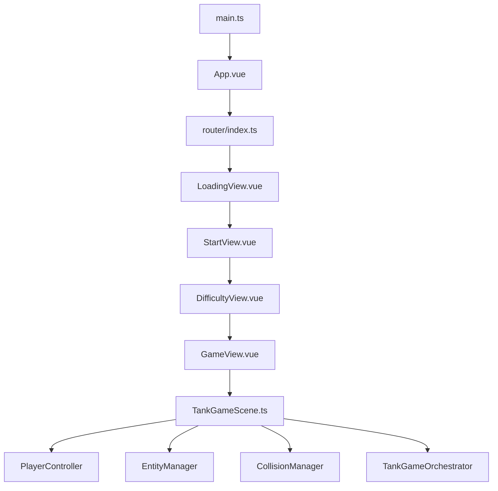
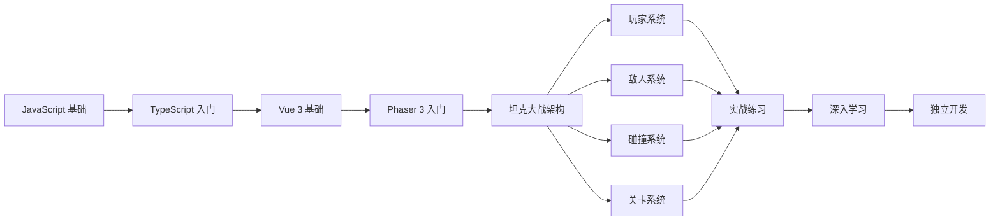

# 🎮 坦克大战代码学习指南（JavaScript 基础版）

## 📋 学习前准备

### 你需要的基础知识
✅ **JavaScript 基础**（你已具备）
- 变量、函数、对象
- 数组操作
- 异步编程（Promise、async/await）

⚠️ **需要补充的知识**（边学边补）
- **TypeScript 基础**（1-2 天）
  - 类型注解（string, number, boolean）
  - 接口（interface）
  - 类（class）和继承
  - 泛型基础
  
- **Vue 3 基础**（2-3 天）
  - 组件结构
  - Props 和 Events
  - Composition API（setup 语法糖）
  - Pinia 状态管理
  
- **Phaser 3 基础**（3-5 天）
  - Game 配置
  - Scene 生命周期（preload, create, update）
  - Sprite（精灵）
  - Physics（物理系统）
  - Groups（对象组）

---

## 🎯 分阶段学习路线（共 4 个阶段）

### 📚 第一阶段：理解项目架构（1-2 天）

#### 目标
了解坦克大战项目的整体结构和数据流

#### 学习内容

##### 1. 项目结构概览
```
tank-battle/
├── src/
│   ├── main.ts              # ⭐ 入口文件（最先看）
│   ├── App.vue              # Vue 根组件
│   ├── router/              # 路由配置
│   ├── stores/              # Pinia 状态管理
│   │   ├── game.ts         # 游戏状态（分数、生命）
│   │   └── config.ts       # 配置状态（难度设置）
│   ├── scenes/              # Phaser 游戏场景
│   │   ├── GameScene.ts    # 基类场景
│   │   └── TankGameScene.ts # ⭐ 主场景（核心）
│   ├── views/               # Vue 页面组件
│   │   ├── LoadingView.vue  # 加载页
│   │   ├── StartView.vue    # 开始页
│   │   ├── GameView.vue     # 游戏页
│   │   └── GameOverView.vue # 结束页
│   ├── managers/            # 游戏管理器（重点）
│   │   ├── PlayerController.ts      # ⭐ 玩家控制器
│   │   ├── EntityManager.ts         # ⭐ 实体管理器
│   │   ├── CollisionManager.ts      # ⭐ 碰撞管理器
│   │   └── EnemyAIManager.ts        # 敌人 AI
│   └── core/                # 核心逻辑
│       └── TankGameOrchestrator.ts  # ⭐ 关卡编排器
```

##### 2. 数据流理解


##### 3. 阅读顺序
1. **main.ts**（5 分钟）- 理解如何启动应用
2. **router/index.ts**（10 分钟）- 理解页面跳转逻辑
3. **stores/game.ts**（15 分钟）- 理解游戏状态管理
4. **TankGameScene.ts**（30 分钟）- 只看 create() 方法，理解初始化流程

#### 实践任务
- [ ] 画出项目的组件树形图
- [ ] 追踪一次"点击开始游戏按钮"到"游戏场景启动"的完整流程
- [ ] 列出所有 Manager 的职责

---

### 🎮 第二阶段：核心系统学习（7-10 天）

#### 目标
深入理解每个游戏子系统的工作原理

#### 学习内容

##### Day 1-2: 玩家控制系统

###### 核心文件
- `src/managers/PlayerController.ts` - 玩家输入统一入口
- `src/managers/PlayerMovementManager.ts` - 移动逻辑
- `src/managers/PlayerCombatManager.ts` - 射击逻辑
- `src/managers/PlayerStateManager.ts` - 状态机

###### 学习重点
```typescript
// 1. 键盘输入如何被监听
this.cursors = this.input.keyboard.createCursorKeys()
this.keySpace = this.input.keyboard.addKey(Phaser.Input.Keyboard.KeyCodes.SPACE)

// 2. 输入如何转换为移动
if (this.cursors.left.isDown || this.keyA.isDown) {
  this.player.setVelocityX(-200)
}

// 3. 射击如何触发
if (Phaser.Input.Keyboard.JustDown(this.keySpace)) {
  this.combatManager.shoot()
}
```

###### 实践任务
- [ ] 修改玩家移动速度（从 200 改为 300）
- [ ] 添加新的按键（如 K 键也能射击）
- [ ] 绘制玩家状态转换图（正常→无敌→死亡）

---

##### Day 3-4: 实体系统

###### 核心文件
- `src/managers/EntityManager.ts` - 实体创建与管理
- `src/entities/BaseEntity.ts` - 实体基类

###### 学习重点
```typescript
// 1. 实体类型枚举
enum EntityType {
  PLAYER = 'player',
  ENEMY = 'enemy',
  BULLET = 'bullet',
  WALL = 'wall'
}

// 2. 创建实体
const enemy = this.entityManager.spawnEnemy(x, y, 'heavy')

// 3. 实体池（性能优化）
class ExplosionPool {
  spawnExplosion(x, y): void
  // 对象池模式，避免频繁创建销毁
}
```

###### 实践任务
- [ ] 添加一个新的实体类型（如"奖励道具"）
- [ ] 理解对象池如何提升性能
- [ ] 追踪一颗子弹从创建到销毁的完整生命周期

---

##### Day 5-6: 碰撞系统

###### 核心文件
- `src/managers/CollisionManager.ts` - 碰撞检测中心
- `CLASSIC_COLLISION_RULES.md` - 碰撞规则文档

###### 学习重点
```typescript
// 1. 碰撞矩阵定义
this.physics.world.colliders = [
  { obj1: player, obj2: wall },
  { obj1: bullet, obj2: enemy },
  { obj1: playerBullet, obj2: base }
]

// 2. 碰撞回调
this.physics.add.collider(player, walls, () => {
  // 玩家撞到墙
})

this.physics.add.overlap(bullet, enemy, (bullet, enemy) => {
  // 子弹击中敌人
})
```

###### 实践任务
- [ ] 添加一个新的碰撞规则（如"子弹可以穿过友军"）
- [ ] 调试碰撞问题（使用 debug 模式）
- [ ] 解释经典坦克大战的碰撞规则

---

##### Day 7-8: 敌人 AI 系统

###### 核心文件
- `src/managers/EnemyAIManager.ts` - AI 行为控制
- `src/core/TankSpawner.ts` - 敌人生成器

###### 学习重点
```typescript
// 1. AI 行为模式
enum AIBehavior {
  PATROL = 'patrol',           // 巡逻
  CHASE_PLAYER = 'chase',      // 追击玩家
  GUARD_BASE = 'guard',        // 保护基地
  RANDOM_MOVE = 'random'       // 随机移动
}

// 2. 决策逻辑
if (distanceToPlayer < 200) {
  this.changeBehavior(AIBehavior.CHASE_PLAYER)
} else if (distanceToBase < 100) {
  this.changeBehavior(AIBehavior.GUARD_BASE)
}
```

###### 实践任务
- [ ] 修改敌人的移动速度
- [ ] 添加新的 AI 行为（如"逃跑"）
- [ ] 调试敌人卡住的问题

---

##### Day 9-10: 关卡系统

###### 核心文件
- `src/core/TankGameOrchestrator.ts` - 关卡编排器
- `src/utils/LevelConfigLoader.ts` - 关卡配置加载器

###### 学习重点
```typescript
// 1. 关卡配置
const levelConfigs = [
  { level: 1, enemyCount: 5, spawnInterval: 3000 },
  { level: 2, enemyCount: 8, spawnInterval: 2500 }
]

// 2. 关卡流程
startLevel(level) → spawnEnemies() → checkWinCondition() → nextLevel()

// 3. 胜利/失败条件
if (enemiesRemaining === 0) {
  this.onLevelComplete({ success: true })
}
```

###### 实践任务
- [ ] 设计一个新关卡（第 6 关）
- [ ] 修改现有关卡的难度参数
- [ ] 添加新的胜利条件（如"坚持 60 秒"）

---

### 🔧 第三阶段：实战练习（5-7 天）

#### 目标
通过实际修改代码巩固学习

#### 练习项目

##### 练习 1: 修改游戏参数（最简单）
```typescript
// 修改 src/stores/config.ts
export const DIFFICULTY_PRESETS = [
  {
    key: 'easy',
    enemyCount: 10,  // 从 5 改为 10
    enemySpeed: 150, // 从 100 改为 150
  }
]
```

##### 练习 2: 添加新武器（中等）
```typescript
// 在 PlayerCombatManager.ts 中添加
shootDoubleBullet(): void {
  // 同时发射两颗子弹
  const bullet1 = this.createBullet(this.player.x - 10, this.player.y)
  const bullet2 = this.createBullet(this.player.x + 10, this.player.y)
  bullet1.setVelocityX(-300)
  bullet2.setVelocityX(-300)
}
```

##### 练习 3: 实现新道具（困难）
```typescript
// 1. 定义道具类型
enum PowerUpType {
  SPEED_BOOST = 'speed_boost',  // 加速
  SHIELD = 'shield',            // 护盾
  DOUBLE_DAMAGE = 'double_dmg'  // 双倍伤害
}

// 2. 添加道具效果
applyPowerUp(type): void {
  switch(type) {
    case PowerUpType.SPEED_BOOST:
      this.player.setSpeed(400)
      break
  }
}
```

##### 练习 4: 优化性能（挑战）
- 实现子弹对象池
- 优化碰撞检测（使用空间分区）
- 减少不必要的渲染

---

### 📖 第四阶段：深入理解（持续学习）

#### 目标
掌握高级主题和最佳实践

#### 学习内容

##### 1. TypeScript 高级模式
- 泛型在实体系统中的应用
- 装饰器模式（用于道具系统）
- 策略模式（用于 AI 行为）

##### 2. Vue 3 高级用法
- 组合式函数（Composables）
- 自定义指令
- 性能优化（懒加载、虚拟滚动）

##### 3. Phaser 3 高级特性
- 自定义 RenderPipeline
- Tilemap 地图系统
- 粒子系统
- 动画状态机

##### 4. 软件架构模式
- ECS（Entity-Component-System）
- 观察者模式（事件系统）
- 状态模式（游戏状态机）
- 对象池模式

---

## 🛠️ 学习方法论

### 1. 五步学习法
```
Step 1: 阅读代码（30 分钟）
  - 快速浏览文件结构
  - 找出关键函数和类

Step 2: 运行调试（30 分钟）
  - 在关键位置打断点
  - 观察变量变化

Step 3: 画图理解（20 分钟）
  - 流程图
  - 时序图
  - 状态转换图

Step 4: 修改实验（40 分钟）
  - 小改动验证理解
  - 观察运行结果

Step 5: 总结记录（20 分钟）
  - 写学习笔记
  - 记录踩坑经验
```

### 2. 调试技巧

#### 使用浏览器 DevTools
```javascript
// 1. 断点调试
debugger;  // 代码执行到这里会暂停

// 2. 打印日志
console.log('玩家位置:', player.x, player.y)
console.table(enemies)  // 表格形式显示

// 3. 监控变量
watchExpression: 'player.health'
```

#### 使用游戏内置 Debug 工具
```typescript
// TankGameScene 中已集成的 Debug 面板
- PoolMonitorPanel      // 对象池监控
- PlayerDebugPanel      // 玩家状态调试
- EntityDebugPanel      // 实体调试
- EnemyDebugManager     // AI 调试
```

### 3. 做笔记的方法

#### 代码注释法
```typescript
/**
 * ⭐ 玩家射击函数
 * 调用时机：按下空格键时
 * 核心逻辑:
 *   1. 检查冷却时间
 *   2. 创建子弹对象
 *   3. 设置子弹速度和方向
 *   4. 播放音效
 */
shoot(): void {
  // ... 代码
}
```

#### 思维导图法
```
坦克大战
├── 玩家系统
│   ├── 移动控制
│   ├── 射击系统
│   └── 状态管理
├── 敌人系统
│   ├── AI 行为
│   ├── 生成逻辑
│   └── 死亡处理
└── 关卡系统
    ├── 配置加载
    ├── 胜利判定
    └── 难度曲线
```

---

## 📚 推荐学习资源

### 官方文档
- [Vue 3 文档](https://vuejs.org/) - 必读
- [Phaser 3 文档](https://photonstorm.github.io/phaser3-docs/) - 查阅 API
- [TypeScript 文档](https://www.typescriptlang.org/) - 语法参考

### 视频教程
- Bilibili: "Phaser 3 入门教程"
- YouTube: "Vue 3 + TypeScript 实战"

### 书籍
- 《TypeScript 编程》
- 《Phaser 3 游戏开发指南》

### 代码示例
- 项目中的 `examples/` 目录
- Phaser 官方示例：https://phaser.io/examples

---

## 🎯 学习检查清单

### 第一阶段完成后
- [ ] 能说出项目使用了哪些技术栈
- [ ] 能画出数据流程图
- [ ] 知道每个 Manager 的职责

### 第二阶段完成后
- [ ] 能独立修改玩家属性
- [ ] 理解碰撞检测原理
- [ ] 能调整敌人 AI 行为
- [ ] 能设计新关卡

### 第三阶段完成后
- [ ] 能添加新游戏元素
- [ ] 能优化性能问题
- [ ] 能修复常见 bug

### 第四阶段完成后
- [ ] 能设计类似的游戏架构
- [ ] 能指导他人学习
- [ ] 能进行技术创新

---

## 💡 常见问题解答

### Q1: TypeScript 报错太多怎么办？
**A**: 这些通常是类型检查错误，不影响运行。初期可以：
1. 先忽略红色波浪线，关注功能实现
2. 逐步学习 TypeScript 类型系统
3. 使用 `any` 类型临时绕过（不推荐长期）

### Q2: 看不懂泛型怎么办？
**A**: 泛型是高级话题，初期可以：
1. 把 `T` 理解为"某种类型"
2. 关注具体使用场景（如 `Array<T>` 就是数组）
3. 慢慢在实践中体会

### Q3: Phaser 的 API 记不住怎么办？
**A**: 正常现象！建议：
1. 多用多查，不要死记
2. 建立自己的代码片段库
3. 善用 IDE 的智能提示

### Q4: 代码太多看不完怎么办？
**A**: 采用"二八原则"：
1. 先学 20% 的核心代码（Manager 们）
2. 其余 80% 用到再查
3. 不要试图一次性理解所有细节

---

## 🚀 学习路线图



---

## 📞 学习支持

### 遇到问题时的解决步骤
1. **查文档** - 官方文档第一站
2. **搜代码** - 在项目内搜索类似实现
3. **看示例** - Phaser/Vue 官方示例
4. **问 AI** - 使用 AI 助手解答疑惑
5. **做实验** - 写测试代码验证猜想

### 推荐的学习节奏
- **每天学习时长**: 2-3 小时
- **理论 vs 实践**: 30% 阅读代码 + 70% 动手练习
- **休息频率**: 每 45 分钟休息 5 分钟
- **总学习周期**: 约 15-20 天（从零到能独立修改）

---

## 🎊 结语

坦克大战项目是一个**绝佳的学习案例**，它涵盖了：
- ✅ 完整的现代 Web 游戏技术栈
- ✅ 清晰的模块化架构设计
- ✅ 丰富的游戏编程模式
- ✅ 可扩展的系统设计

**记住**: 
1. 不要急于求成，循序渐进
2. 多动手实践，少纸上谈兵
3. 享受解决问题的过程
4. 学习是一场马拉松，不是短跑

**祝你学习愉快，早日成为游戏开发高手！🎮✨**

---

*最后更新：2026-04-04*  
*版本：1.0.0*
