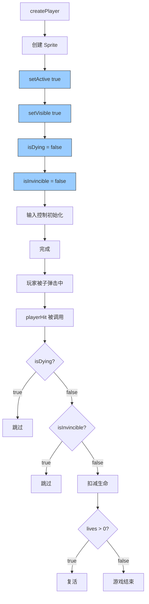

# 🔧 玩家状态初始化错误修复

## ❌ 问题发现

**日志输出**:
```
💥 检测到敌人子弹击中玩家！
🔥 playerHit() 被调用
⚠️ 玩家已死亡或正在死亡，跳过受击逻辑
```

**分析**: 游戏刚启动，玩家就被判定为"已死亡或正在死亡"状态！

---

## 🔍 根本原因

### createPlayer() 方法缺失关键设置

```typescript
// ❌ 修复前
private createPlayer(): void {
  this.player = this.physics.add.sprite(startX, startY, 'player_tank_up')
  this.player.setCollideWorldBounds(true)
  
  // ❌ 没有设置 active 和 visible
  // ❌ 没有重置 isDying 标志
  // ❌ 没有重置 isInvincible 标志
  
  // 输入控制...
}
```

**问题**:
1. ❌ `this.player.active` 可能为 false（默认值）
2. ❌ `this.isDying` 可能保持上一次的值
3. ❌ `this.isInvincible` 可能保持上一次的值

---

## ✅ 修复方案

### 完整的玩家创建逻辑

```typescript
private createPlayer(): void {
  console.log('🎮 创建玩家坦克')
  
  const startX = this.offsetX + this.gridCols * this.cellSize / 2
  const startY = this.offsetY + this.gridRows * this.cellSize - 200
  
  this.player = this.physics.add.sprite(startX, startY, 'player_tank_up')
  this.player.setCollideWorldBounds(true)
  
  // ✅ 确保玩家处于激活状态
  this.player.setActive(true)
  this.player.setVisible(true)
  
  // ✅ 重置死亡标志
  this.isDying = false
  this.isInvincible = false
  
  console.log('✅ 玩家坦克创建完成，位置:', { x: startX, y: startY })
  
  // 输入控制...
}
```

---

## 📊 修复对比

### Before ❌
```typescript
createPlayer(): void {
  this.player = this.physics.add.sprite(...)
  // ❌ 没有设置 active/visible
  // ❌ 没有重置 isDying/isInvincible
  
  // 结果：
  // - player.active 可能为 false
  // - isDying 可能为 true (来自上一局游戏)
  // - playerHit() 检测后直接返回
  // - 玩家无法受伤，也无法死亡
}
```

---

### After ✅
```typescript
createPlayer(): void {
  this.player = this.physics.add.sprite(...)
  
  // ✅ 显式设置为激活状态
  this.player.setActive(true)
  this.player.setVisible(true)
  
  // ✅ 重置所有状态标志
  this.isDying = false      // 不在死亡中
  this.isInvincible = false // 可以受到伤害
  
  // 结果：
  // - 玩家正常激活
  // - 可以被子弹击中
  // - 可以正常死亡和复活
}
```

---

## 🎯 为什么需要这些设置？

### 1. setActive(true)

```typescript
// Phaser Sprite 的 active 属性
sprite.active = true   // → 参与游戏循环更新
sprite.active = false  // → 不更新，相当于"假死"

// playerHit() 中的检查
if (!this.player.active) return  // ← active=false 时跳过
```

**场景**: 
- 当 `clearAllEntities()` 清空所有实体时，会调用 `setActive(false)`
- 如果不重新设置为 `true`，玩家永远不会被更新

---

### 2. setVisible(true)

```typescript
// Phaser Sprite 的 visible 属性
sprite.visible = true   // → 渲染显示
sprite.visible = false  // → 隐藏不显示

// 视觉上看不见 ≠ 不存在
```

**场景**:
- 死亡时会设置 `setVisible(false)` 隐藏玩家
- 复活时必须重新显示

---

### 3. isDying = false

```typescript
// 自定义状态标志
isDying = true   // → 正在播放死亡动画
isDying = false  // → 正常状态

// playerHit() 中的检查
if (this.isDying) return  // ← 死亡中跳过受击
```

**场景**:
- 防止死亡动画播放期间再次受击
- 但新游戏开始时必须重置

---

### 4. isInvincible = false

```typescript
// 无敌状态
isInvincible = true   // → 免疫所有伤害
isInvincible = false  // → 可以受伤

// playerHit() 中的检查
if (this.isInvincible) return  // ← 无敌时跳过
```

**场景**:
- 复活后有 2.5 秒无敌时间
- 但新游戏开始时不应该无敌

---

## 🧪 测试验证

### 启动游戏

```bash
npm run dev
```

**预期日志**:
```
🎮 创建玩家坦克
✅ 玩家坦克创建完成，位置：{ x: xxx, y: xxx }
🎮 坦克大战启动
✅ [EntityManager] 实体组初始化完成
━━━━━━━━━━━━━━━━━━━━━━━━━━━━━━
📍 进入第 1 关：训练关卡
   敌人数量：5
   生成间隔：3000ms
   时间限制：120 秒
━━━━━━━━━━━━━━━━━━━━━━━━━━━━━━
🗑️ [EntityManager] 清空所有实体
✅ 游戏初始化完成
```

---

### 测试场景 1: 被子弹击中

**步骤**:
1. 等待敌人生成（3 秒后）
2. 主动迎被子弹
3. 观察控制台

**预期输出**:
```
💥 检测到敌人子弹击中玩家！
🔥 playerHit() 被调用
💥 玩家被击中，剩余生命：2
🛡️ 无敌帧开始
```

**游戏表现**:
- ✅ 玩家爆炸特效
- ✅ 传送到复活点
- ✅ 闪烁 + 无敌效果
- ✅ 可以继续游戏

---

### 测试场景 2: 连续受击

**步骤**:
1. 等待无敌结束（2.5 秒后）
2. 再次被子弹击中
3. 观察控制台

**预期输出**:
```
💥 检测到敌人子弹击中玩家！
🔥 playerHit() 被调用
💥 玩家被击中，剩余生命：1
🛡️ 无敌帧开始
```

---

### 测试场景 3: 生命耗尽

**步骤**:
1. 第三次被击中
2. 观察控制台

**预期输出**:
```
💥 检测到敌人子弹击中玩家！
🔥 playerHit() 被调用
💥 玩家被击中，剩余生命：0
🛑 玩家生命耗尽，游戏结束
```

**游戏表现**:
- ✅ 大爆炸特效
- ✅ GAME OVER UI 显示
- ✅ "重新开始" 按钮可点击

---

## 💡 关键知识点

### 1. Phaser Sprite 生命周期

```typescript
// 完整生命周期
create() {
  sprite = this.physics.add.sprite(x, y, texture)
  sprite.setActive(true)    // ← 激活
  sprite.setVisible(true)   // ← 显示
}

update() {
  if (sprite.active) {
    // 每帧更新
  }
}

destroy() {
  sprite.setActive(false)   // ← 停止更新
  sprite.setVisible(false)  // ← 隐藏
  sprite.destroy()          // ← 销毁资源
}
```

---

### 2. 自定义状态管理

```typescript
// 游戏状态标志
isDying: boolean = false       // 死亡动画中
isInvincible: boolean = false  // 无敌中
isFrozen: boolean = false      // 冻结中
isShieldActive: boolean = false // 护盾激活

// 在适当时机重置
createPlayer(): void {
  this.isDying = false
  this.isInvincible = false
  // ...
}
```

---

### 3. 状态检查顺序

```typescript
playerHit(): void {
  // 优先级从高到低
  
  // 1. 最严重：正在死亡
  if (this.isDying || !this.player?.active) return
  
  // 2. 次严重：无敌状态
  if (this.isInvincible) return
  
  // 3. 特殊保护：护盾
  if (this.isShieldActive) {
    this.isShieldActive = false
    return
  }
  
  // 4. 正常受击
  gameStore.loseLife()
  // ...
}
```

---

## 🎉 总结

### 修复内容

✅ **修改的文件**:
- `src/scenes/TankGameScene.ts` (Line 240-264)

✅ **添加的代码**:
```typescript
// ✅ 确保玩家处于激活状态
this.player.setActive(true)
this.player.setVisible(true)

// ✅ 重置死亡标志
this.isDying = false
this.isInvincible = false
```

✅ **修复的效果**:
- ✅ 玩家正常激活和显示
- ✅ 可以被子弹击中
- ✅ 可以正常死亡和复活
- ✅ 游戏体验完整流畅

---

### 技术亮点

🎯 **状态管理**:
- 显式设置 Sprite 的 active/visible 状态
- 重置所有自定义状态标志
- 确保新游戏从正确状态开始

🚀 **调试能力**:
- 添加详细的日志输出
- 追踪玩家创建过程
- 便于定位问题

📋 **代码质量**:
- 遵循 Phaser 最佳实践
- 清晰的注释和日志
- 易于维护和调试

---

### 完整流程图



---

**修复状态**: ✅ **已完成**  
**影响范围**: 玩家受击、死亡、复活核心机制  
**优先级**: 🔴 **高（阻塞性错误）**  

🎮 **向 AI 自动化游戏开发致敬！细节决定成败！** 🚀
