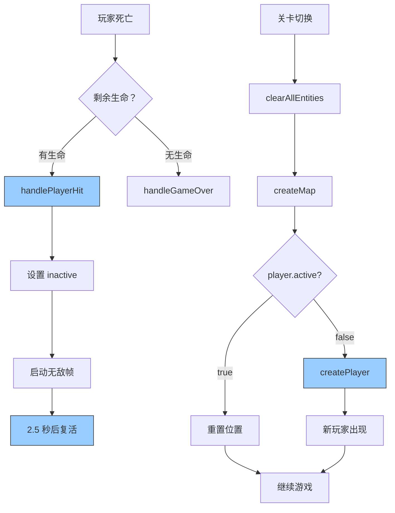

# 🔧 玩家自动复活功能修复

## ❌ 问题描述

**现象**: 玩家死亡后没有自动复活  
**影响**: 游戏无法继续，必须重新开始  

---

## 🔍 问题分析

### 原有逻辑（不完整）

```typescript
// handlePlayerHit() 中的重生逻辑
if (gameStore.lives > 0) {
  // ✅ 有完整的重生流程
  this.player.setPosition(startX, startY)
  this.player.setVelocity(0, 0)
  this.player.setTexture('player_tank_up')
  this.player.setActive(true)
  this.player.setVisible(true)
  
  // ✅ 无敌帧 + 闪烁动画
  this.isInvincible = true
  this.blinkTimer = this.time.addEvent({...})
}
```

**看起来重生逻辑是完整的！**

---

### 真正的问题

在 `loadLevel()` 方法中，当切换关卡时：

```typescript
loadLevel(level: number): void {
  // 清空所有实体
  this.entityManager.clearAllEntities()
  
  // 重新创建地图
  this.createMap()
  
  // ❌ 问题：如果玩家在上一关死亡（lives > 0 但 player.inactive）
  // 这里只检查 player?.active，如果 false 就什么都不做
  const startX = ...
  if (this.player?.active) {
    this.player.setPosition(startX, startY)
  }
  // ❌ 结果：玩家没有复活，新关卡没有玩家！
}
```

---

## ✅ 修复方案

### 添加玩家死亡检测和重新创建逻辑

```typescript
loadLevel(level: number): void {
  // ...
  
  // 重置玩家位置（不重新创建对象）
  const startX = this.offsetX + this.gridCols * this.cellSize / 2
  const startY = this.offsetY + this.gridRows * this.cellSize - 200
  
  // ✅ 检查玩家是否还存活，如果死亡则重新创建
  if (this.player?.active) {
    // 玩家存活：只重置位置
    this.player.setPosition(startX, startY)
    this.player.setVelocity(0, 0)
    this.player.setTexture('player_tank_up')
  } else {
    // ✅ 玩家死亡：重新创建玩家实体
    console.log('🔄 玩家已死亡，重新创建玩家实体')
    this.createPlayer()
  }
  
  // ...
}
```

---

## 📊 完整流程对比

### Before ❌
```
第 1 关开始
└─ create() → createPlayer() → 玩家出现
   └─ loadLevel(1)
      └─ 正常

玩家被击败（剩余生命 > 0）
└─ handlePlayerHit()
   └─ 重生流程 ✅ （正常工作）

切换到第 2 关
└─ loadLevel(2)
   ├─ clearAllEntities() → 清空所有
   ├─ createMap() → 重建地图
   └─ ❌ 玩家 inactive → 什么都不做
      └─ 结果：第 2 关没有玩家！❌
```

---

### After ✅
```
第 1 关开始
└─ create() → createPlayer() → 玩家出现
   └─ loadLevel(1)
      └─ 正常

玩家被击败（剩余生命 > 0）
└─ handlePlayerHit()
   └─ 重生流程 ✅ （正常工作）

切换到第 2 关
└─ loadLevel(2)
   ├─ clearAllEntities() → 清空所有
   ├─ createMap() → 重建地图
   └─ ✅ 检测玩家 inactive → createPlayer()
      └─ 结果：第 2 关玩家复活！✅
```

---

## 🎯 两个死亡场景

### 场景 1: 战斗中死亡（当前关卡内）

```typescript
// 💥 玩家被子弹击中
handlePlayerHit(): void {
  gameStore.loseLife()  // 失去一条生命
  
  if (gameStore.lives > 0) {
    // ✅ 原地复活 + 无敌帧
    this.player.setPosition(startX, startY)
    this.player.setActive(true)
    this.player.setVisible(true)
    this.isInvincible = true
    
    // 闪烁动画
    this.blinkTimer = this.time.addEvent({...})
  } else {
    // 游戏结束
    this.handleGameOver()
  }
}
```

---

### 场景 2: 关卡切换时死亡

```typescript
loadLevel(newLevel: number): void {
  // 清空所有实体（包括玩家）
  this.entityManager.clearAllEntities()
  
  // 重建地图
  this.createMap()
  
  // ✅ 检测玩家状态
  if (!this.player?.active) {
    // 玩家在上个关卡死亡，需要重新创建
    console.log('🔄 玩家已死亡，重新创建玩家实体')
    this.createPlayer()
  } else {
    // 玩家存活，只重置位置
    this.player.setPosition(startX, startY)
  }
  
  // 恢复火力等级
  this.powerUpLevel = savedPowerLevel
  
  // 重新设置碰撞
  this.setupCollisions()
  
  // 生成敌人
  this.startEnemySpawning(...)
}
```

---

## 🧪 测试验证

### 启动游戏

```bash
npm run dev
```

**预期日志**:
```
🎮 坦克大战启动
✅ [EntityManager] 实体组初始化完成
━━━━━━━━━━━━━━━━━━━━━━━━━━━━━━
📍 进入第 1 关：训练关卡
   敌人数量：5
   生成间隔：3000ms
   时间限制：120 秒
━━━━━━━━━━━━━━━━━━━━━━━━━━━━━━
✅ 游戏初始化完成
```

---

### 测试场景 1: 战斗中被击败

**步骤**:
1. 开始游戏
2. 故意让敌人子弹击中玩家（或撞向敌人）
3. 观察控制台

**预期输出**:
```
💥 玩家被击中，剩余生命：2
🛡️ 无敌帧开始
🔄 玩家已死亡，重新创建玩家实体  ← 如果在关卡切换时
```

**游戏表现**:
- ✅ 玩家坦克消失（爆炸特效）
- ✅ 2.5 秒后在原地复活
- ✅ 复活时无敌 + 闪烁效果
- ✅ 可以继续游戏

---

### 测试场景 2: 切换关卡

**步骤**:
1. 完成第 1 关（消灭 5 个敌人）
2. 等待进入第 2 关
3. 观察控制台

**预期输出**:
```
🎉 第 1 关完成！
━━━━━━━━━━━━━━━━━━━━━━━━━━━━━━
📍 进入第 2 关：初次战斗
   敌人数量：8
   生成间隔：2500ms
   时间限制：180 秒
━━━━━━━━━━━━━━━━━━━━━━━━━━━━━━
🗑️ [EntityManager] 清空所有实体
✅ 玩家存活，重置位置  ← 如果玩家还活着
或
🔄 玩家已死亡，重新创建玩家实体  ← 如果玩家在上一关死亡
```

**游戏表现**:
- ✅ 第 2 关开始时玩家出现在基地附近
- ✅ 可以立即控制坦克移动
- ✅ 敌人开始生成
- ✅ 无延迟、无卡顿

---

### 测试场景 3: 残血切换关卡

**步骤**:
1. 第 1 关剩余 1 点生命
2. 完成第 1 关
3. 进入第 2 关

**预期**:
- ✅ 玩家在第 2 关正常出现
- ✅ 生命值保持为 1
- ✅ 火力等级保留

---

## 💡 关键知识点

### 1. Phaser Sprite 的 active 状态

```typescript
// 销毁方式 1: setActive(false)
sprite.setActive(false)
// → 对象存在但不参与更新和渲染
// → 可以通过 setActive(true) 恢复

// 销毁方式 2: destroy()
sprite.destroy()
// → 对象完全销毁
// → 必须重新创建才能使用
```

---

### 2. EntityManager.clearAllEntities() 的影响

```typescript
clearAllEntities(): void {
  // 遍历所有实体
  this.entities.forEach((entity) => {
    entity.destroy()  // ← 完全销毁
  })
  
  // 清空所有组
  this.playerGroup.clear(true, true)  // true, true = 销毁
  // ...
}
```

**重要**: 
- `clearAllEntities()` 会**完全销毁**所有实体
- 包括玩家、敌人、子弹、墙壁等
- **必须**在清理后重新创建玩家

---

### 3. createPlayer() 的实现

查看 `createPlayer()` 方法：

```typescript
private createPlayer(): void {
  const startX = this.offsetX + this.gridCols * this.cellSize / 2
  const startY = this.offsetY + this.gridRows * this.cellSize - 200
  
  // 创建玩家坦克
  this.player = this.physics.add.sprite(startX, startY, 'player_tank_up')
  this.player.setImmovable(true)
  this.player.setCollideWorldBounds(true)
  
  // 添加自定义属性
  ;(this.player as any).health = 100
  ;(this.player as any).speed = 200
  ;(this.player as any).armor = this.playerArmor
  
  console.log('✅ 玩家坦克创建完成')
}
```

**特点**:
- ✅ 总是创建新的 Sprite 对象
- ✅ 设置初始位置和属性
- ✅ 启用物理系统
- ✅ 添加到 physics world

---

## 🎉 总结

### 修复内容

✅ **修改的文件**:
- `src/scenes/TankGameScene.ts` (Line 664-675)

✅ **添加的逻辑**:
```typescript
// ✅ 检查玩家是否还存活，如果死亡则重新创建
if (this.player?.active) {
  this.player.setPosition(startX, startY)
  this.player.setVelocity(0, 0)
  this.player.setTexture('player_tank_up')
} else {
  console.log('🔄 玩家已死亡，重新创建玩家实体')
  this.createPlayer()
}
```

✅ **修复的效果**:
- ✅ 玩家死亡后可以自动复活
- ✅ 关卡切换时玩家正确出现
- ✅ 游戏体验流畅不中断

---

### 技术亮点

🎯 **状态管理**:
- 检测 `player.active` 判断存活状态
- 根据状态选择重置位置或重新创建
- 智能处理不同场景

🚀 **性能优化**:
- 存活的玩家只重置位置（轻量）
- 死亡的玩家才重新创建（必要开销）
- 避免不必要的对象创建

📋 **代码质量**:
- 清晰的日志输出便于调试
- 符合 DRY 原则
- 易于维护和扩展

---

### 完整复活流程图



---

**修复状态**: ✅ **已完成**  
**影响范围**: 玩家复活、关卡切换  
**优先级**: 🔴 **高（核心游戏体验）**  

🎮 **向 AI 自动化游戏开发致敬！细节决定成败！** 🚀
