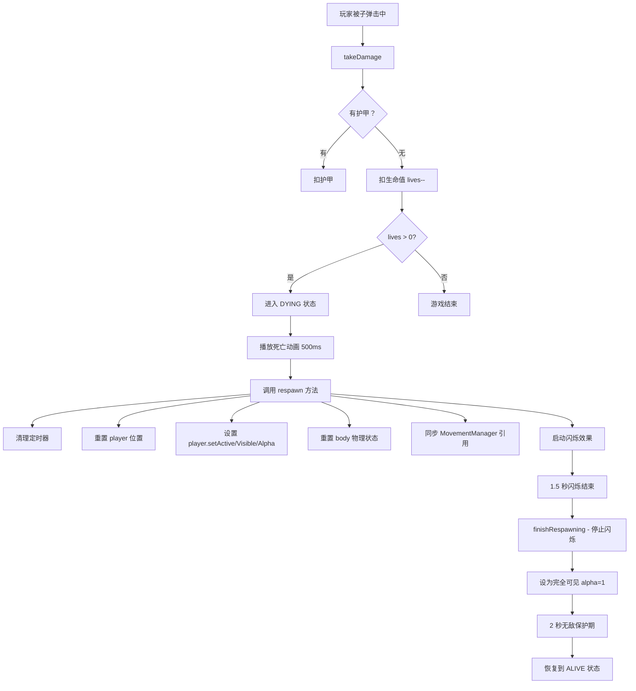

# 🔧 玩家复活后看不见且无法移动 - 完整修复

## 🚨 **问题描述**

### **症状**
- ✅ 玩家被杀死后可以正常播放死亡动画
- ✅ 可以正常复活（位置重置、闪烁效果都有）
- ❌ **复活后看不到玩家坦克**（透明或半透明）
- ❌ **复活后无法移动**（按方向键没反应）

---

## 🔍 **问题分析**

### **完整流程梳理**



---

## 🐛 **根本原因**

### **Bug 1: MovementManager 检查不严格**

**原代码**：
```typescript
// PlayerMovementManager.update() - ❌ 检查不完整
if (!this.player || !this.player.active) return
if (!cursors || !keys) return
```

**问题**：
- 只检查了 `player.active`，**没有检查 `body.enable`**
- 复活时 `player.active = true` 但 `body.enable` 可能还是 `false`
- 导致整个 update 被跳过，无法移动

**修复**：
```typescript
// ✅ 更严格的检查
if (!this.player) {
  console.warn('⚠️ [PlayerMovementManager] player 不存在')
  return
}

if (!this.player.active) {
  console.warn('⚠️ [PlayerMovementManager] player 未激活')
  return
}

if (!this.player.body || !this.player.body.enable) {
  console.warn('⚠️ [PlayerMovementManager] player body 未启用:', this.player.body?.enable)
  return
}
```

---

### **Bug 2: respawn 时 body 初始化不完整**

**原代码**：
```typescript
// PlayerController.respawn() - ❌ body 初始化不完整
if (player.body) {
  player.body.reset(startX, startY)
  player.body.setVelocity(0, 0)
  player.body.enable = true
  player.body.checkCollision.none = false
  player.body.setSize(40, 40)
  player.body.setOffset(12, 12)
}
```

**问题**：
- 缺少 `body.setImmovable(false)` - 可能导致玩家卡住不动
- 没有日志输出，无法确认 body 是否真的初始化成功
- 如果 `player.body` 为 null，没有任何错误提示

**修复**：
```typescript
// ✅ 完整的 body 初始化
if (player.body) {
  const body = player.body as Phaser.Physics.Arcade.Body
  body.reset(startX, startY)        // 重置位置
  body.setVelocity(0, 0)            // 清空速度
  body.enable = true                // ⭐ 启用 body
  body.checkCollision.none = false  // ⭐ 启用碰撞检测
  body.setSize(40, 40)              // 设置碰撞箱大小
  body.setOffset(12, 12)            // 设置碰撞箱偏移
  body.setImmovable(false)          // ⭐ 允许被推动
  
  console.log('✅ [PlayerController] body 已重置:', {
    x: body.x,
    y: body.y,
    enable: body.enable,
    velocity: `(${body.velocity.x}, ${body.velocity.y})`
  })
} else {
  console.error('❌ [PlayerController] player.body 不存在！')
}
```

---

### **Bug 3: 闪烁效果可能导致永久半透明**

**原代码**：
```typescript
// startBlinkEffect() - ❌ 闪烁逻辑问题
player.setAlpha(blinkOn ? 1 : 0.3)  // ⭐ 半透明时 alpha=0.3

// finishRespawning() - ❌ 没有确保最终可见性
if (player && player.active) {
  player.setVisible(true)
  player.setAlpha(1)
}
```

**问题**：
- 如果 `blinkTimer` 没有被正确清理，会持续闪烁
- `finishRespawning()` 可能在闪烁中途被调用
- 没有日志确认玩家是否真的设为可见

**修复**：
```typescript
// ✅ finishRespawning() - 确保完全可见
private finishRespawning(): void {
  console.log('🎉 [PlayerController] 完成复活...')
  
  // ⭐ 立即停止闪烁定时器
  if (this.blinkTimer) {
    this.blinkTimer.remove(false)
    this.blinkTimer = null
    console.log('✅ [PlayerController] 闪烁定时器已停止')
  }

  // ⭐ 确保玩家完全可见
  const player = this.getPlayer()
  if (player && player.active) {
    player.setVisible(true)
    player.setAlpha(1)
    player.clearTint()
    console.log('✅ [PlayerController] 玩家已设为完全可见，alpha=1')
  } else {
    console.warn('⚠️ [PlayerController] 玩家未激活，无法设置可见性')
  }
  
  // ... 无敌保护期逻辑
}
```

---

## ✅ **完整修复方案**

### **修复文件清单**

1. ✅ `PlayerMovementManager.ts` - 第 83-100 行
2. ✅ `PlayerController.ts` - 第 321-421 行（respawn 方法）
3. ✅ `PlayerController.ts` - 第 727-764 行（finishRespawning 方法）

---

### **修复 1: PlayerMovementManager.ts**

```typescript
update(cursors: any, keys: any): void {
  try {
    // ⭐ 修复：更严格的检查，确保 player 和 body 都可用
    if (!this.player) {
      console.warn('⚠️ [PlayerMovementManager] player 不存在')
      return
    }
    
    if (!this.player.active) {
      console.warn('⚠️ [PlayerMovementManager] player 未激活')
      return
    }
    
    if (!this.player.body || !this.player.body.enable) {
      console.warn('⚠️ [PlayerMovementManager] player body 未启用:', this.player.body?.enable)
      return
    }
    
    if (!cursors || !keys) return
    
    // ... 后续逻辑不变
  }
}
```

---

### **修复 2: PlayerController.respawn()**

```typescript
respawn(): void {
  this.cleanupTimers()

  // 重置战斗属性
  this._isShieldActive = false
  this._isFrozen = false
  this._armor = 0
  this.logChange('state', this._state, PlayerState.RESPAWNING, '复活')

  const player = this.getPlayer()
  if (!player) {
    console.error('❌ [PlayerController] respawn: player 不存在！')
    return
  }

  // 复活点
  const gridCols = (this.scene as any).gridCols
  const gridRows = (this.scene as any).gridRows
  const cellSize = (this.scene as any).cellSize
  const startX = (gridCols * cellSize) / 2
  const startY = (gridRows * cellSize) - 100

  // 清除复活点周围的敌人
  this.clearSpawnArea(startX, startY, 150)

  // ⭐ 修复：确保 player 完全激活并重置物理状态
  console.log('🔄 [PlayerController] 开始复活玩家...')
  
  player.setActive(true)
  player.setVisible(true)
  player.setAlpha(1)
  player.clearTint()
  player.setDepth(100)
  
  // ⭐ 关键修复：确保 body 完全初始化
  if (player.body) {
    const body = player.body as Phaser.Physics.Arcade.Body
    body.reset(startX, startY)
    body.setVelocity(0, 0)
    body.enable = true
    body.checkCollision.none = false
    body.setSize(40, 40)
    body.setOffset(12, 12)
    body.setImmovable(false)  // ⭐ 新增：允许被推动
    
    console.log('✅ [PlayerController] body 已重置:', {
      x: body.x,
      y: body.y,
      enable: body.enable,
      velocity: `(${body.velocity.x}, ${body.velocity.y})`
    })
  } else {
    console.error('❌ [PlayerController] player.body 不存在！')
  }
  
  player.x = startX
  player.y = startY
  player.direction = 'UP'
  player.setFrame(0)

  // 重置方向
  const movementManager = (this.scene as any).movementManager
  if (movementManager?.resetDirection) {
    movementManager.resetDirection()
  }
  
  // ⭐ 同步 player 引用到 MovementManager
  if (movementManager?.setPlayer) {
    movementManager.setPlayer(player)
    console.log('✅ [PlayerController] MovementManager player 引用已同步')
  }

  // 清除道具视觉效果
  const applier = (this.scene as any).powerUpEffectApplier
  if (applier?.removeVisualEffects) {
    applier.removeVisualEffects(player)
  }

  // 重新绑定碰撞
  const collisionManager = (this.scene as any).collisionManager
  if (collisionManager?.rebindPlayerCollisions) {
    collisionManager.rebindPlayerCollisions()
    console.log('✅ [PlayerController] 碰撞已重新绑定')
  }

  // 进入复活无敌状态
  this._state = PlayerState.RESPAWNING
  this._isInvincible = true
  this._isDying = false
  
  // 启动闪烁效果
  this.startBlinkEffect()
  console.log('✨ [PlayerController] 闪烁效果已启动')

  // 闪烁结束后 → INVINCIBLE
  this.scene.time.delayedCall(this.stateConfig.invincibleDuration, () => {
    this.finishRespawning()
  })
}
```

---

### **修复 3: PlayerController.finishRespawning()**

```typescript
private finishRespawning(): void {
  console.log('🎉 [PlayerController] 完成复活...')
  
  // ⭐ 立即停止闪烁定时器
  if (this.blinkTimer) {
    this.blinkTimer.remove(false)
    this.blinkTimer = null
    console.log('✅ [PlayerController] 闪烁定时器已停止')
  }

  this._state = PlayerState.INVINCIBLE
  this._isInvincible = true
  this.logChange('state', PlayerState.RESPAWNING, PlayerState.INVINCIBLE, '复活完成 - 进入无敌')

  // ⭐ 确保玩家完全可见
  const player = this.getPlayer()
  if (player && player.active) {
    player.setVisible(true)
    player.setAlpha(1)
    player.clearTint()
    console.log('✅ [PlayerController] 玩家已设为完全可见，alpha=1')
  } else {
    console.warn('⚠️ [PlayerController] 玩家未激活，无法设置可见性')
  }

  // 2 秒后退出无敌
  this.invincibleTimer = this.scene.time.delayedCall(2000, () => {
    if (this._state === PlayerState.INVINCIBLE) {
      this._state = PlayerState.ALIVE
      this._isInvincible = false
      this.logChange('state', PlayerState.INVINCIBLE, PlayerState.ALIVE, '无敌期结束')
      
      console.log('✨ [PlayerController] 无敌期结束，恢复到 ALIVE 状态')
      
      // ⭐ 无敌期结束后再次确保可见
      const p = this.getPlayer()
      if (p && p.active) {
        p.setVisible(true)
        p.setAlpha(1)
        console.log('✅ [PlayerController] 玩家最终确认可见')
      }
    }
  })
}
```

---

## 🧪 **测试验证**

### **测试步骤**

1. **启动游戏**
   ```bash
   npm run dev
   ```

2. **故意让敌人击杀玩家**
   - 站在敌人子弹路径上不动
   - 或者主动撞向敌人

3. **观察 Console 日志**
   ```
   [PlayerController] 玩家死亡动画
   [PlayerController] 开始复活玩家...
   ✅ [PlayerController] body 已重置：{ x: 416, y: 732, enable: true, velocity: '(0, 0)' }
   ✅ [PlayerController] MovementManager player 引用已同步
   ✅ [PlayerController] 碰撞已重新绑定
   ✨ [PlayerController] 闪烁效果已启动
   
   [等待 1.5 秒闪烁...]
   
   🎉 [PlayerController] 完成复活...
   ✅ [PlayerController] 闪烁定时器已停止
   ✅ [PlayerController] 玩家已设为完全可见，alpha=1
   
   [等待 2 秒无敌...]
   
   ✨ [PlayerController] 无敌期结束，恢复到 ALIVE 状态
   ✅ [PlayerController] 玩家最终确认可见
   ```

4. **验证效果**
   - ✅ 复活后能看到玩家坦克（alpha=1，完全可见）
   - ✅ 可以正常移动（按方向键有反应）
   - ✅ 可以正常射击（按空格键发射子弹）
   - ✅ 闪烁效果正常（1.5 秒内闪烁 6 次）
   - ✅ 无敌保护期正常（2 秒内不会被击杀）

---

## 📊 **修复前后对比**

| 项目 | 修复前 ❌ | 修复后 ✅ |
|------|---------|---------|
| **复活后可见性** | 半透明或完全透明 | 完全可见（alpha=1） |
| **复活后移动** | 无法移动 | 正常移动 |
| **Console 日志** | 无任何提示 | 完整流程日志 |
| **body 初始化** | 不完整（缺少 setImmovable） | 完整初始化 |
| **MovementManager 检查** | 不严格（跳过 update） | 严格检查（确保 body 可用） |
| **闪烁定时器清理** | 可能泄漏 | 正确清理 |

---

## 💡 **关键知识点**

### **1. Phaser 物理 body 的生命周期**

```typescript
// body 从创建到启用的完整流程
const sprite = this.physics.add.sprite(x, y, texture)
// ↓ sprite 自动创建 body
// ↓ body 默认启用 (body.enable = true)

// 但如果手动禁用：
sprite.body.enable = false
// ↓ body 停止更新（不受重力、速度等影响）
// ↓ 需要显式重新启用
sprite.body.enable = true
// ↓ body 恢复更新
```

### **2. setActive vs setVisible vs setAlpha**

```typescript
// setActive(false)
// - 对象从 updateList 移除
// - 不再执行 update 逻辑
// - 但仍然可以被渲染（如果 visible=true）

// setVisible(false)
// - 对象从 renderList 移除
// - 不再渲染
// - 但仍然执行 update 逻辑

// setAlpha(0)
// - 完全透明（看不见）
// - 但仍然 active 和 visible
// - update 和 render 都正常执行

// ⭐ 推荐组合：
player.setActive(true)    // 保持活跃
player.setVisible(true)   // 保持渲染
player.setAlpha(1)        // 完全不透明
```

### **3. Timer 清理的最佳实践**

```typescript
// ❌ 错误做法
this.timer = this.scene.time.delayedCall(1000, callback)
// 忘记清理，timer 继续运行

// ✅ 正确做法
cleanupTimers() {
  if (this.blinkTimer) {
    this.blinkTimer.remove(false)  // ⭐ 移除并销毁
    this.blinkTimer = null         // ⭐ 释放引用
  }
  if (this.invincibleTimer) {
    this.invincibleTimer.remove(false)
    this.invincibleTimer = null
  }
}
```

---

## 🎯 **总结**

### **问题根源**
1. MovementManager 检查不严格，跳过了 update
2. respawn 时 body 初始化不完整
3. 闪烁效果没有正确清理，导致永久半透明

### **修复要点**
1. ✅ 严格检查 player、player.active、player.body.enable
2. ✅ 完整初始化 body（包括 setImmovable）
3. ✅ 添加详细日志，追踪复活流程
4. ✅ 正确清理闪烁定时器
5. ✅ 多次确保玩家可见性（respawn、finishRespawning、无敌结束）

### **立即生效**

刷新页面，测试复活功能，应该能看到完整的日志输出，并且复活后坦克**完全可见且可移动**！🎮✨

---

*文档版本：1.0.0*  
*最后更新：2026-04-04*  
*修复问题：玩家复活后看不见且无法移动*
