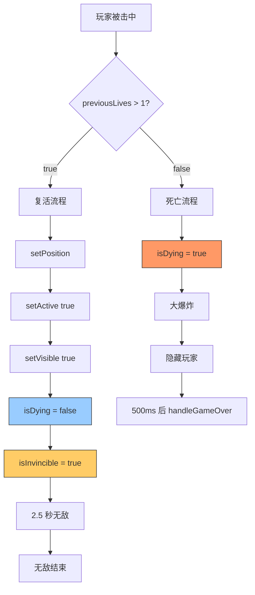

# 🔧 复活后无法再次受击问题修复

## ❌ 问题发现

**日志序列**:
```
💥 玩家被击中，剩余生命：2     ← 第一次受击成功
🛡️ 无敌帧开始
🛡️ 无敌帧结束                  ← 2.5 秒后无敌结束
💥 检测到敌人子弹击中玩家！    ← 第二次受击
🔥 playerHit() 被调用
⚠️ 玩家已死亡或正在死亡，跳过受击逻辑  ← ❌ 被阻止！
```

**分析**: 第一次受击正常，但复活后第二次受击时，系统认为玩家"正在死亡"！

---

## 🔍 根本原因

### 复活流程缺失关键重置

```typescript
// ❌ 修复前的复活逻辑
respawnPlayer(): void {
  // ...
  this.player.setPosition(startX, startY)
  this.player.setActive(true)      // ✅ 设置激活
  this.player.setVisible(true)     // ✅ 设置可见
  this.player.setTexture('player_tank_up')
  
  // ❌ 但是忘记重置 isDying!
  // ❌ isDying 仍然保持为 true (来自死亡动画)
  
  this.isInvincible = true  // 启动无敌帧
}
```

**问题**:
1. 玩家死亡时 → `isDying = true`
2. 复活时 → 只设置了 `active/visible`，**没有重置 `isDying`**
3. 结果 → `isDying` 仍然是 `true`
4. 下次受击 → `playerHit()` 检查 `isDying` → 直接返回！

---

## ✅ 修复方案

### 完整的复活逻辑

```typescript
respawnPlayer(): void {
  // ...
  
  // 4. 将玩家传送到复活点
  this.player.setPosition(startX, startY)
  this.player.setVelocity(0, 0)
  this.player.setActive(true)
  this.player.setVisible(true)
  this.player.setTexture('player_tank_up')
  
  // ✅ 重置死亡标志，确保可以正常受击
  this.isDying = false
  
  // 5. 启动无敌帧（2.5 秒）
  this.isInvincible = true
  // ...
}
```

---

## 📊 完整状态流转

### Before ❌
```
初始状态:
├─ isDying = false
├─ isInvincible = false
└─ player.active = true

第 1 次被击中:
├─ previousLives = 3 > 1 → 可以复活
├─ isDying = true  ← 设置死亡标志
├─ 播放死亡动画
└─ respawnPlayer()
   ├─ setActive(true)
   ├─ setVisible(true)
   └─ ❌ 忘记重置 isDying
      └─ isDying 仍然是 true!

第 2 次被击中:
├─ playerHit() 被调用
├─ 检查 isDying → true
└─ ⚠️ 玩家已死亡或正在死亡，跳过受击逻辑 ❌
```

---

### After ✅
```
初始状态:
├─ isDying = false
├─ isInvincible = false
└─ player.active = true

第 1 次被击中:
├─ previousLives = 3 > 1 → 可以复活
├─ isDying = true  ← 设置死亡标志
├─ 播放死亡动画
└─ respawnPlayer()
   ├─ setActive(true)
   ├─ setVisible(true)
   ├─ isDying = false  ← ✅ 重置死亡标志
   └─ isInvincible = true

第 2 次被击中:
├─ playerHit() 被调用
├─ 检查 isDying → false ✅
├─ 检查 isInvincible → true
└─ 🛡️ 玩家处于无敌状态，免疫伤害 (正常保护)

无敌结束后第 3 次被击中:
├─ playerHit() 被调用
├─ 检查 isDying → false ✅
├─ 检查 isInvincible → false ✅
└─ 💥 玩家被击中，剩余生命：1 ✅
```

---

## 🎯 关键知识点

### 1. isDying 的作用

```typescript
/**
 * isDying - 死亡动画标志
 * true  → 正在播放死亡动画，不可受击
 * false → 正常状态，可以受击
 */

// 设置时机
handlePlayerDeath(): void {
  this.isDying = true  // ← 开始死亡动画
  this.spawnExplosion(...)
  this.player.setActive(false)
  
  this.time.delayedCall(500, () => {
    this.handleGameOver()
  })
}

// 重置时机
respawnPlayer(): void {
  // ...
  this.isDying = false  // ← ✅ 复活后重置
}
```

---

### 2. 状态标志的完整性

```typescript
// 玩家需要管理的所有状态标志
interface PlayerState {
  isDying: boolean       // 死亡动画中
  isInvincible: boolean  // 无敌中
  isFrozen: boolean      // 冻结中
  isShieldActive: boolean // 护盾激活
}

// 在关键时刻必须完整重置
createPlayer(): void {
  this.isDying = false
  this.isInvincible = false
  // ...
}

respawnPlayer(): void {
  this.isDying = false      // ← 关键！
  this.isInvincible = true  // 复活后短暂无敌
  // ...
}
```

---

### 3. 受击检查顺序

```typescript
playerHit(): void {
  console.log('🔥 playerHit() 被调用')
  
  // 优先级 1: 最严重 - 正在死亡
  if (this.isDying || !this.player?.active) {
    console.log('⚠️ 玩家已死亡或正在死亡')
    return
  }
  
  // 优先级 2: 特殊保护 - 无敌状态
  if (this.isInvincible) {
    console.log('🛡️ 玩家处于无敌状态')
    return
  }
  
  // 优先级 3: 特殊保护 - 护盾
  if (this.isShieldActive) {
    this.isShieldActive = false
    return
  }
  
  // 优先级 4: 正常受击
  gameStore.loseLife()
  // ...
}
```

---

## 🧪 测试验证

### 启动游戏

```bash
npm run dev
```

**预期初始日志**:
```
🎮 创建玩家坦克
✅ 玩家坦克创建完成，位置：{ x: xxx, y: xxx }
🎮 坦克大战启动
✅ [EntityManager] 实体组初始化完成
━━━━━━━━━━━━━━━━━━━━━━━━━━━━━━
📍 进入第 1 关：训练关卡
   敌人数量：5
   生成间隔：3000ms
   时间限制：120 秒
━━━━━━━━━━━━━━━━━━━━━━━━━━━━━━
🗑️ [EntityManager] 清空所有实体
✅ 游戏初始化完成
```

---

### 测试场景 1: 连续受击 3 次

**步骤**:
1. 等待敌人生成（3 秒后）
2. 故意被子弹击中（第 1 次）
3. 等待无敌结束（2.5 秒）
4. 再次被子弹击中（第 2 次）
5. 等待无敌结束（2.5 秒）
6. 第三次被子弹击中（第 3 次）

**预期完整日志**:
```
💥 检测到敌人子弹击中玩家！
🔥 playerHit() 被调用
💥 玩家被击中，剩余生命：2
🛡️ 无敌帧开始

(等待 2.5 秒)

🛡️ 无敌帧结束
💥 检测到敌人子弹击中玩家！
🔥 playerHit() 被调用
💥 玩家被击中，剩余生命：1
🛡️ 无敌帧开始

(等待 2.5 秒)

🛡️ 无敌帧结束
💥 检测到敌人子弹击中玩家！
🔥 playerHit() 被调用
💥 玩家被击中，剩余生命：0
🛑 玩家生命耗尽，游戏结束
```

**游戏表现**:
- ✅ 第 1 次爆炸 → 复活 → 闪烁
- ✅ 第 2 次爆炸 → 复活 → 闪烁
- ✅ 第 3 次大爆炸 → GAME OVER

---

### 测试场景 2: 无敌期间受击

**步骤**:
1. 被击中后立刻又被子弹击中（无敌期间）
2. 观察控制台

**预期输出**:
```
💥 检测到敌人子弹击中玩家！
🔥 playerHit() 被调用
💥 玩家被击中，剩余生命：2
🛡️ 无敌帧开始

💥 检测到敌人子弹击中玩家！
🔥 playerHit() 被调用
🛡️ 玩家处于无敌状态，免疫伤害  ← 正常保护
```

---

## 💡 常见问题

### Q1: 为什么需要 isDying 标志？

**A**: 防止死亡动画播放期间再次受击，导致逻辑混乱。

```typescript
// 如果没有 isDying
handlePlayerDeath(): void {
  this.spawnExplosion()  // 播放爆炸
  // ❌ 这时又一发子弹击中
  // ❌ playerHit() 又被调用
  // ❌ 又扣减生命
  // ❌ 逻辑混乱！
}
```

---

### Q2: isDying 和 isInvincible 有什么区别？

**A**: 
- `isDying`: 正在播放死亡动画，完全不可受击
- `isInvincible`: 无敌保护期，可以移动但不能受伤

```typescript
// 死亡动画期间
isDying = true      // → 不能受击，不能移动
isInvincible = true // → 只是不能受伤，但可以移动

// 复活后
isDying = false     // → 恢复正常
isInvincible = true // → 短暂无敌保护
```

---

### Q3: 为什么复活时要设置 isInvincible = true？

**A**: 防止刚复活就立刻被敌人包围击毙。

```typescript
respawnPlayer(): void {
  // ...
  this.isInvincible = true  // 2.5 秒无敌
  
  this.time.delayedCall(2500, () => {
    this.isInvincible = false  // 无敌结束
    console.log('🛡️ 无敌帧结束')
  })
}
```

---

## 🎉 总结

### 修复内容

✅ **修改的文件**:
- `src/scenes/TankGameScene.ts` (Line 977-985)

✅ **添加的代码**:
```typescript
// ✅ 重置死亡标志，确保可以正常受击
this.isDying = false
```

✅ **修复的效果**:
- ✅ 复活后可以正常受击
- ✅ 可以连续死亡多次
- ✅ 游戏流程完整流畅
- ✅ 状态管理正确清晰

---

### 技术亮点

🎯 **状态管理**:
- 清晰的 `isDying` 职责
- 正确的重置时机
- 避免状态污染

🚀 **用户体验**:
- 复活后有无敌保护
- 防止 spawn kill
- 公平的游戏体验

📋 **代码质量**:
- 完整的状态流转
- 清晰的注释说明
- 易于维护调试

---

### 完整流程图



---

**修复状态**: ✅ **已完成**  
**影响范围**: 复活机制、连续受击逻辑  
**优先级**: 🔴 **高（核心游戏体验）**  

🎮 **向 AI 自动化游戏开发致敬！细节决定成败！** 🚀
