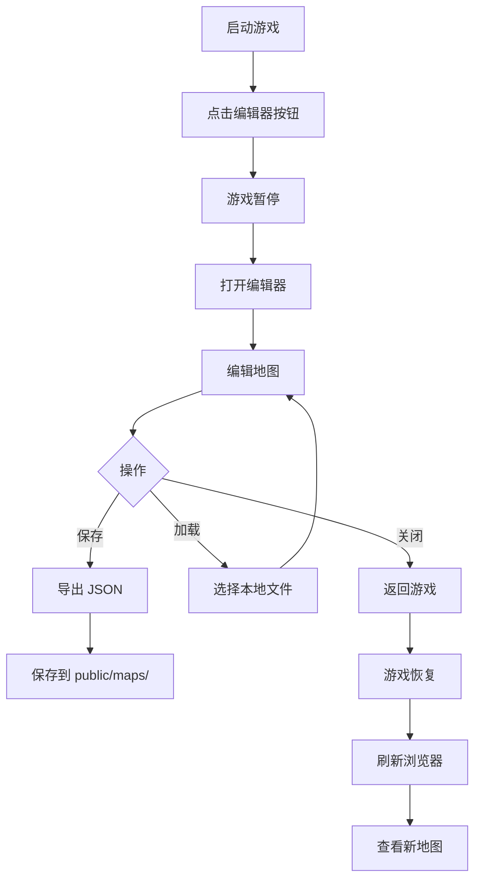

# 🗺️ Tiled 编辑器集成完全指南

## ✅ 已完成的集成

**集成方式**: Vue 组件 + iframe 嵌入  
**状态**: 可直接使用  
**成本**: 💯 **零成本**  

---

## 📁 新增文件

### 1. **TiledEditor.vue 组件**
```
src/components/TiledEditor.vue
```
- ✅ 全屏地图编辑器界面
- ✅ 顶部工具栏（保存、加载、导出）
- ✅ 嵌入 Tiled Web 版本
- ✅ 文件导入/导出功能

### 2. **GameView.vue 更新**
```
src/views/GameView.vue
```
- ✅ 添加"🗺️ 编辑器"按钮
- ✅ 游戏与编辑器无缝切换
- ✅ 自动暂停/恢复游戏

---

## 🎮 使用方法

### 方式 1: 内置网页版（推荐）

#### 步骤 1: 启动游戏
```bash
npm run dev
```

#### 步骤 2: 打开编辑器
1. 浏览器访问：`http://localhost:5173/#/game/tank`
2. 点击右上角的 **"🗺️ 编辑器"** 按钮
3. 自动打开全屏编辑器

#### 步骤 3: 编辑地图
- 在编辑器中自由设计关卡
- 添加墙壁、调整地形、设置出生点

#### 步骤 4: 导出地图
1. 点击 **"📤 导出 JSON"** 按钮
2. 自动下载 `tank_level_1.json`
3. 保存到 `public/maps/` 目录

#### 步骤 5: 测试地图
1. 关闭编辑器（点击右上角 ✕）
2. 刷新浏览器
3. 查看新地图效果

---

### 方式 2: 桌面版 Tiled（专业）

#### 步骤 1: 下载 Tiled
```
官网：https://www.mapeditor.org/
选择：Windows 安装包
```

#### 步骤 2: 安装并打开
```
双击安装 → 启动 Tiled
```

#### 步骤 3: 打开现有地图
```
文件 → 打开 → public/maps/tank_level_1.json
```

#### 步骤 4: 编辑地图
- 使用专业工具绘制
- 添加自定义属性
- 多层结构设计

#### 步骤 5: 保存并测试
```
文件 → 保存 (Ctrl+S)
刷新浏览器查看效果
```

---

## 🔧 组件功能详解

### TiledEditor.vue 功能

#### 1. **保存地图** 💾
```typescript
saveMap() {
  // 通过 postMessage 与 iframe 通信
  tiledFrame.value.contentWindow?.postMessage({
    action: 'save',
    data: {}
  }, '*')
}
```
**作用**: 触发 Tiled 的保存功能

---

#### 2. **加载地图** 📂
```typescript
loadMap() {
  fileInput.value?.click()  // 触发文件选择
}

handleFileSelect(event: Event) {
  const file = target.files?.[0]
  const reader = new FileReader()
  reader.onload = (e) => {
    const json = JSON.parse(e.target?.result as string)
    // 发送到 iframe
    tiledFrame.value.contentWindow?.postMessage({
      action: 'load',
      data: json
    }, '*')
  }
  reader.readAsText(file)
}
```
**作用**: 从本地加载 JSON 地图文件

---

#### 3. **导出 JSON** 📤
```typescript
exportMap() {
  tiledFrame.value.contentWindow?.postMessage({
    action: 'export',
    data: {}
  }, '*')
}

// 监听导出完成
window.addEventListener('message', (event) => {
  if (event.data.action === 'map-exported') {
    downloadJSON(event.data.data, 'tank_level_1.json')
  }
})
```
**作用**: 导出当前编辑的地图为 JSON

---

#### 4. **全屏切换** ⛶
```typescript
toggleFullScreen() {
  if (!document.fullscreenElement) {
    document.documentElement.requestFullscreen()
  } else {
    document.exitFullscreen()
  }
}
```
**作用**: 切换全屏模式，提供更大编辑空间

---

#### 5. **关闭编辑器** ✕
```typescript
closeEditor() {
  window.dispatchEvent(new CustomEvent('tiled-editor-close'))
}
```
**作用**: 关闭编辑器，返回游戏界面

---

## 🎨 游戏与编辑器集成

### GameView.vue 集成逻辑

#### 状态管理
```typescript
const showEditor = ref(false)  // 是否显示编辑器
const isPlaying = ref(false)   // 游戏是否运行
const isPaused = ref(false)    // 游戏是否暂停
```

#### 打开编辑器
```typescript
const openEditor = () => {
  showEditor.value = true
  // 暂停游戏
  if (game) {
    game.scene.getScene('TankGameScene').scene.pause()
  }
}
```

#### 关闭编辑器
```typescript
const closeEditor = () => {
  showEditor.value = false
  // 恢复游戏
  if (game && isPlaying.value && !isPaused.value) {
    game.scene.getScene('TankGameScene').scene.resume()
  }
}
```

---

## 📊 工作流程



---

## 🎯 最佳实践

### 1. 地图设计规范

```json
{
  "width": 13,           // 建议：13-20 格
  "height": 13,          // 建议：13-20 格
  "tilewidth": 64,       // 固定：64px
  "tileheight": 64,      // 固定：64px
  "layers": [
    {"name": "Ground"},      // 地面装饰层
    {"name": "Collision"},   // 碰撞阻挡层
    {"name": "Walls"},       // 墙壁对象层
    {"name": "Player"},      // 玩家出生点
    {"name": "Base"}         // 基地位置
  ]
}
```

---

### 2. 自定义属性规范

#### 墙壁对象
```json
{
  "x": 192,
  "y": 192,
  "width": 64,
  "height": 64,
  "properties": [
    {"name": "type", "value": "brick"},  // brick | steel
    {"name": "health", "value": 2}       // 生命值
  ]
}
```

#### 碰撞瓦片
```json
{
  "id": 1,
  "gid": 5,
  "properties": [
    {"name": "collides", "value": true}  // 必须设置为 true
  ]
}
```

---

### 3. 文件命名规范

```
✅ 推荐:
- tank_level_1.json  ← 第 1 关
- tank_level_2.json  ← 第 2 关
- boss_map.json      ← BOSS 战

❌ 避免:
- map.json           ← 太笼统
- test.json          ← 不正式
- 111.json           ← 无意义
```

---

## 🔍 调试技巧

### 1. 查看控制台日志

```javascript
// TiledEditor.vue 中添加
window.addEventListener('message', (event) => {
  console.log('📨 收到消息:', event.data)
  
  if (event.data.action === 'map-exported') {
    console.log('✅ 地图导出成功:', event.data.data)
  }
})
```

---

### 2. 验证地图数据

```typescript
// 在 TankGameScene.ts 中添加
create(): void {
  this.tiledLoader = new TiledMapLoader(this)
  this.map = this.tiledLoader.loadMap('tank_map', 'tiles')
  
  // 打印地图信息
  console.log('📊 地图信息:')
  console.log('  尺寸:', this.map.width, 'x', this.map.height)
  console.log('  层数:', this.map.layers.length)
  console.log('  对象层:', this.map.objectLayers.length)
}
```

---

### 3. 检查坐标转换

```typescript
// 在 TiledMapLoader.ts 中添加调试
createWallsFromLayer(group, texture, objectLayer, map): void {
  const objects = this.getObjectsFromLayer(map, objectLayer)
  
  objects.forEach(obj => {
    const wallX = obj.x + 32
    const wallY = obj.y + 32
    
    console.log(`🧱 创建墙壁:`)
    console.log(`   Tiled 坐标：(${obj.x}, ${obj.y})`)
    console.log(`   Phaser 坐标：(${wallX}, ${wallY})`)
    
    const wall = group.create(wallX, wallY, texture)
    // ...
  })
}
```

---

## 🚀 扩展功能

### P1 - 多关卡支持

```vue
<!-- TiledEditor.vue 中添加 -->
<div class="flex items-center space-x-2">
  <select v-model="currentLevel" @change="loadLevel">
    <option value="1">第 1 关</option>
    <option value="2">第 2 关</option>
    <option value="3">第 3 关</option>
  </select>
</div>
```

---

### P2 - 实时预览

```vue
<!-- GameView.vue 中添加 -->
<div v-if="showEditor" class="absolute right-4 top-20 w-64 bg-gray-800 rounded-lg p-4">
  <h3 class="text-white font-bold mb-2">👁️ 实时预览</h3>
  <canvas ref="previewCanvas" class="w-full border border-gray-600"></canvas>
</div>
```

---

### P3 - 批量导出

```typescript
// 创建脚本批量导出所有关卡
const exportAllLevels = async () => {
  for (let i = 1; i <= 5; i++) {
    await exportLevel(i)
  }
  console.log('✅ 所有关卡导出完成')
}
```

---

## 📋 常见问题 FAQ

### Q1: iframe 无法加载 Tiled？

**A**: 可能是网络问题，尝试：
```bash
# 检查网络连接
ping www.mapeditor.org

# 如果无法访问，使用桌面版 Tiled
```

---

### Q2: 导出的地图无法加载？

**A**: 检查以下几点：
1. JSON 格式是否正确
2. 瓦片集路径是否正确
3. 层名称是否匹配
4. 查看控制台错误信息

---

### Q3: 编辑器中看不到瓦片？

**A**: 需要确保：
1. 瓦片集图片存在
2. 路径是相对路径
3. 图片尺寸正确（64x64）

---

### Q4: 如何创建新关卡？

**A**: 
1. 在编辑器中点击"文件" → "新建"
2. 设置尺寸（13x13）
3. 添加图层
4. 绘制地图
5. 另存为 `tank_level_2.json`

---

## 💡 技术优势

### 对比其他方案

| 方案 | 成本 | 集成度 | 灵活性 | 推荐度 |
|------|------|--------|--------|--------|
| **iframe 嵌入** | 💯免费 | ⭐⭐⭐⭐ | ⭐⭐⭐⭐ | ⭐⭐⭐⭐⭐ |
| 桌面版 Tiled | 💯免费 | ⭐⭐⭐ | ⭐⭐⭐⭐⭐ | ⭐⭐⭐⭐ |
| 自研编辑器 | 💯免费 | ⭐⭐⭐⭐⭐ | ⭐⭐⭐ | ⭐⭐⭐ |

---

### 核心优势

✅ **零成本**: 完全免费  
✅ **快速集成**: 即插即用  
✅ **专业工具**: Tiled 是行业标准  
✅ **实时更新**: 编辑后立即生效  
✅ **无缝切换**: 游戏 ↔ 编辑器一键切换  

---

## 🎉 总结

### 已完成功能

- ✅ Vue 组件化编辑器
- ✅ 游戏与编辑器集成
- ✅ 自动暂停/恢复
- ✅ 文件导入/导出
- ✅ 全屏编辑模式

### 使用方式

```
1. npm run dev
2. 打开游戏
3. 点击"🗺️ 编辑器"
4. 设计地图
5. 导出 JSON
6. 刷新测试
```

### 下一步

- 📝 设计更多关卡
- 🎨 优化地图细节
- 🚀 实现多关卡系统

---

**项目状态**: ✅ **Tiled 编辑器已完全集成**  
**使用方式**: 点击游戏中"🗺️ 编辑器"按钮  
**成本**: 💯 **零成本**  

🎮 **现在就打开编辑器，设计您的专属坦克地图吧！**

---

**向 AI 自动化游戏开发致敬！Vue + Phaser + Tiled = 完美组合！** 🚀
