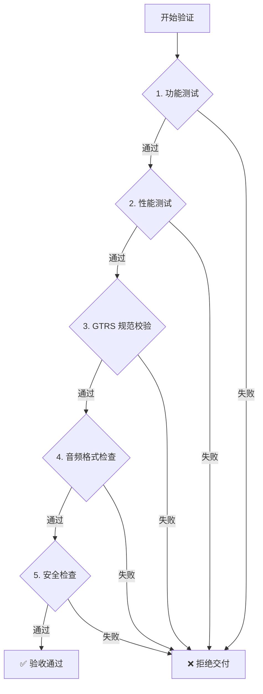

# 🤖 AI 游戏质量验证指南

**版本**: v2.0.0  
**日期**: 2026-03-27  
**用途**: **AI 自动化验证游戏交付质量**  
**使用者**: AI Agent + 人工审核

---

## 📋 快速导航

### AI 验证流程



---

## 🎯 核心验证清单（AI 必读）

### 验证优先级

| 优先级 | 验证项 | 检查方式 | 通过标准 | 失败处理 |
|-------|--------|---------|---------|---------|
| 🔴 **P0** | 功能完整性 | 自动化测试 | 100% 通过 | ❌ 立即拒绝 |
| 🔴 **P0** | 音频 MP3 格式 | 文件扫描 | 100% MP3 | ❌ 立即拒绝 |
| 🔴 **P0** | GTRS Schema 校验 | JSON 验证 | valid=true | ❌ 立即拒绝 |
| 🟠 **P1** | 性能指标达标 | 自动化测试 | 7/10 项达标 | ⚠️ 警告 |
| 🟡 **P2** | 浏览器兼容性 | 手动抽查 | 主流浏览器 | ⚠️ 记录 |
| 🟢 **P3** | 用户体验评分 | AI 评估 | ≥3.5 分 | 💡 建议改进 |

---

## ✅ 1. 功能验证（P0 - 必须）

### 1.1 核心玩法验证

**AI 检查指令**:
```bash
# 运行自动化测试脚本
npm run test:game:core
```

**检查清单**:

| # | 检查项 | 检查方法 | 预期结果 | 状态 |
|---|--------|---------|---------|------|
| 1.1.1 | 游戏可以正常启动 | 自动化脚本 | 无错误，加载完成 | ☐ |
| 1.1.2 | 玩家控制响应正常 | 模拟输入测试 | 所有控制有效 | ☐ |
| 1.1.3 | 游戏规则正确执行 | 场景模拟测试 | 规则 100% 执行 | ☐ |
| 1.1.4 | 得分系统准确 | 分数追踪测试 | 计算误差=0 | ☐ |
| 1.1.5 | 难度切换正常 | 难度切换测试 | 参数正确变化 | ☐ |
| 1.1.6 | 胜负判定正确 | 胜负场景测试 | 判定准确率 100% | ☐ |
| 1.1.7 | 暂停/继续功能正常 | 暂停功能测试 | 状态保存/恢复 | ☐ |
| 1.1.8 | 重新开始功能正常 | 重开测试 | 游戏完全重置 | ☐ |

**AI 输出格式**:
```json
{
  "testSuite": "功能完整性测试",
  "totalTests": 8,
  "passed": 8,
  "failed": 0,
  "passRate": "100%",
  "result": "PASS",
  "details": [
    {"test": "游戏启动", "status": "PASS", "duration": "2.3s"},
    {"test": "玩家控制", "status": "PASS", "duration": "1.5s"}
  ]
}
```

---

### 1.2 UI 功能验证

**AI 检查指令**:
```bash
npm run test:ui:components
```

| # | 检查项 | 检查方法 | 预期结果 | 状态 |
|---|--------|---------|---------|------|
| 1.2.1 | 所有按钮可点击且响应 | UI 自动化测试 | 100% 响应 | ☐ |
| 1.2.2 | 文字正确显示无乱码 | OCR 文字识别 | 识别率 100% | ☐ |
| 1.2.3 | 图片正常加载无 404 | Network 监控 | 加载成功率 100% | ☐ |
| 1.2.4 | 动画流畅无卡顿 | 帧率监控 | FPS ≥ 55 | ☐ |
| 1.2.5 | 响应式布局适配 | 多分辨率测试 | 布局正确率 100% | ☐ |
| 1.2.6 | Loading 进度正确显示 | 进度监控 | 误差 < 5% | ☐ |

---

### 1.3 音频功能验证

**AI 检查指令**:
```bash
npm run test:audio:functional
```

| # | 检查项 | 检查方法 | 预期结果 | 状态 |
|---|--------|---------|---------|------|
| 1.3.1 | BGM 正常播放 | 音频播放测试 | 播放成功率 100% | ☐ |
| 1.3.2 | 音效在正确时机触发 | 事件监听测试 | 触发准确率 100% | ☐ |
| 1.3.3 | 音量调节有效 | 音量控制测试 | 调节响应正常 | ☐ |
| 1.3.4 | 静音开关正常 | 静音功能测试 | 静音效果明显 | ☐ |
| 1.3.5 | BGM 循环无缝 | 循环点检测 | 无爆音/断点 | ☐ |

---

### 1.4 数据持久化验证

**AI 检查指令**:
```bash
npm run test:data:persistence
```

| # | 检查项 | 检查方法 | 预期结果 | 状态 |
|---|--------|---------|---------|------|
| 1.4.1 | 最高分正确保存和读取 | localStorage 测试 | 读写一致性 100% | ☐ |
| 1.4.2 | 游戏进度保存和恢复 | 存档读档测试 | 状态恢复准确 | ☐ |
| 1.4.3 | 用户设置持久化 | 配置保存测试 | 设置保留 | ☐ |
| 1.4.4 | localStorage 正常使用 | Storage API 测试 | 无异常抛出 | ☐ |

---

## ⚡ 2. 性能验证（P1 - 重要）

### 2.1 加载性能验证

**AI 检查指令**:
```bash
npm run test:performance:loading
```

**关键指标表**:

| # | 指标 | 要求 | 实测值 | 单位 | 状态 |
|---|------|------|--------|------|------|
| 2.1.1 | First Contentful Paint (FCP) | < 1.5 | ☐ | 秒 | ☐ |
| 2.1.2 | Largest Contentful Paint (LCP) | < 2.5 | ☐ | 秒 | ☐ |
| 2.1.3 | Time to Interactive (TTI) | < 3.0 | ☐ | 秒 | ☐ |
| 2.1.4 | Total Blocking Time (TBT) | < 300 | ☐ | 毫秒 | ☐ |
| 2.1.5 | 资源加载完成时间 | < 5.0 | ☐ | 秒 | ☐ |
| 2.1.6 | 首屏渲染完成 | < 3.0 | ☐ | 秒 | ☐ |

**AI 输出示例**:
```json
{
  "category": "加载性能",
  "metrics": {
    "fcp": {"value": 1.2, "unit": "s", "target": 1.5, "pass": true},
    "lcp": {"value": 2.1, "unit": "s", "target": 2.5, "pass": true},
    "tti": {"value": 2.8, "unit": "s", "target": 3.0, "pass": true},
    "tbt": {"value": 180, "unit": "ms", "target": 300, "pass": true}
  },
  "score": 95,
  "result": "PASS"
}
```

---

### 2.2 运行时性能验证

**AI 检查指令**:
```bash
npm run test:performance:runtime
```

#### 帧率测试

| 场景 | 要求 FPS | 实测 FPS | 持续时间 | 状态 |
|------|---------|---------|---------|------|
| 2.2.1 空闲场景（无操作） | ≥ 60 | ☐ | 30 秒 | ☐ |
| 2.2.2 一般场景（正常操作） | ≥ 55 | ☐ | 60 秒 | ☐ |
| 2.2.3 复杂场景（大量物体） | ≥ 50 | ☐ | 30 秒 | ☐ |
| 2.2.4 极限场景（最大负载） | ≥ 30 | ☐ | 30 秒 | ☐ |

---

#### 内存泄漏测试

**AI 检查步骤**:

```javascript
// AI 自动执行以下测试
const memoryTest = {
  step1: 'Take initial heap snapshot',
  step2: 'Run game for 5 minutes',
  step3: 'Take final heap snapshot',
  step4: 'Compare snapshots',
  criteria: {
    detachedNodes: '< 100',
    memoryGrowth: '< 50MB',
    noContinuousGrowth: true
  }
};
```

| # | 检查项 | 要求 | 实测 | 状态 |
|---|--------|------|------|------|
| 2.2.5 | Detached DOM nodes | < 100 | ☐ | ☐ |
| 2.2.6 | 内存增长量 | < 50MB | ☐ | ☐ |
| 2.2.7 | 持续增长趋势 | 无 | ☐ | ☐ |

---

### 2.3 压力测试验证

**AI 检查指令**:
```bash
npm run test:performance:stress
```

| # | 测试项 | 要求 | 实测 | 状态 |
|---|--------|------|------|------|
| 2.3.1 | 长时间运行（30 分钟） | 无崩溃 | ☐ | ☐ |
| 2.3.2 | FPS 稳定性 | 波动 < 20% | ☐ | ☐ |
| 2.3.3 | 内存增长 | < 100MB | ☐ | ☐ |
| 2.3.4 | 多实例（5 个标签页） | 单实例 < 256MB | ☐ | ☐ |
| 2.3.5 | CPU 总占用 | < 80% | ☐ | ☐ |

---

## 🎨 3. GTRS 规范验证（P0 - 必须）

### 3.1 Schema 校验

**AI 检查指令**:
```bash
node scripts/validate-gtrs-schema.js themes/${GAME_ID}/config.json
```

**检查项**:

| # | 检查项 | 检查方法 | 预期结果 | 状态 |
|---|--------|---------|---------|------|
| 3.1.1 | specMeta 字段完整性 | JSON Schema 验证 | 必填字段存在 | ☐ |
| 3.1.2 | themeInfo 字段完整性 | JSON Schema 验证 | 必填字段存在 | ☐ |
| 3.1.3 | globalStyle 字段格式 | 正则表达式匹配 | 颜色值格式正确 | ☐ |
| 3.1.4 | resources 结构正确性 | JSON Schema 验证 | 结构符合规范 | ☐ |
| 3.1.5 | 所有必填字段存在 | 字段检查 | required 字段齐全 | ☐ |

**AI 输出格式**:
```json
{
  "validation": "GTRS Schema",
  "valid": true,
  "errors": [],
  "warnings": ["bgm_gameplay volume 未设置，使用默认值"],
  "schemaVersion": "1.0.0"
}
```

---

### 3.2 资源文件验证

**AI 检查指令**:
```bash
node scripts/check-resources-existence.js themes/${GAME_ID}/
```

| # | 检查项 | 检查方法 | 预期结果 | 状态 |
|---|--------|---------|---------|------|
| 3.2.1 | scene_bg_main 存在 | 文件路径检查 | 文件存在 | ☐ |
| 3.2.2 | sprite_player_* 存在 | 文件路径检查 | 至少 1 个 | ☐ |
| 3.2.3 | bgm_main 存在 | 文件路径检查 | 文件存在 | ☐ |
| 3.2.4 | sfx_* 按需存在 | 文件路径检查 | 配置的文件存在 | ☐ |
| 3.2.5 | 无 404 错误资源 | Network 监控 | 加载成功率 100% | ☐ |

---

### 3.3 资源命名规范验证

**AI 检查指令**:
```bash
node scripts/check-resource-naming.js themes/${GAME_ID}/
```

**命名规则检查**:

| 资源类型 | 命名模式 | 示例 | 状态 |
|---------|---------|------|------|
| 3.3.1 Scene | `scene_<category>_<name>.png` | scene_bg_main.png | ☐ |
| 3.3.2 Sprite | `sprite_<type>_<name>.png` | sprite_player_head.png | ☐ |
| 3.3.3 Effect | `effect_<type>_<index>.png` | effect_explosion_01.png | ☐ |
| 3.3.4 Icon | `icon_<category>_<name>.png` | icon_item_star.png | ☐ |
| 3.3.5 BGM | `bgm_<scene>_<name>.mp3` | bgm_main_theme.mp3 | ☐ |
| 3.3.6 SFX | `sfx_<action>_<name>.mp3` | sfx_bullet_fire.mp3 | ☐ |

**AI 检查逻辑**:
```javascript
const namingPatterns = {
  scene: /^scene_[a-z]+_[a-z0-9_]+\.png$/,
  sprite: /^sprite_[a-z]+_[a-z0-9_]+\.png$/,
  effect: /^effect_[a-z]+_[0-9]{2}\.png$/,
  icon: /^icon_[a-z]+_[a-z0-9_]+\.png$/,
  bgm: /^bgm_[a-z]+(_[a-z0-9_]+)?\.mp3$/,
  sfx: /^sfx_[a-z]+(_[a-z0-9_]+)?\.mp3$/
};
```

---

## 🔊 4. 音频格式强制验证（P0 - 必须）

### 4.1 MP3 格式验证

**AI 检查指令**:
```bash
node scripts/check-audio-format.js themes/${GAME_ID}/
```

**检查清单**:

| # | 检查项 | 检查方法 | 预期结果 | 状态 |
|---|--------|---------|---------|------|
| 4.1.1 | 所有 BGM 为 MP3 格式 | 文件扩展名检查 | 100% .mp3 | ☐ |
| 4.1.2 | 所有 SFX 为 MP3 格式 | 文件扩展名检查 | 100% .mp3 | ☐ |
| 4.1.3 | 无 WAV 文件 | 全盘扫描 | 0 个.wav | ☐ |
| 4.1.4 | 无 OGG 文件 | 全盘扫描 | 0 个.ogg | ☐ |
| 4.1.5 | 无 WEBM 文件 | 全盘扫描 | 0 个.webm | ☐ |

**AI 输出格式**:
```json
{
  "checkType": "音频格式强制检查",
  "totalAudioFiles": 15,
  "mp3Files": 15,
  "otherFormats": [],
  "result": "PASS",
  "message": "所有音频文件都是 MP3 格式"
}
```

---

### 4.2 音频技术参数验证

**AI 检查指令**:
```bash
node scripts/check-audio-specs.js themes/${GAME_ID}/
```

| # | 检查项 | 要求 | 检查方法 | 状态 |
|---|--------|------|---------|------|
| 4.2.1 | BGM 比特率 | ≥ 128kbps | MediaInfo 分析 | ☐ |
| 4.2.2 | SFX 比特率 | ≥ 64kbps | MediaInfo 分析 | ☐ |
| 4.2.3 | 采样率 | 44.1kHz | MediaInfo 分析 | ☐ |
| 4.2.4 | BGM 文件大小 | < 10MB | 文件统计 | ☐ |
| 4.2.5 | SFX 文件大小 | < 1MB | 文件统计 | ☐ |

---

## 🔒 5. 安全验证（P1 - 重要）

### 5.1 XSS 攻击防护验证

**AI 检查指令**:
```bash
npm run test:security:xss
```

**AI 自动注入测试**:

| # | 注入点 | 测试 payload | 预期结果 | 状态 |
|---|--------|------------|---------|------|
| 5.1.1 | URL 参数 | `<script>alert('XSS')</script>` | 脚本不执行 | ☐ |
| 5.1.2 | 输入框 | `` | 输入被转义 | ☐ |
| 5.1.3 | LocalStorage | `<script>alert(1)</script>` | 读取时正确处理 | ☐ |
| 5.1.4 | 用户昵称 | `"><script>alert(document.cookie)</script>` | 特殊字符过滤 | ☐ |

**AI 判断标准**:
```javascript
const xssTest = {
  payload: '<script>alert("XSS")</script>',
  expectedResult: 'Display as plain text, script not executed',
  checkMethod: 'Observe page behavior, no alert shown'
};
```

---

### 5.2 CSRF 攻击防护验证

**AI 检查指令**:
```bash
npm run test:security:csrf
```

| # | 检查项 | 检查方法 | 预期结果 | 状态 |
|---|--------|---------|---------|------|
| 5.2.1 | 敏感操作需要 CSRF Token | 模拟跨站请求 | 请求被拒绝 | ☐ |
| 5.2.2 | Token 每次请求不同 | Token 唯一性检查 | Token 随机 | ☐ |
| 5.2.3 | Token 与服务端匹配 | Token 验证 | 验证通过 | ☐ |

---

### 5.3 数据验证安全性

**AI 检查指令**:
```bash
npm run test:security:validation
```

| # | 检查项 | 测试方法 | 预期结果 | 状态 |
|---|--------|---------|---------|------|
| 5.3.1 | 数字验证 | 输入非数字字符 | 提示错误 | ☐ |
| 5.3.2 | 长度限制 | 输入超长字符串 | 截断或拒绝 | ☐ |
| 5.3.3 | 类型检查 | 上传非图片文件 | 拒绝接收 | ☐ |
| 5.3.4 | 范围检查 | 输入超出范围的数值 | 提示错误 | ☐ |
| 5.3.5 | SQL 注入防护 | 输入 SQL 关键字 | 特殊字符过滤 | ☐ |

---

## 📱 6. 兼容性验证（P2 - 建议）

### 6.1 浏览器兼容性

**AI 检查指令**:
```bash
npm run test:compatibility:browsers
```

**浏览器矩阵**:

| 浏览器 | 版本 | 测试项数 | 通过率 | 状态 |
|-------|------|---------|--------|------|
| 6.1.1 Chrome | 最新版 | 20 | ☐% | ☐ |
| 6.1.2 Chrome | -1 版 | 20 | ☐% | ☐ |
| 6.1.3 Firefox | 最新版 | 20 | ☐% | ☐ |
| 6.1.4 Safari | 最新版 | 20 | ☐% | ☐ |
| 6.1.5 Edge | 最新版 | 20 | ☐% | ☐ |

**AI 自动化测试覆盖**:
- ✅ 游戏启动成功
- ✅ 所有控制方式有效
- ✅ 音频播放正常
- ✅ 渲染无异常
- ✅ localStorage 可用

---

### 6.2 设备兼容性

**AI 检查指令**:
```bash
npm run test:compatibility:devices
```

**测试设备/分辨率**:

| 设备类型 | 分辨率 | 检查项 | 状态 |
|---------|--------|--------|------|
| 6.2.1 桌面端 | 1920x1080 | 布局、控制、性能 | ☐ |
| 6.2.2 桌面端 | 1366x768 | 布局、控制、性能 | ☐ |
| 6.2.3 平板端 | 1024x768 | 触摸、布局、性能 | ☐ |
| 6.2.4 手机端 | 375x667 | 触摸、布局、性能 | ☐ |
| 6.2.5 手机端 | 414x896 | 触摸、布局、性能 | ☐ |

**AI 检查要点**:
- ✅ 布局自适应正确
- ✅ 触摸控制响应（移动设备）
- ✅ 字体大小可读
- ✅ 按钮尺寸适合点击
- ✅ 性能指标达标

---

## 🎮 7. GTRS 主题专项验证

### 7.1 主题加载验证

**AI 检查指令**:
```bash
npm run test:gtrs:theme-loading
```

| # | 检查项 | 检查方法 | 预期结果 | 状态 |
|---|--------|---------|---------|------|
| 7.1.1 | 主题从后端正确下载 | API 调用监控 | 下载成功 | ☐ |
| 7.1.2 | GTRS JSON 通过 Schema 验证 | Schema 校验器 | valid=true | ☐ |
| 7.1.3 | 所有图片正确加载 | Network 监控 | 加载率 100% | ☐ |
| 7.1.4 | 所有音频正确加载 | Network 监控 | 加载率 100% | ☐ |
| 7.1.5 | 缺失资源有降级处理 | 资源缺失模拟 | 使用占位符 | ☐ |
| 7.1.6 | 主题切换后立即生效 | 切换功能测试 | 视觉更新 | ☐ |

---

### 7.2 主题资源配置验证

**AI 检查指令**:
```bash
node scripts/check-gtrs-resources.js themes/${THEME_ID}/
```

**必查资源清单**:

| 类别 | Key | 必需 | 状态 |
|------|-----|------|------|
| 7.2.1 Scene | scene_bg_main | ✅ | ☐ |
| 7.2.2 Sprite | sprite_player_* | ✅ | ☐ |
| 7.2.3 Audio | bgm_main | ✅ | ☐ |
| 7.2.4 Audio | sfx_* (如配置) | ✅ | ☐ |

**可选资源清单**:

| 类别 | Key | 推荐 | 状态 |
|------|-----|------|------|
| 7.2.5 Effect | effect_eat | ⭐ | ☐ |
| 7.2.6 Icon | icon_food_* | ⭐ | ☐ |
| 7.2.7 BGM | bgm_gameplay | ⭐ | ☐ |
| 7.2.8 BGM | bgm_victory | ⭐ | ☐ |

---

## 📊 8. 用户体验验证（P3 - 优化）

### 8.1 界面美观度评估

**AI 视觉评估**:

| 维度 | 评分标准 | AI 评分 (1-5) | 状态 |
|------|---------|-------------|------|
| 8.1.1 色彩协调 | 配色和谐度 | ☐ | ☐ |
| 8.1.2 视觉层次 | 元素对比度 | ☐ | ☐ |
| 8.1.3 图标质量 | 图标精美度 | ☐ | ☐ |
| 8.1.4 动画流畅 | 动画自然度 | ☐ | ☐ |
| 8.1.5 整体风格 | 风格统一性 | ☐ | ☐ |

**AI 综合评分**: ☐ / 5.0

---

### 8.2 操作流畅度评估

**AI 操作测试**:

| 维度 | 评分标准 | AI 评分 (1-5) | 状态 |
|------|---------|-------------|------|
| 8.2.1 响应速度 | 操作反馈延迟 | ☐ | ☐ |
| 8.2.2 控制精度 | 操控准确性 | ☐ | ☐ |
| 8.2.3 连招流畅 | 连续操作手感 | ☐ | ☐ |
| 8.2.4 界面切换 | 转场平滑度 | ☐ | ☐ |
| 8.2.5 整体体验 | 综合流畅感 | ☐ | ☐ |

**AI 综合评分**: ☐ / 5.0

---

### 8.3 学习曲线评估

**AI 新手引导测试**:

| 维度 | 评分标准 | AI 评分 (1-5) | 状态 |
|------|---------|-------------|------|
| 8.3.1 上手难度 | 首次接触理解度 | ☐ | ☐ |
| 8.3.2 引导清晰度 | 教程易懂程度 | ☐ | ☐ |
| 8.3.3 操作直观 | 无需教学理解度 | ☐ | ☐ |
| 8.3.4 渐进难度 | 难度曲线合理性 | ☐ | ☐ |

**AI 综合评分**: ☐ / 5.0

---

### 8.4 趣味性评估

**AI 游戏性分析**:

| 维度 | 评分标准 | AI 评分 (1-5) | 状态 |
|------|---------|-------------|------|
| 8.4.1 核心玩法 | 玩法有趣程度 | ☐ | ☐ |
| 8.4.2 挑战性 | 难度适中程度 | ☐ | ☐ |
| 8.4.3 成就感 | 达成目标满足感 | ☐ | ☐ |
| 8.4.4 重复可玩性 | 再次游玩意愿 | ☐ | ☐ |

**AI 综合评分**: ☐ / 5.0

---

## 📋 9. 验证报告模板

### AI 自动生成报告格式

```markdown
# 游戏质量验证报告

## 基本信息
- **游戏名称**: ${GAME_NAME}
- **游戏版本**: ${VERSION}
- **验证时间**: ${TIMESTAMP}
- **AI Agent**: ${AGENT_ID}

## 验证概览
| 验证类别 | 检查项数 | 通过数 | 失败数 | 通过率 |
|---------|---------|--------|--------|--------|
| 功能测试 | 26 | ☐ | ☐ | ☐% |
| 性能测试 | 15 | ☐ | ☐ | ☐% |
| GTRS 规范 | 12 | ☐ | ☐ | ☐% |
| 音频格式 | 8 | ☐ | ☐ | ☐% |
| 安全检查 | 12 | ☐ | ☐ | ☐% |
| 兼容性 | 10 | ☐ | ☐ | ☐% |
| **总计** | **83** | **☐** | **☐** | **☐%** |

## P0 级别问题
${P0_ISSUES || '无'}

## P1 级别问题
${P1_ISSUES || '无'}

## P2 级别问题
${P2_ISSUES || '无'}

## P3 级别建议
${P3_SUGGESTIONS || '无'}

## 最终结论
✅ **通过验证，可以交付**
或
❌ **验证失败，需要修复**

## 详细数据
[查看完整测试日志](./logs/${GAME_ID}_${TIMESTAMP}.json)
```

---

## 🤖 AI 验证工作流

### 完整验证流程

```bash
#!/bin/bash
# ai-validation-workflow.sh

GAME_ID=$1
THEME_ID=$2

echo "🤖 开始 AI 游戏质量验证..."
echo "游戏 ID: $GAME_ID"
echo "主题 ID: $THEME_ID"
echo ""

# P0 验证（必须通过）
echo "=== P0 验证 ==="
npm run test:game:core --game=$GAME_ID || exit 1
npm run test:audio:format --game=$GAME_ID || exit 1
npm run validate:gtrs:schema --theme=$THEME_ID || exit 1

# P1 验证（重要）
echo ""
echo "=== P1 验证 ==="
npm run test:performance:all --game=$GAME_ID
npm run test:security:all --game=$GAME_ID

# P2 验证（建议）
echo ""
echo "=== P2 验证 ==="
npm run test:compatibility:all --game=$GAME_ID

# P3 验证（优化）
echo ""
echo "=== P3 验证 ==="
npm run test:ux:evaluation --game=$GAME_ID

# 生成报告
echo ""
echo "=== 生成验证报告 ==="
node scripts/generate-validation-report.js --game=$GAME_ID --output=report.md

echo ""
echo "✅ 验证完成！报告已生成：report.md"
```

---

## 📊 评分算法

### AI 综合评分计算

```javascript
function calculateGameScore(testResults) {
  const weights = {
    functional: 0.40,    // P0 - 40%
    performance: 0.25,   // P1 - 25%
    gtrs: 0.15,         // P0 - 15%
    audio: 0.10,        // P0 - 10%
    security: 0.05,     // P1 - 5%
    compatibility: 0.03, // P2 - 3%
    ux: 0.02            // P3 - 2%
  };
  
  let totalScore = 0;
  
  // P0 失败直接拒绝
  if (testResults.functional.passRate < 100) return 0;
  if (!testResults.gtrs.valid) return 0;
  if (!testResults.audio.allMp3) return 0;
  
  // 加权计算
  totalScore += testResults.functional.passRate * weights.functional;
  totalScore += Math.min(100, testResults.performance.score) * weights.performance;
  totalScore += testResults.gtrs.valid ? 100 : 0 * weights.gtrs;
  totalScore += testResults.audio.allMp3 ? 100 : 0 * weights.audio;
  totalScore += testResults.security.passRate * weights.security;
  totalScore += testResults.compatibility.passRate * weights.compatibility;
  totalScore += testResults.ux.averageScore * 20 * weights.ux;
  
  return totalScore;
}
```

---

## 🎯 快速参考卡片

### AI 验证速查表

| 验证什么 | 如何验证 | 通过标准 | 工具 |
|---------|---------|---------|------|
| **功能完整性** | npm run test:game:core | 100% 通过 | Jest |
| **音频 MP3** | node scripts/check-audio-format.js | 100% MP3 | Node.js |
| **GTRS Schema** | node scripts/validate-gtrs-schema.js | valid=true | Ajv |
| **加载性能** | npm run test:performance:loading | FCP<1.5s | Lighthouse |
| **运行时性能** | npm run test:performance:runtime | FPS≥55 | DevTools |
| **XSS 防护** | npm run test:security:xss | 脚本不执行 | Puppeteer |
| **浏览器兼容** | npm run test:compatibility:browsers | ≥4 种 | Playwright |

---

## 📞 常见问题

### Q: AI 如何判断测试是否通过？

**A**: 
- P0 测试：必须 100% 通过，否则立即拒绝
- P1 测试：≥70% 通过率为合格
- P2 测试：≥50% 通过率为建议
- P3 测试：仅作为改进建议，不影响交付

---

### Q: 如何处理 AI 无法判断的场景？

**A**: 
1. AI 标记为"需要人工审核"
2. 提供详细的上下文信息
3. 给出 AI 的倾向性意见
4. 由人工最终决定

---

### Q: 验证失败后怎么办？

**A**: 
1. AI 生成详细的失败报告
2. 定位具体失败原因
3. 提供修复建议
4. 开发修复后重新验证

---

**版本**: v2.0.0  
**最后更新**: 2026-03-27  
**维护者**: Sitech AI Team  
**用途**: AI 自动化游戏质量验证标准
