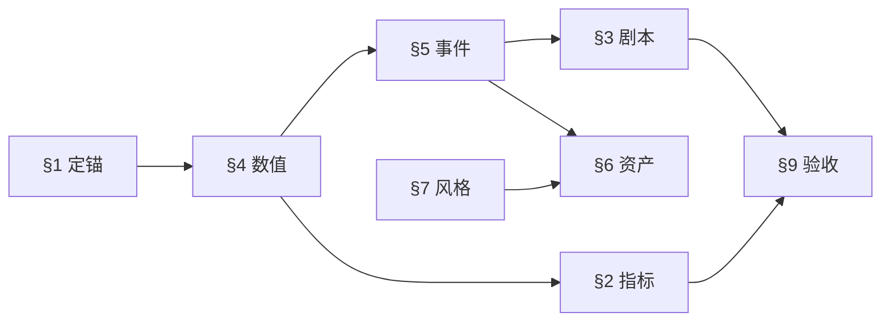

# 高质量网页小游戏 · 策划引导

> **结论**：高质量小游戏不是「文案写得热闹」，而是 **首局节奏可剧本化、数值可进 config、爽点可绑 event_id、上线可勾选验收**。  
> **工具链**：本引导 → [市场参考 GDD-MARKET-REFERENCES.md](GDD-MARKET-REFERENCES.md)（定对标）→ [GDD-AI-ASSET-TEMPLATE.md](GDD-AI-ASSET-TEMPLATE.md)（填空）→ [GDD-DEV-STANDARDS.md](GDD-DEV-STANDARDS.md)（实现）。  
> **说明**：仓库内暂无认可的内部金样例；体验对标以外部成熟小游戏为准，写在每款 GDD 的「主参考 / 抄 / 不抄」。

---

## 1. 什么叫「高质量」（本仓库标准）

| 维度 | 低质量（常见 AI 稿） | 高质量（可商用 P0） |
|------|----------------------|---------------------|
| 玩法 | 「操作简单、反馈饱满」 | §4 有 hp/射速/波次；§3 写清 8s 内发生什么 |
| 爽感 | 「击杀很解压」 | §5 有 `kill_seg`：粒子数、音效名、震屏 0/1 |
| 美术 | 「Q 版可爱」 | §6 每文件一行英文 Prompt + 尺寸 px |
| 竞技 | 「冲击高分」 | §2.3 写星级阈值：3★ 血量≥4 且用时&lt;90s |
| 交付 | 只有策划感想 | `config.ts` 与 §4 字段一一对应，§9 可测 |

**一句话**：玩家每一秒的「紧张 / 释放」，都要在 **§3 时间轴** 和 **§5 事件表** 里找得到；改平衡只改 **§4**，不许口头改。

---

## 2. 策划五步法（按顺序，禁止跳步）

```
① 定锚 → ② 数值骨架 → ③ 反馈清单 → ④ 首局剧本 → ⑤ 体验指标与资产
```

| 步 | 做什么 | 产出章节 | 用时建议 |
|----|--------|----------|----------|
| **① 定锚** | 从 [市场参考](GDD-MARKET-REFERENCES.md) 选类型；竞品抄/不抄、3 支柱 | §1 + 文档信息 | 30 min |
| **② 数值骨架** | 画布、玩家、敌人、波次、buff、胜负 | §4 全表有数字 | 1～2 h |
| **③ 反馈清单** | 每个爽点/受击/结算一个 `event_id` | §5 ≥8 行 | 45 min |
| **④ 首局剧本** | 0～60s 每行绑 kind + event_id | §3 | 30 min |
| **⑤ 指标与资产** | §2 目标值对齐 §4；§6 P0 资产 + Prompt | §2、§6、§7、§8 | 1～2 h |

**定稿**：附录 B 全「是」→ 版本 **v1.0** → 交付等级 **P0**。

**原型验证**：只做 ①② + 程序 emoji 占位 → 文首标 **「仅原型」**，不得进商用合集。

---

## 3. 章节依赖（填错顺序会返工）



- **先 §4 后 §2**：指标里的「首杀 ≤8s」必须和波次血量、玩家伤害算得通。  
- **先 §5 后 §3**：时间轴只引用已有 `event_id`，禁止临时造词。  
- **§6 Prompt 必须含 §7.2 master**：否则 AI 出图风格分裂。

---

## 4. 类型速查（选对结构，少填废话）

| 类型 | §4 重点 | §3 节奏要点（对标市场参考 §3） |
|------|---------|--------------------------------|
| 射击 / 割草 / 断节 | 射速、子弹速度、段血 | 8s 内第一次断段 + 成长选择 |
| 塔防 / 防线 | 格子、造价、波表 | 15s 内第一次造塔并击杀 |
| 消除 / 棋盘 | 棋盘尺寸、连击分 | 5s 内第一次消除 |
| 跑酷 / 躲避 / 球类 | 速度曲线、障碍间距 | 3s 内第一次核心操作 |
| 轻 1v1 / 乱斗 | 技能 CD、AI 血量 | 10s 内第一次有效命中 |

每款在 §1 写清 **主参考产品** + **抄机制 X，不抄 Y**；类型细节见 [GDD-MARKET-REFERENCES.md](GDD-MARKET-REFERENCES.md)。

---

## 5. 质量标尺（P0 / P1）

### P0（进合集商用）

- §3 ≥7 行，0～30s 与实机误差 ≤2s（§9 E1）  
- §4 无空数值格；`WAVES` ≥3 或明确无尽规则  
- §5 覆盖：轻命中、击杀、受伤、选 buff、波次结束、胜/负  
- §6.1 五项全勾；主角色非长期 emoji  
- §9 全部勾选  

### P1（精品）

- P0 + 核心敌人有 **精灵表动效**（帧数×fps 写在 §6）  
- §2 抽测 3 局达标 ≥2 局（§9 E2）  
- 结算页有明确下一局动力（§8）  

---

## 6. 人机协作建议

| 角色 | 用法 |
|------|------|
| **人（主策）** | 定 §1 支柱、§4 平衡、§9 签字 |
| **AI** | 用模板附录 A 任务头生成初稿；人只改数值与节奏 |
| **程序** | 只认 §4 + §5；需求变更 = GDD 版本号 +1 |
| **美术/音频** | 只认 §6 + §7；缺行不私自加文件 |
| **测试** | 用例 = §3 每一行 + §9 清单 |

**禁止**：让 AI 从「游戏名」直接写全文却不给竞品与类型 → 必产出空话稿。

---

## 7. 文件清单

| 文件 | 用途 |
|------|------|
| [GDD-PLANNING-GUIDE.md](GDD-PLANNING-GUIDE.md) | 本引导（先读） |
| [GDD-AI-ASSET-TEMPLATE.md](GDD-AI-ASSET-TEMPLATE.md) | 复制为 `docs/<gameId>-GDD.md` 再填 |
| [GDD-MARKET-REFERENCES.md](GDD-MARKET-REFERENCES.md) | 外部市场小游戏对标（类型 + 共性指标） |
| [GDD-DEV-STANDARDS.md](GDD-DEV-STANDARDS.md) | 工程与 Registry |

---

*引导版本：v1.1 · 与 GDD 模板 v3.2 配套（无内部金样例）*